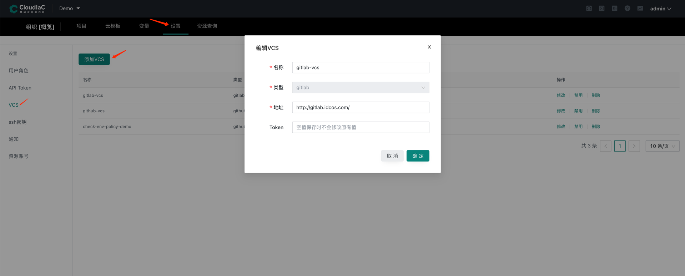
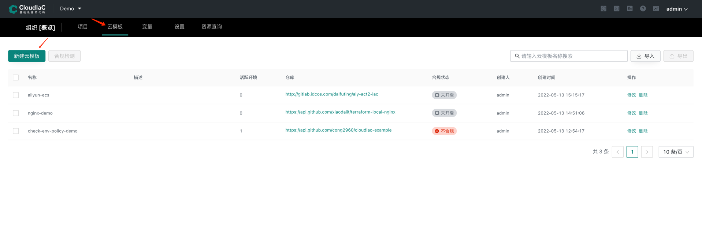
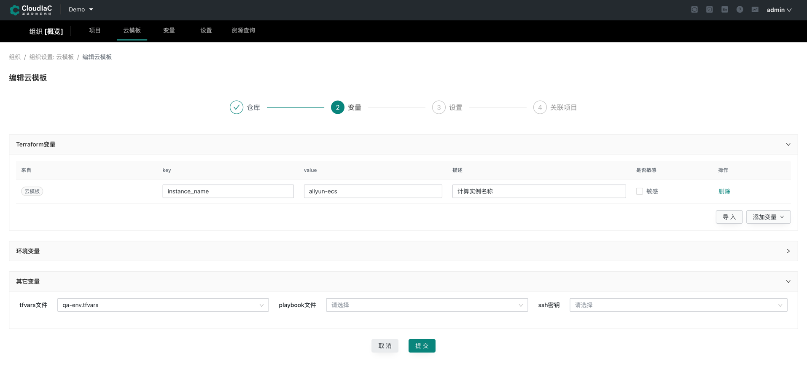
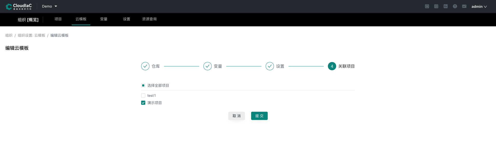
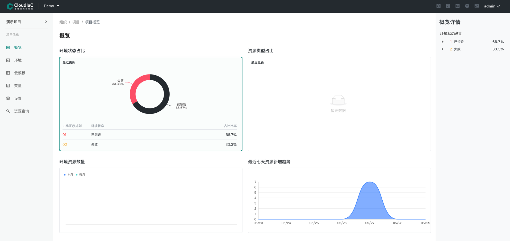
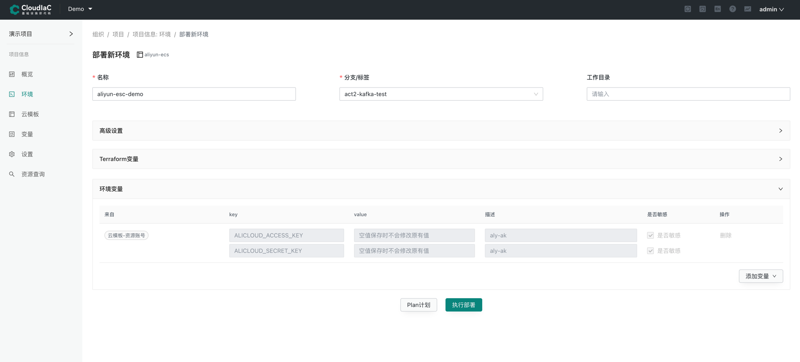
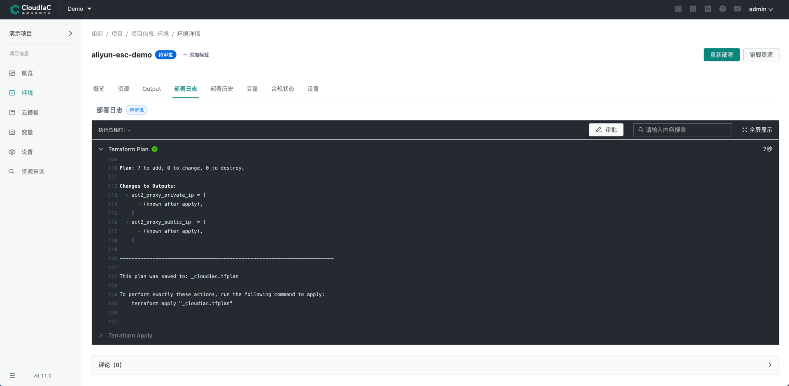
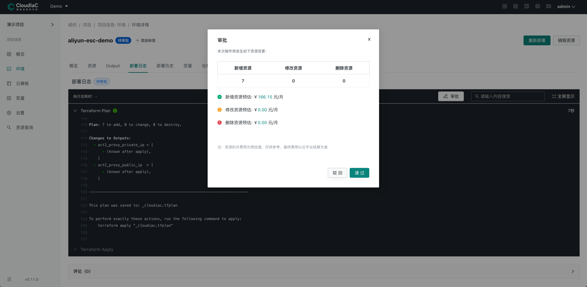
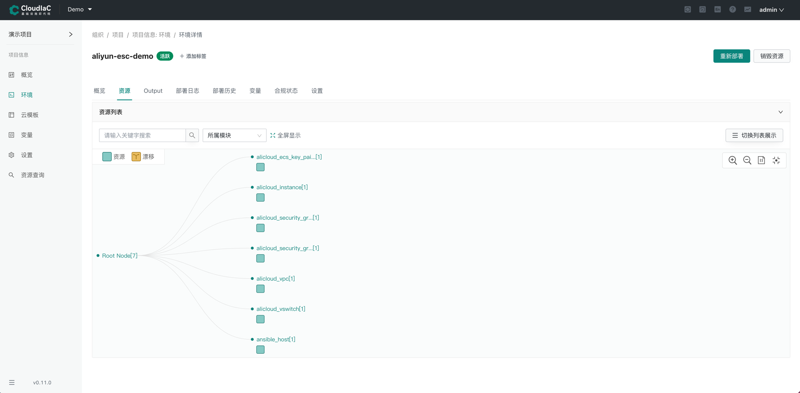

# 如何用 CloudIaC 管理 terraform 环境
当我们使用 terraform 来管理资源时，通常的做法是一个目录管理一套环境资源，当需要复用一套 tf 文件时，我们会把这个目录复制一份，然后基于这套 tf 文件进行修改后进行部署，terraform 默认会在本地目录中保存状态文件，以方便后续资源的变更、销毁等管理操作。

当然我们也可以在同一个目录通过 terraform 的 workspace 来进行不同环境资源的管理，但也容易在操作时忘了切换当前工作区，导致错误操作目标环境的问题。

尤其在多个管理人员需要对环境进行管理时会存在资源配置文件分发、同步，状态统一管理等问题，CloudIaC 为我们提供了以上管理场景的解决方案，通过 VCS 管理 tf 文件，通过在 consul 中远程管理状态文件，同时引入组织、项目、环境等管理视角，解决我们在多人协作管理环境资源时面临的问题。

下面介绍如何在 CloudIaC 中纳管我们的环境资源：

## 集成 VCS
什么是 VCS，请参考：[VCS管理](../manual/vcs.md)

在 CloudIaC 中，我们把 terraform 的 tf 文件统一称为Stack，一个Stack对应的是 VCS 中的一个代码仓库，所以在纳管环境资源之前我们需要在 VCS 中创建一个仓库，并把 tf 文件提交到该仓库中；

在组织设置-VCS 中选择『添加VCS』

## 新建Stack
1. 添加 VCS 集成后我们接下在组织-Stack页面选择『新建Stack』

2. 依次选择 VCS、仓库、分支/Tag 以及 terraform 版本后选择下一步进入变量设置，在变量设置中可以设置 terraform 变量、环境变量以及是否在资源供给后运行 Ansible 来部署应用

   
3. 选择下一步并输入Stack名称，最后选择要将该Stack关联到哪些项目

## 部署环境
1. 在组织-项目页选择相应项目进入项目视图

2. 进入项目视图后在左侧的『Stack』菜单页面，我们可以看到刚刚关联到该项目的Stack，通过点击Stack右侧的『部署』操作来进行新环境的部署

3. 部署时需要在环境变量中输入我们的云平台的 ak/sk，我们也可以提前在组织设置-资源帐号中添加好资源帐号，添加后在部署时可以直接进行引用

4. 点击『执行部署』开始部署新环境，在执行完成 terraform plan 后将进入审批阶段，此时需要管理员或审批者角色进行审批，通过后才能进入真正的部署操作

5. 审批通过将执行 apply 操作，完成后该环境即部署完成

## 环境管理
在环境创建后，我们可以在环境详情里浏览整个环境的资源，变更时修改Stack代码，通过『重新部署』来进行变更操作，当环境需要回收时可以一键『销毁资源』，对于临时的测试环境场景更可以通过设置环境的存活时间来实现定时销毁，从而可以更加灵活的管理我们的环境资源。
