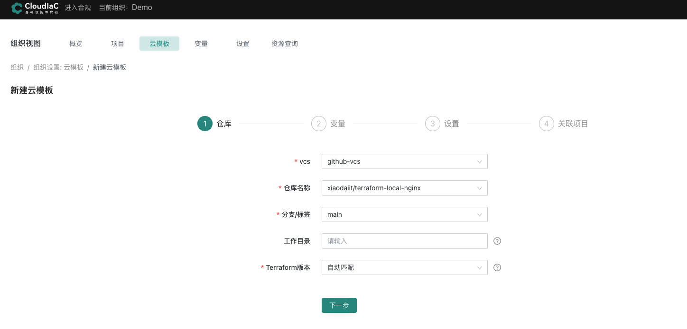
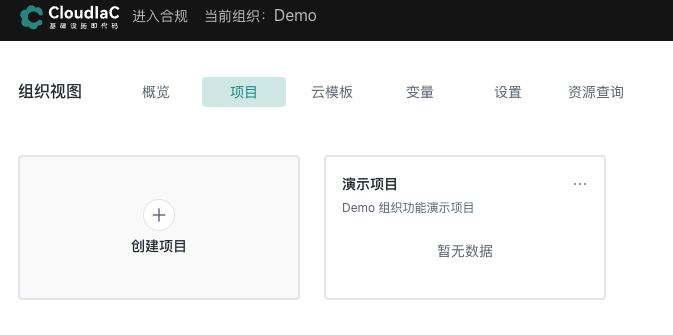
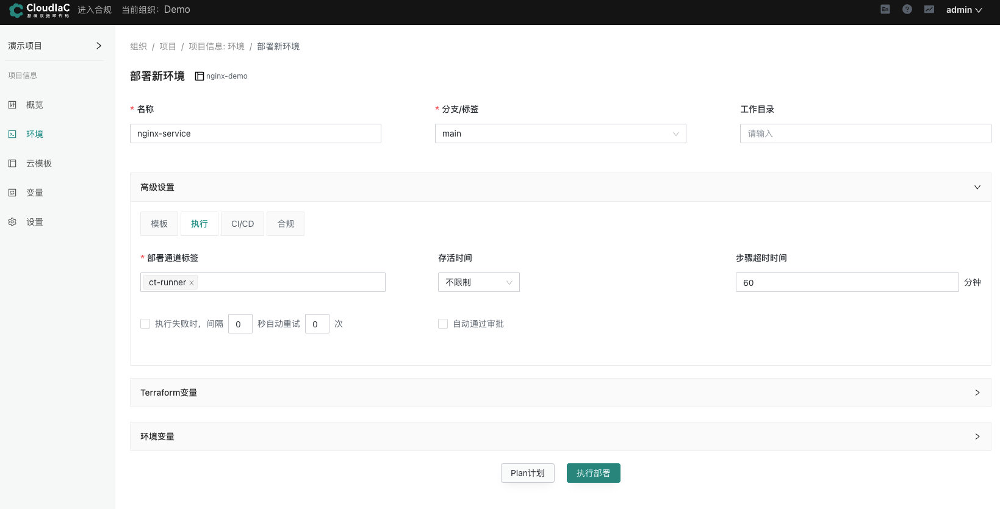
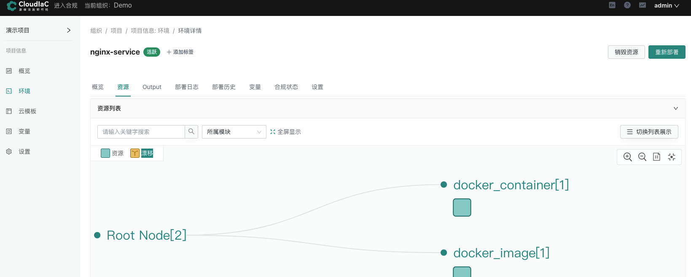

# 本地资源创建

:::tip
场景描述:
依据样板间代码,在本地创建nginx服务,体验cloudiac创建管理资源的生命周期
随用随起,用完即销毁
:::


## 获取基础云模板
```shell
基础样板代码仓库,保存到自己的github仓库
创建一个nginx服务

https://github.com/xiaodaiit/terraform-local-nginx
```


##  创建云模板

### 组织视图 [新建云模板] 选择vcs仓库,找到刚才新增的样板间代码分支


### 设置云模板变量
选择需要导入的变量


### 设置名称和关联项目


## 使用云模板创建ECS资源设置
选择关联的 [演示项目]



选择云模板,点击 [部署]


设置名称和执行部署通道然后点击 [执行部署]



## 执行部署

### 部署信息,点击  [审核], 选择 [通过]


### 审核通过,部署成功


### 访问nginx
通过部署服务的ip地址加上资源创建输出的端口,即可访问nginx服务


以上就是通过样板预制云模板创建nginx服务的流程

## 销毁资源
点击 [销毁资源] 输入环境名称


销毁审核 点击 [审核] 通过


销毁资源完成


以上就是整个环境创建到销毁的完整生命周期

