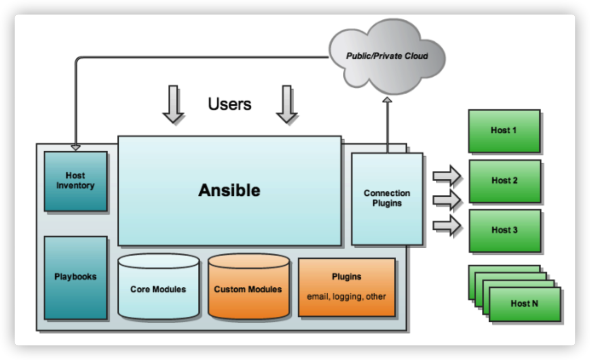

# Ansible 介绍

Ansible 是一款为类 Unix 系统开发的自由开源的配置和自动化工具，类似于 saltstack 和 Puppet，但是有一个不同和优点是我们不需要在节点中安装任何客户端。使用 SSH 来和节点进行通信。Ansible 基于 Python 开发，分布式，无需客户端，轻量级，配置语法使用 YMAL 及 Jinja2 模板语言，更强的远程命令执行操作。


**Ansible 具有如下特点：**

1、部署简单，只需在主控端部署 Ansible 环境，被控端无需做任何操作；

2、默认使用 SSH 协议对设备进行管理；

3、通过 Playbook 来定制强大的配置、状态管理

4、对云计算平台、大数据都有很好的支持；


**Ansible** **工作机制**

Ansible 在管理节点将 Ansible 模块通过 SSH 协议推送到被管理端执行，执行完之后自动删除，可以使用 SVN 等来管理自定义模块及编排。



**由上面的图可以看到** **Ansible** **的组成由** **5** **个部分组成：**

Ansible ：     Ansible 核心

Modules ：    包括 Ansible 自带的核心模块及自定义模块

Plugins ：      完成模块功能的补充，包括连接插件、邮件插件等

Playbooks ：   剧本；定义 Ansible 多任务配置文件，由 Ansible 自动执行

Inventory ：    定义 Ansible 管理主机的清单


**Ansible 工具使用：**

```plain
# 安装 Ansible 工具需要启用 epel 仓库。
# 配置163镜像源，安装 epel 仓库
$ curl -o /etc/yum.repos.d/CentOS7-Base-163.repo http://mirrors.163.com/.help/CentOS7-Base-163.repo
$ sed -i  's/$releasever/7/g' /etc/yum.repos.d/CentOS7-Base-163.repo
$ yum install -y epel-release
$ yum install -y ansible 

# ansible命令参数
# anisble命令语法： ansible [-i 主机文件] [-f 批次] [组名] [-m 模块名称] [-a 模块参数]
ansible详细参数：
 -v,–verbose   #  详细模式，如果命令执行成功，输出详细的结果 (-vv –vvv -vvvv)
 -i PATH, -inventory=PATH      #  指定 host 文件的路径，默认是在 /etc/ansible/hosts 
inventory  [ˈɪnvəntri]  库存
 -f NUM,-forks=NUM     # NUM 是指定一个整数，默认是 5 ，指定 fork 开启同步进程的个数。
 -m NAME,-module-name=NAME    #   指定使用的 module 名称，默认使用 command模块
 -a,MODULE_ARGS   #指定 module 模块的参数
 -k,-ask-pass           #提示输入 ssh 的密码，而不是使用基于 ssh 的密钥认证
 -sudo          # 指定使用 sudo 获得 root 权限
 -K,-ask-sudo-pass             #提示输入 sudo 密码，与 -sudo 一起使用
 -u USERNAME,-user=USERNAME          # 指定移动端的执行用户
 -C,–check             #测试此命令执行会改变什么内容，不会真正的去执行
ansible-doc详细参数：
	ansible-doc -l           #列出所有的模块列表
	ansible-doc -s 模块名    #查看指定模块的参数
  
# 定义主机清单
## 1、基于端口，用户，密码定义主机清单
$ vim  hosts   #文件 hosts 维护着 Ansible 中服务器的清单。在文件最后追加以下内容
[redis]                 #主机组名
192.168.100.145  ansible_ssh_port=22  ansible_ssh_user=root  ansible_ssh_pass=123456

简单测试下主机的连通性
$ ansible -i hosts redis -m ping 
192.168.100.145 | SUCCESS => {   #表示成测试。通信成功。
    "changed": false,   #因为ping命令不会改变被管理的服务器的状态。所以是false正常
    "ping": "pong"
}
 -i    #  指定 host 文件的路径，默认是在 /etc/ansible/hosts 
 -m    #   指定使用的ping模块


## 2、基于ssh密钥来访问定义主机清单(推荐)
## 一般来说，使用明文密码不安全，所以增加主机无密码访问。
## 在Ansible服务端生成密钥，并且复制公钥到节点中。
$ ssh-keygen   #一直回车
## 使用ssh-copy-id命令来复制Ansible公钥到客户端
$ ssh-copy-id root@192.168.100.145
$ ssh-copy-id root@192.168.100.147
## 验证免密登录
$ ssh 192.168.1.64

$ vim hosts  #在文件的最后添加以下内容
删除之前在最后添加的两行主机清单：
[redis]
192.168.100.145 ansible_ssh_port=22  ansible_ssh_user=root  ansible_ssh_pass=123456
增加：
[redis]
192.168.100.145
192.168.100.147


## 例子：给客户端增加用户
$ ansible -i hosts 'redis' -m command -a "useradd test123"
192.168.100.145 | SUCCESS | rc=0 >>
192.168.100.147 | SUCCESS | rc=0 >>
## 查看用户是否创建
$ ansible -i hosts 'redis' -m command -a "grep test123 /etc/passwd"
```

 

### 7.2 Ansible Roles 简介

Ansible 自1.2版本之后，引入了 Roles 的新特性，以便层次性和结构化的组织 Playbook。相比于 Ansible 命令的方式进行控制，Ansible Playbook 的控制方式极大的提升了 Ansible 对于被控端设备的管理能力。但是，如果我们想配置更加复杂的被控端环境，那么单单的将所有的配置命令写成一个 Playbook 文件就可多达成百上千行。这极不利于 Ansible Playbook 的管理和维护。

相比于Ansible Playbook，Roles 能够层次型结构自动装载变量、任务以及handlers。在本质上，Ansible Roles就是将变量、任务、模板以及处理器分别的放在不同的目录中，并通过include的方式进行调用，并组合成一个整体。


**Ansible Roles 目录结构**

```plain
roles/
├── mysql
│   ├── defaults
│   │   └── main.yml
│   ├── files
│   ├── handlers
│   │   └── main.yml
│   ├── meta
│   │   └── main.yml
│   ├── README.md
│   ├── tasks
│   │   └── main.yml
│   ├── templates
│   ├── tests
│   │   ├── inventory
│   │   └── test.yml
│   └── vars
│       └── main.yml
└── redis
    ├── defaults
    │   └── main.yml
    ├── files
    ├── handlers
    │   └── main.yml
    ├── meta
    │   └── main.yml
    ├── README.md
    ├── tasks
    │   └── main.yml
    ├── templates
    ├── tests
    │   ├── inventory
    │   └── test.yml
    └── vars
        └── main.yml


Ansible的Roles配置全部存放在ansible/roles/目录下。在该目录下，有着很多子文件夹，
每个子文件夹就是一个role。每个Role通常应该包含以下子文件夹。
1、files/
用来存放copy模块的文件，或者是script模块的脚本文件。

2、tasks/
用于存放一系列任务文件，在该目录下，必须存在一个main.yml文件，该文件会通过include调用其他的文件。

3、vars/
该目录下存放一系列的变量，在该目录下，必须存在一个main.yml文件，该文件会通过include调用其他的
文件。如果整个roles配置变量使用较少，则只使用一个main.yml文件即可，但是如果整个roles配置变量
比较多，那么就可以将变量进行分类后存放到不同的目录下，然后再通过main.yml进行调用。

4、meta/
该目录通常存放此Role的特殊设定及其依赖关系，在该目录下，也必须存在一个main.yml文件。

5、default/
该目录存放此Role的设定默认变量，在该目录下，也必须存在一个main.yml文件。

6、handlers/
该目录下用于存放Role中触发条件后执行的动作，在该目录下，也必须存在一个main.yml文件。

7、template/
此目录下用于存放此Role需要使用的jinjia2模板文件。
```