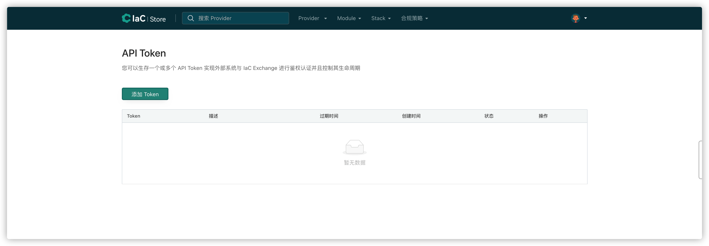
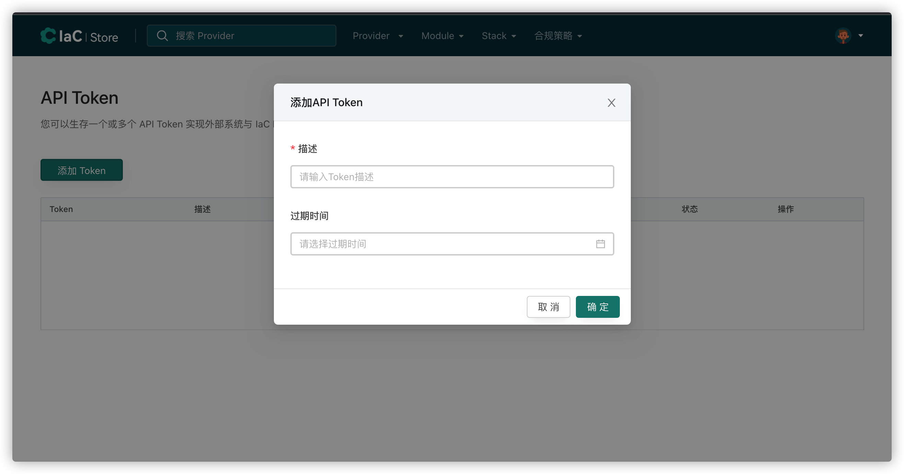

# API Token 使用

## 什么是 API Token
API Token 是为了在第三方调用 IaC Store 时使用的唯一密钥，在第三方平台需要使用 IaC Store 的部分 API 功能时，请求头中携带密钥即可访问通过认证权限来访问 API
一个 API Token 包含过期时间等基础功能。

## 创建自己的 API Token
1. 登录 IaC Store 账号，在账号下拉框中选择 API Token

2. 点击添加 Token 按钮

3. 填写描述，选择过期时间

复制生成好的 Token 就可以在第三方平台使用 Token 来进行访问 IaC Store API 接口了
