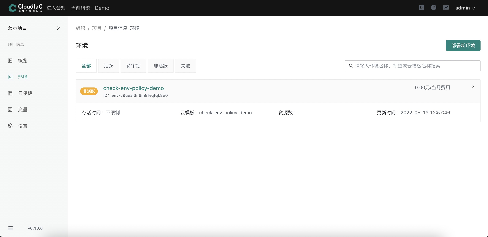
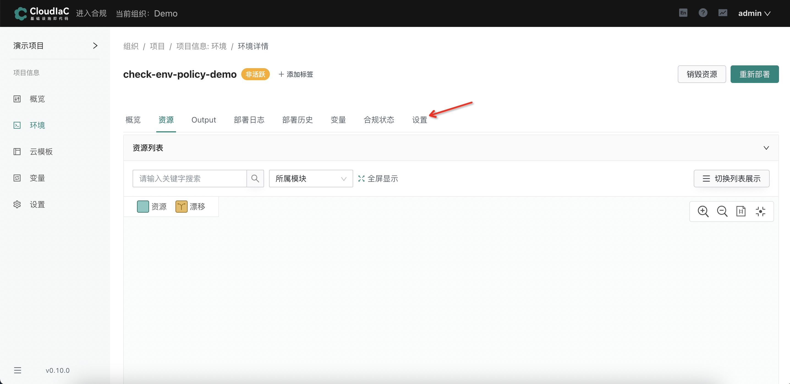
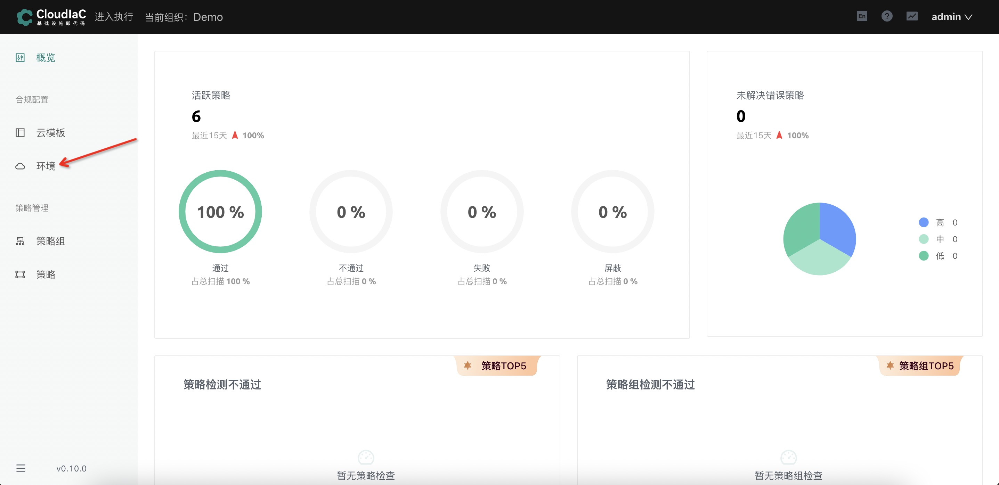
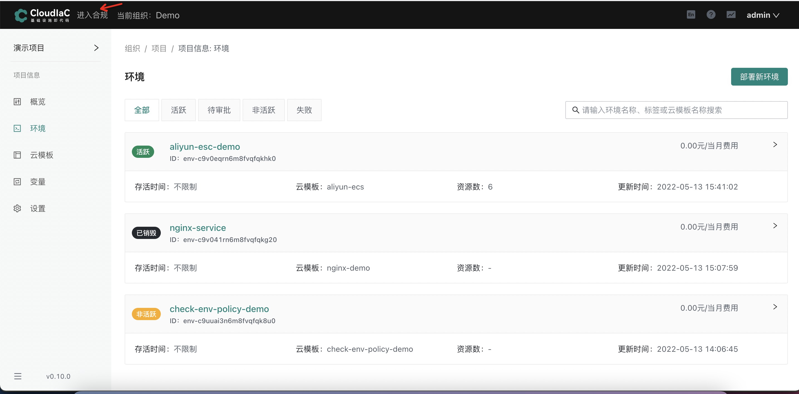
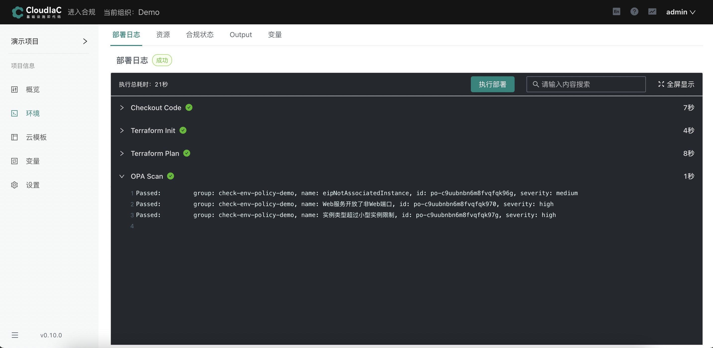
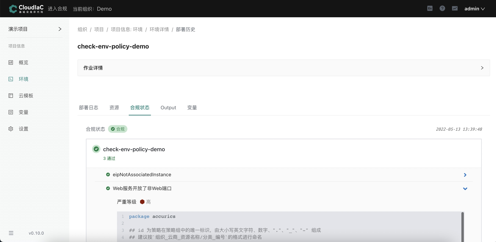

# 检测资源合规

## 场景描述

我们通常会有检查 terraform 创建资源的合规性要求，比如检查 ecs 实例必须绑定弹性公网 ip、ecs 实例开放 80 端口或443 端口、ecs 实例的类型，以上检查通过人工方式进行耗时耗力。

为了解决以上问题，cloudiac 提供了合规检测功能，通过合规检测功能，您只需在 cloudiac 中创建策略组，并将策略组绑定到环境，即可实现自动检测资源的合规性

目前 cloudiac 可以使用 vcs 仓库和 IaC Exchange 中的策略组，如果 IaC Exchange 中无满足您需求的策略组，您还可自行编写合规策略并上传到自己的 vcs 仓库或者我们的 IaC Exchange 平台，即可在 cloudiac 中使用

有关合规策略的详细介绍，请参考[安全合规](/docs/mkdocs/manual/compliance.md)

## 场景演示

使用以下环境作为示例说明：

演示环境和策略组如下：




该环境用来在阿里云创建 ecs 服务器

同时策略组包含了 3 条合规策略，每条策略都对资源的创建进行合规检测

**名称为”eipNotAssociatedInstance“的合规策略要求创建出来的 ecs 服务器必须绑定弹性公网（eip）**

**名称为“ Web 服务开放了非 Web 端口”的合规策略要求创建出来的ecs服务器必须只能开放（ 80 端口或者 443 端口）**

**名称为”实例类型超过小型实例限制“的合规策略要求创建出来的 ecs 服务器类型只能为 small 或者 nano 类型的小型实例**

### 环境合规开启方式

#### 方式一：在执行页面部署新环境或者重新部署旧环境时同时绑定策略组

选择菜单【项目信息】下的【环境】，点击【设置】按钮



在【合规】栏中点击开启合规检测并绑定策略组


若勾选了 "合规不通过时中止部署"，那么环境将会中止这次资源变更
#### 方式二：在合规页面为已存在的环境绑定策略组

点击【进入合规】


选择菜单【合规配置】下的【环境】



点击【开启检测】，并绑定策略组


### Stack合规开启方式

点击【进入合规】



选择菜单【合规配置】下的【Stack】


点击【开启检测】，并绑定策略组


### 环境合规检测效果展示

#### 环境不合规

执行 terraform plan 操作过后，会去执行合规策略检测的步骤

其中 Passed 代表环境将要创建的资源满足该条合规策略，Violated 代表环境将要创建的资源不满足该条合规策略

如下图：Web 服务开放了非web端口这条合规策略的类型为 Violated，即说明该资源开放了除 80 端口或者 443 端口以外的端口，
由此 cloudiac 根据合规策略自动对将要变更的资源进行了合规性检测，您可根据检测结果更改 terraform 代码以满足合规性


#### 环境合规

只有当所有合规策略都 passed ，该环境才算合规



可以在合规状态里查看通过检测的策略详情



### Stack合规检测效果展示

#### Stack不合规

其中 Passed 代表Stack中 tf 文件资源满足该条合规策略，Violated 代表Stack中 tf 文件资源不满足该条合规策略


#### Stack合规

只有当所有合规策略都 passed ，该Stack才算合规


### 合规检测机制说明

cloudiac 中可以针对Stack或者环境进行合规检测，但检测机制并不相同

Stack合规是检查的 tf 静态文件，环境合规检测的是动态生成的 plan 文件，因此，对同一Stack与其创建出来的环境进行合规检测，结果并不一致。

我们在Stack里面会定义很多变量，比如资源```alicloud_eip_association```定义了一个 ```instance_id = alicloud_instance.web[count.index].id```，这些变量的值在环境部署前是不确定的，只有执行了部署才知道最终生效的值，因此Stack合规和环境合规分别满足不同场景，两者结合一起确保资源合规性。

#### 针对Stack进行合规检测


#### 针对环境进行合规检测

