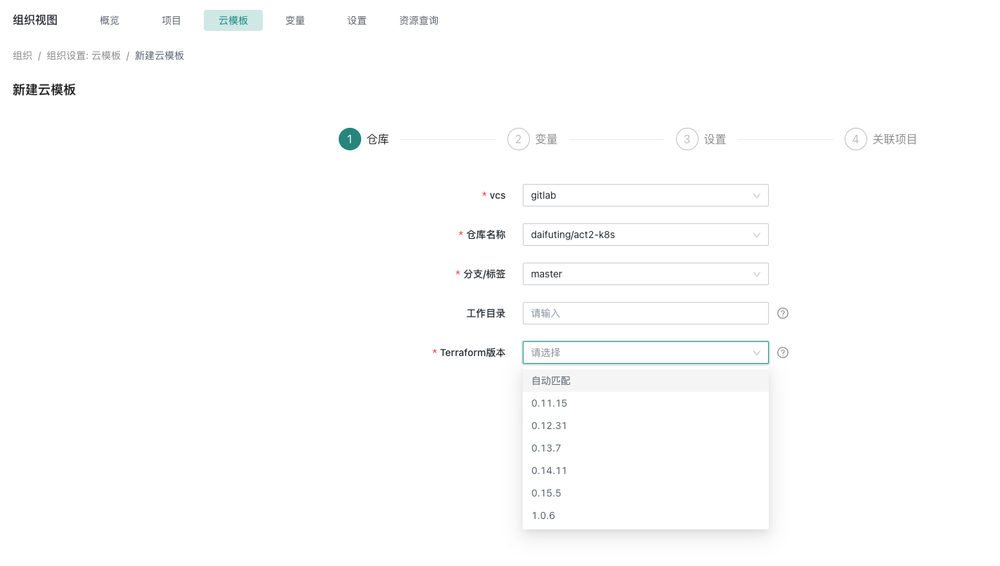

# 云模板terraform版本选择

## terraform版本信息选择

### 方式一 基于创建云模板模式选择terraform版本

在云模板的编辑页面,新建云模板,填写对应的信息后,选择terraform版本
 {.img-fluid}


### 方式二 基于代码层面指定terraform版本 
在version.tf文件中指定版本,参数required_version
```yaml
# version.tf
terraform {
 required_version = "= v0.15.5"
    alicloud = {
      source = "aliyun/alicloud"
      version = "1.124.3"
   }
  }
}

```
:::tip
当选择“自动匹配”时，CloudIaC 才会解析工作目录下的 versions.tf 文件，并根据其中的版本约束选择最佳的 terraform 版本，若匹配失败则默认使用 v0.14.0。
:::


