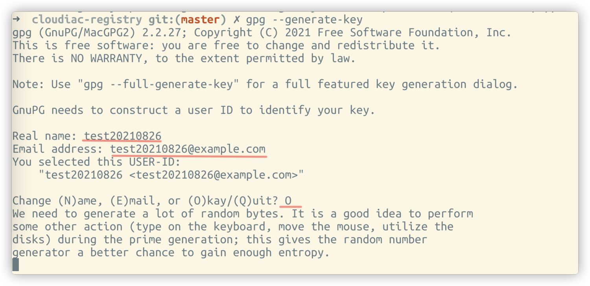
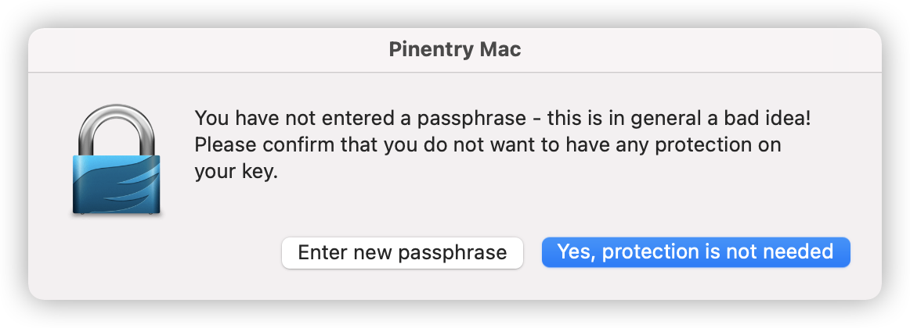

# 获取签名密钥

GPG 密钥生成可参考文档：[GPG签名密钥获取](https://docs.github.com/en/authentication/managing-commit-signature-verification/generating-a-new-gpg-key)

以下为 macos 下创建 GPG 密钥对的过程，其他系统过程大致相同

```bash
1. gpg --generate-key
2. 根据提示输入 user id: username-example
3. 根据提示输入 email: username@example.com
4. 在弹出的窗口中输入 passphrase 或者留空
5. 再次在弹出的窗口中输入 passphrase 或者留空
6. 创建成功

使用 gpg --list-keys 查看创建的密钥对
```

以下为过程截图：

{.img-fluid}

{.img-fluid}

{.img-fluid}

导出上一步生成的 GPG key 公钥:

```bash
gpg --armor --export "$GPG_EMAIL"
```

执行以上命令后会输出公钥，格式如下

```bash
-----BEGIN PGP PUBLIC KEY BLOCK-----

mQGNBGEOqLABDAC44R2AxNm6sB/kpBqAl2iV811E1dppRodyMcyNkC2T7zbtjlX6
oR1x8goYrykh5Yn2S0KNzEuT1Uv473ffBNIlM99yzQE74UyYCuw9YnJ3v5ipqqg/
pU7B6AJBcwaZSEgldZC+apidhjRJvZFsrepDaEl292cG9vFPpLjdQ2D95jP0hA49
jaDrXL+Rras9HAphMogEp4q06zijbFr+scrNJyrbdJAWckZZHdiyjRbI+MaAozf+
S5DLKQArm4ih7wQ85620fUh0IUb/cupI05VekaUzOT28o/DybMHgry1Hbis+z2og
mRKdJkK90uubZT8F3bWJdp8OQGahuq8sNpMmwhPR4SLHQZt8Wl7CEe01ShLoTG31
MsVQ7myF/oI+BAKuhyvlFguSHrUPaaigoFCrFYnoJaYpwJ1Bm/bSqnZBMkyFT0Sr
llDtgaVHv6L1yMekFPtbJYVcMJY3r5ytR5/Yllp/APtL/Eto9YM+5aqBaWRpcSEJ
JTtQFhVoQAWl4OUAEQEAAbQpanhpbmdpbmctdGYtcHJvdmlkZXIgPGp4aW5naW5n
QGdtYWlsLmNvbT6JAdQEEwEIAD4WIQRMPwU7Hn0wrLak/n7so3cIf+ZsggUCYQ6o
sAIbAwUJA8JnAAULCQgHAgYVCgkICwIEFgIDAQIeAQIXgAAKCRDso3cIf+ZsgikM
C/41yOODkZ9L+OhN9Z5Ln0OBPnvGNU/UqRIM6YozQ2H/TG5iXspLEjArIafWNKbl
yLZy4EE/yQn/6oX6zRNCy25d3J+FsOvSIUfOWSW7qWs6dVr0umZT9hcZ4F3AFO3d
NuzOef5bOFtStPmmmRlw1gdUeBxAiAKrbNOE+y6SLzmPQIxnThiSay0ezwWud82t
8Ap4rGZwmyXtOseCayCx1m8CBrMWzU0OLlehMXTtT/gGfwjENOlXMjJCki57s4j+
ZyU5G1MVYLf0UhDq9LU0dJfjpKkrQV9gDl93yeLQKWBZH+wLL5EgIPMHNtGj0KhK
mHg7IFQBTe/6KzjWogT+gHtkDLgdKwiEtrADURQF8L436NiURT9ZOS62YNMBKwQB
lQF0MK7Y39v47TTzaBOp4tun2fRhEqhE++491HiEpUWRh1VxDrysM2ro+wNNZcgb
CdXiWRuuXdR4bLiNslAr+lnWT57fCPu84pjuBfMj7riljMwMWg5XpQtXY4/gvvQw
xRK5AY0EYQ6osAEMANi4AAYwKK1hrmInMfEJlv4ZSsP2/kWQBZaQpfO73BhfKveV
Yo4R1UW7w6cgYvFgDl2VUvXyjVJs1KBScgAcXRMIlrCvdW2woVkKPgJdArBcaQ71
/Vs+hsjS/D6kikM61ZZbtYj+Bvigs9fMuCJ3rDM64xDCMvqjrtQ8PC6dPUj/2s03
lPba5x5Ej7oKLfcxgai+JaqSpkAgqQJZ4qJHz4qHLUMR5DbuLbO8nPM3xRaBabK6
RdH5tRrII0EEugJxJ/xyWTlhUIHeTd8h1xWvu7ns4xMKF3BlcuNMEsv5pseQMa20
mmyvK9f7esvAF6hiv1HrMjgF1c9o3ATyebuGw2SeAgeKrkM3ptRn0PASlhTqxPTP
fMs+JQgBIL8P5yP5yNAu1sq4bM5Rc/xw8clD+knFUirhaP0j6DJ5PZOhi1AzHNH6
8Us2+P24YDHvFNfWT2CK1pN/SHB9x/khujIUlhtL8+y34SqV/mRp5dfqMqZUX7//
FKY5otlNVWWt7lrBvQARAQABiQG8BBgBCAAmFiEETD8FOx59MKy2pP5+7KN3CH/m
bIIFAmEOqLACGwwFCQPCZwAACgkQ7KN3CH/mbIIuRAv9HKI4yqogeT9mQXbPAF3/
2lFQ3pgkuIaZWhMUDi8EkmXsOKZYXt5kGqFcrQWMTQvAl2iCzFxsHJ0GjxZcHznF
rCbw+czWB1uONeF2UR/w+t8kuw6Pn+0MLPDnJKVG/WOjE4+TtuavAdMivNmKZpm7
QO7Zh+X2VJ9dTJZPRGhbzz18xnA2uXIz3qzuwNq+KMiwT46U5atGgEZMRpLHlP0j
CtCU+yG/3wKEI/oI1NMUL7q1/ExhXUsPDjN+S/a65GhUKTvWRIfp6bYGlU5VHE2B
6klzTpnSnjRSFUet0TEd9DqA9feCvwqgFzz3JmMTLxnWrG6sPcOBm7icWtsNITDO
wLKVcZh1L/i2S2FScTqqwiqCcL76Q9FsqmVD4GVhdXK8sCpeXEbhNZjH0qyqVZEN
A5eW9SxM3pf8LkBlf5Bd7tMIKuv0EW23/yda7+Vp96gWHFEema7a6UaiIVnMkoi2
Dr6RCAGCkInHu7PvUMCm7x7NwTC9OfIxkAv2I3Cd+LAi
=wJUC
-----END PGP PUBLIC KEY BLOCK-----
```
