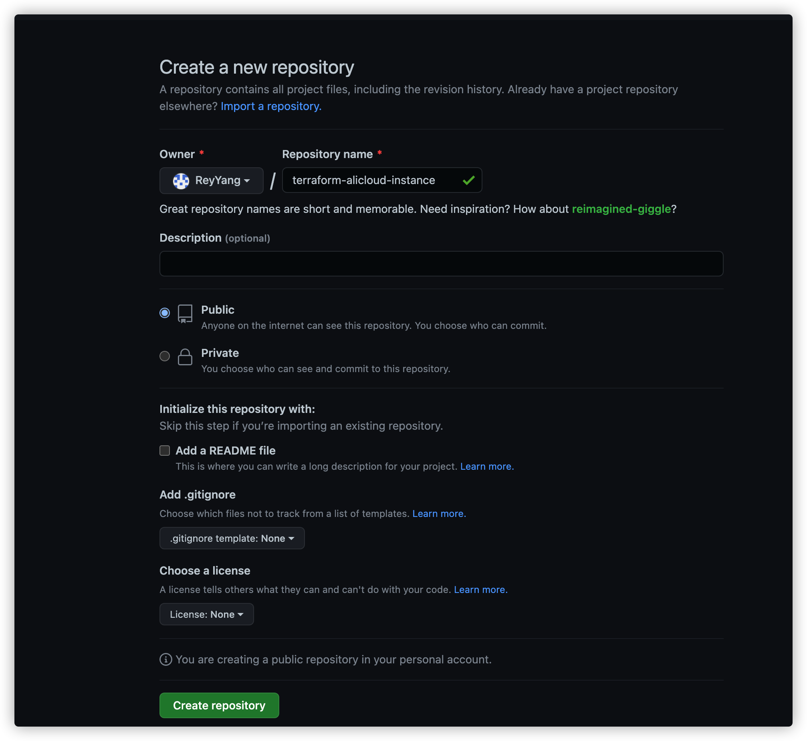

# Module 编写
## 先决条件

本教程中的概念适用于任何模块创建工作流程，但本教程使用腾讯公有云 ecs-instance 模块。将创建一个模块来管理腾讯公有云实例。

**要遵循本教程，您将需要：**

- 将您的腾讯公有云的AK/SK作为环境变量导入
- 如果您在 CloudIaC 平台上使用，可以创建资源账号，填写您的腾讯公有云的AK/SK。[CloudIaC添加资源账号](https://idcos.github.io/cloudiac/0.9/product-features/resource-account/)

## 一、Module 开发说明

### 1、Module 结构：

Module 典型文件结构如下：

```plain
.
├── main.tf
├── LICENSE
├── provider.tf
├── outputs.tf
├── README.md
└── variables.tf
```

### 2、 Module 编写基本原则

每个 Module 不宜包含过多的资源，要尽可能只包含同一产品的相关资源，这样带来的好处是 Module 的复杂度不高，便于维护和阅读； 对于统一产品的不同资源，应该分别放在不同的子 Module 中，然后在最外层的main.tf 中组织所有的子资源，比如 Module slb 中定义了两个资源 slb instance 和 slb attachment，这两个子资源分别定义在了 Modules/slb 和 modules/slb_attachment 中，然后在最外层的 main.tf 中将这两个 Module 组合为一个新的 Module 每个 Module 要尽可能单元化，以便可以在实际使用过程中自由添加和删除而不影响其他resource。即一个 Module 尽可能叙述1-2件事情，如创建一个slb实例，并将一组 ecs 的挂载到这个 slb 下（slb的作用就是实现对ecs的负载均衡），至于 slb 的 listener 配置，应该放置在一个独立的 Module 中，一方面listeners比较复杂，涉及四种协议，另一方面，对于同一协议的listener，除了监听端口外，大部分的配置都是相同的，而这些相同的配置可以通过一个单独的 Module 被复用在不同其他资源模板中； 模板编写过程中，需要使用到大量的 TF 语法，详见 configuration syntax 和 interpolation syntax。

（1）main.tf

每个 Module 都必须包含一个 main.tf 用于存放 resource 和 datasource。resource和datasource的参数禁止使用硬编码，必须通过变量进行引用； 为了标准起见，每个 resource 和 data source 的命名均以一些关键字或者关键字前缀为主，如this，default，尽量避免使用foo，test等 为了更好的了解 Module 被他人引用的次数，阿里云 Provider 支持对每个 Module 进行打标，即在 main.tf 的 provider 中声明字段 configuration_source，格式如下： provider "alicloud" { ... configuration_source = "terraform-alicloud-modules/demo" // This should be replaced by the specified owner and module name }

（2）provider.tf

provider.tf 文件是用来指定 Module 中 resource 所需要的 provider 及其适用版本。

（3）variables.tf

每个变量都要添加该参数对应的描述信息，这个信息最终是要呈现在terraform registry官网上的； 对于一些非关系型的参数，可设置一个默认值，如 name，description 等 对于复杂类型的变量，要显示声明其类型，如list，map 子资源的变量要在Readme中以列表的形式予以呈现

（4）outputs.tf

Module 中 output 的作用是被其他模板和module引用，因此，每个module要将一些重要的信息输出出来，如资源ID，资源name 等； 重复资源的变量要以列表的形式予以输出，如module ecs-instance中，创建多个instance资源，这些资源的ID应该输出到一个list变量instance_ids中 和variables一样，子资源的output变量也要在Readme中以列表的形式予以呈现

（5）README.md

描述当前 Module 是用来干什么的，涉及哪些 resource 和 datasource ，增加 使用方法说明该如何使用这个 Module。Module 的 source 格式为 source = "<Repo Organization>/<NAME>/alicloud"，如：source = "terraform-alicloud-modules/slb-listener/alicloud" ，添加 Module 暴露的入参和出参，帮助开发者更好的使用 Module 具体细节可参考其他 Module

6、LICENSE

此模块可用的许可证。如果您公开发布模块，许多组织不会采用模块，除非存在明确的许可证。我们建议始终拥有许可证文件，即使它不是开源许可证。

## 二、开发步骤

开发环境：Linux/MacOS

### 1、创建 GitHub 项目存放 Module 代码

访问[GitHub仓库](http://www.github.com) ，点击新建项目，填写项目名称（名称规范：terraform-基础设施提供商-资源名称），选择可见性级别，勾选使用自述文件初始化仓库。



### 2、本地克隆 GitHub 项目

确定需要开发 Module 的资源，进行 Module 开发。

```plain
git clone https://github.com/iacstore/terraform-alicloud-rds.git
```

### 3、创建 main.tf 的文件

将 [terraform resource 代码块](https://registry.terraform.io/providers/tencentcloudstack/tencentcloud/latest/docs) 填写到 main.tf 文件中，内容如下：

```plain
terraform {
  required_providers {
    tencentcloud = {
      source = "tencentcloudstack/tencentcloud"
    }
  }
}

# Configure the TencentCloud Provider
provider "tencentcloud" {
  secret_id  = "my-secret-id"
  secret_key = "my-secret-key"
  region     = "ap-guangzhou"
}

# Get availability zones
data "tencentcloud_availability_zones" "default" {
}

# Get availability images
data "tencentcloud_images" "default" {
  image_type = ["PUBLIC_IMAGE"]
  os_name    = "centos"
}

# Get availability instance types
data "tencentcloud_instance_types" "default" {
  cpu_core_count = 1
  memory_size    = 1
}

# Create a web server
resource "tencentcloud_instance" "web" {
  instance_name              = "web server"
  availability_zone          = data.tencentcloud_availability_zones.default.zones.0.name
  image_id                   = data.tencentcloud_images.default.images.0.image_id
  instance_type              = data.tencentcloud_instance_types.default.instance_types.0.instance_type
  system_disk_type           = "CLOUD_PREMIUM"
  system_disk_size           = 50
  allocate_public_ip         = true
  internet_max_bandwidth_out = 20
  security_groups            = [tencentcloud_security_group.default.id]
  count                      = 1
}

# Create security group
resource "tencentcloud_security_group" "default" {
  name        = "web accessibility"
  description = "make it accessible for both production and stage ports"
}

# Create security group rule allow web request
resource "tencentcloud_security_group_rule" "web" {
  security_group_id = tencentcloud_security_group.default.id
  type              = "ingress"
  cidr_ip           = "0.0.0.0/0"
  ip_protocol       = "tcp"
  port_range        = "80,8080"
  policy            = "accept"
}

# Create security group rule allow ssh request
resource "tencentcloud_security_group_rule" "ssh" {
  security_group_id = tencentcloud_security_group.default.id
  type              = "ingress"
  cidr_ip           = "0.0.0.0/0"
  ip_protocol       = "tcp"
  port_range        = "22"
  policy            = "accept"
}
```

### 4、封装 Module

将 resource 和 datasource 的参数去除使用硬编码，改为变量引用 ，封装成 Module，达到可重复引用的效果，内容如下：

```plain
# 资源账号作为环境变量导入或在 CloudIaC 平台上维护，此处不填写
provider "tencentcloud" {
    region     = var.Region
}

# 获取可用区
data "tencentcloud_availability_zones" "default" {
}

# 获取可用镜像
data "tencentcloud_images" "default" {
  image_type = var.image_type
  os_name    = var.osName
}

# 获取可用的实例规格
data "tencentcloud_instance_types" "default" {
  cpu_core_count = var.cpu
  memory_size    = var.memory
}

# 创建腾讯云实例
resource "tencentcloud_instance" "web" {
  instance_name              = var.instanceNumber > 1  ? format("%s%02d", var.instanceName, count.index + 1) : var.instanceName
  availability_zone          = data.tencentcloud_availability_zones.default.zones.0.name
  image_id                   = data.tencentcloud_images.default.images.9.image_id
  instance_type              = data.tencentcloud_instance_types.default.instance_types.0.instance_type
  system_disk_type           = var.diskType
  system_disk_size           = var.diskSize
  allocate_public_ip         = var.allocatePublicIp
  internet_max_bandwidth_out = var.bandwidthOut
  security_groups            = [tencentcloud_security_group.default.id]
  count                      = var.instanceNumber
}

# 创建安全组
resource "tencentcloud_security_group" "default" {
  name        = var.securityName
  description = var.securitydescription
}

# 创建安全组规则，并开放端口
resource "tencentcloud_security_group_rule" "web" {
  security_group_id = tencentcloud_security_group.default.id
  type              = "ingress"
  cidr_ip           = "0.0.0.0/0"
  ip_protocol       = var.ipProtocol
  port_range        = var.portRange
  policy            = "accept"
}
```

### 5、创建 provider.tf 文件

指定 resource 所需要的 provider 及适用版本。

```plain
# 使用 IaC Store 平台的 Provider
terraform {
  required_providers {
    tencentcloud = {
      source = "tencentcloudstack/tencentcloud"
      version = "1.48.0"
      }
    }
}
```

### 6、创建 variables.tf 文件

定义 main.tf 文件使用的变量及其类型。

```plain
variable "Region" {
    type = string
    description = "可用区"
}

variable "osName" {
    type = string
    description = "操作系统名称"
}

variable "image_type" {
    type = string
    description = "操作系统类型"
}

variable "cpu" {
    description = "CPU数量"
}

variable "memory" {
    description = "内存大小"
}

variable "instanceName" {
    type = string
    description = "实例名称"
}

variable "diskType" {
    type = string
    description = "系统磁盘类型"
}

variable "diskSize" {
    description = "系统磁盘大小"
}

variable "instanceNumber" {
    description = "需要创建的实例数量"
}

variable "allocatePublicIp" {
    type = bool
    description = "是否分配公网IP"
}

variable "bandwidthOut" {
    description = "公网IP最大带宽"
}

variable "securityName" {
    type = string
    description = "安全组名称"
    #对于用户/密码等敏感变量，添加该参数声明为加密变量。
    sensitive   = true
}

variable "securitydescription" {
    type = string
    description = ""
}

variable "ipProtocol" {
  type = string
  description = "安全组端口协议"
}

variable "portRange" {
  type = string
  description = "安全组开放端口,例如:80或80,8080"
}
```

以上声明的变量是 Module 必需的，均未赋予默认值，因此在引用该 Module 时必须存在这些变量并赋予值。

### 7、创建 outputs.tf 文件

添加文件 outputs.tf，输出 Module 中的一些关键信息，以下参数输出了实例名称，私有IP和公网IP:

```plain
output "instance_name" {
  value = tencentcloud_instance.web[*].instance_name
}

output "private_ip" {
  value = tencentcloud_instance.web[*].private_ip
}

output "public_ip" {
  value = tencentcloud_instance.web[*].public_ip
}
```

### 8、创建 LICENSE 文件

本教程将使用 Apache 2.0 开源许可证。LICENSE 的文件以下内容：

```plain
Licensed under the Apache License, Version 2.0 (the "License");
you may not use this file except in compliance with the License.
You may obtain a copy of the License at

    http://www.apache.org/licenses/LICENSE-2.0

Unless required by applicable law or agreed to in writing, software
distributed under the License is distributed on an "AS IS" BASIS,
WITHOUT WARRANTIES OR CONDITIONS OF ANY KIND, either express or implied.
See the License for the specific language governing permissions and
limitations under the License.Licensed under the Apache License, Version 2.0 (the "License");
you may not use this file except in compliance with the License.
You may obtain a copy of the License at

    http://www.apache.org/licenses/LICENSE-2.0

Unless required by applicable law or agreed to in writing, software
distributed under the License is distributed on an "AS IS" BASIS,
WITHOUT WARRANTIES OR CONDITIONS OF ANY KIND, either express or implied.
See the License for the specific language governing permissions and
limitations under the License.
```

### 9、创建README.md文件

~~~plain
## Terraform TencentCloud Module  

此 Module 用于创建腾讯公有云主机,包括资源云主机、安全组、安全组规则。


### 在您的腾讯公有云环境中部署(单台/多台)云主机  

这个模块部署一台或多台类型的云主机(Linux/Windows)，具有以下特性:  

- 能够指定云主机部署区域。
- 能够指定Linux或Windows类型云主机。  
- 支持指定CPU和内存大小。    
- 支持指定系统磁盘大小。  

注意:在指定CPU和内存大小，需要注意该区域下有无这个CPU和内存规格。  


### 使用方法

首先，创建一个<code>main.tf</code>文件。

接下来，复制下面的代码并填充所需的变量。

```
module "ecs-instance" {
    source = "registry.cloudiac.org/shihuanpeng/ecs-instance/tencentcloud"
    version = "1.3.0"
    Region = "ap-guangzhou"
    osName  = "centos"
    cpu  = 2
    memory = 2
    instanceName  = "webServer"
    diskType = "CLOUD_PREMIUM"
    diskSize  = 50
    instanceNumber  = 1
    allocatePublicIp  = bool
    bandwidthOut  = 20
    securityName = "webServer"
    ipProtocol  = "tcp"
    portRange  = "22,80,8080"
}

output "instanceName" {
  description = "实例名称"
  value = module.ecs-instance.*.instance_name
}
output "private_ip" {
  description = "私有IP"
  value = module.ecs-instance.*.private_ip
}
output "public_ip" {
  description = "公网IP"
  value = module.ecs-instance.*.public_ip
}
```
最后,执行该模块
```
terraform run
```

**如果您想要参数修改更灵活，我们推荐在CloudIaC平台上使用，并用以下做法：**

创建一个<code>main.tf</code>文件，复制下面的代码

```
module "ecs-instance" {
    source = "registry.cloudiac.org/shihuanpeng/ecs-instance/tencentcloud"
    version = "1.3.0"
    Region = var.Region
    osName  = var.osName
    cpu  = var.cpu
    memory = var.memory
    instanceName  = var.instanceName
    diskType = var.diskType
    diskSize  = var.diskSize
    instanceNumber  = var.instanceNumber
    allocatePublicIp  = var.allocatePublicIp
    bandwidthOut  = var.bandwidthOut
    securityName = var.securityName
    ipProtocol  = var.ipProtocol
    portRange  = var.portRange
}
output "instanceName" {
  description = "实例名称"
  value = module.ecs-instance.*.instance_name
}
output "private_ip" {
  description = "私有IP"
  value = module.ecs-instance.*.private_ip
}
output "public_ip" {
  description = "公网IP"
  value = module.ecs-instance.*.public_ip
}
```

再创建一个<code>variables.tf</code>文件,并对所需的变量进行赋值。

```
variable Region {
    type = string
    default = "ap-guangzhou"
    description = "可用区"
}

variable osName {
    type = string
    default = "centos"
    description = "操作系统类型"
}

variable cpu {
    default = 2
    description = "CPU数量"
}

variable memory {
    default = 2
    description = "内存大小"
}

variable instanceName {
    type = string
    default = "webServer"
    description = "实例名称"
}

variable diskType {
    type = string
    default = "CLOUD_PREMIUM"
    description = "系统磁盘类型"
}

variable diskSize {
    default = 50
    description = "系统磁盘大小"
}

variable instanceNumber {
    default = 2
    description = "需要创建的实例数量"
}

variable allocatePublicIp {
    type = bool
    default = true
    description = "是否分配公网IP"
}

variable bandwidthOut {
    default = 20
    description = "公网IP最大带宽"
}

variable securityName {
    type = string
    default = "webServer"
    description = "安全组名称"
}

variable ipProtocol {
  type = string
  default = "tcp"
  description = "安全组端口协议"
}

variable portRange {
  type = string
  default = "22,80,8080"
  description = "安全组开放端口,例如:80或80,8080"
}
```

最后，您可以将这两个文件上传到VCS，在CloudIaC平台上关联VCS项目创建云模板,并部署云模板创建资源，详细操作查看[CloudIaC快速入门](https://idcos.github.io/cloudiac/0.9/quick-start/)。
~~~

至此，完成腾讯公有云实例的 Module 开发。

### 10、上传 Module 代码到 GitHub 项目