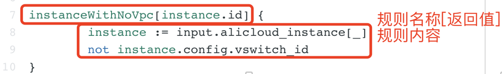
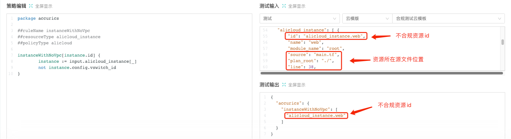
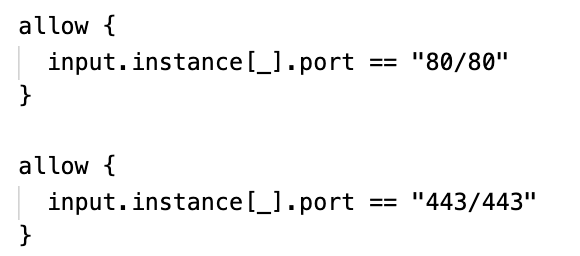
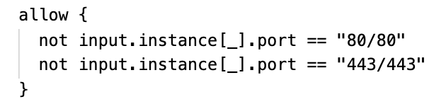
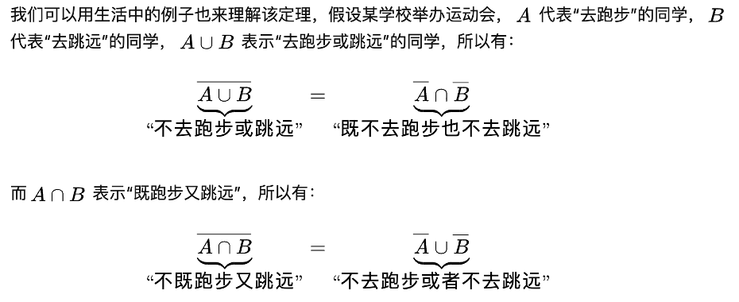

# 策略组编写

## 什么是 [CloudIaC 合规策略](https://cloudiac.org/markdown/docs/mkdocs/manual/compliance.md)

## [合规策略的使用](https://cloudiac.org/markdown/docs/mkdocs/cases/check-policy.md)

## 编写合规策略

### 合规策略组

合规策略组以代码仓库的形式组织相关联的合规策略和说明文件。

策略组目录结构：

```shell
cloudiac-policy-group-demo
├── README.md
├── policy-a.rego 
└── policy-b.rego
```

1. README.md：合规策略组说明文件
2. *.rego：合规策略文件


#### 合规策略组说明文件：README.md

README文件示例：

```markdown
# CloudIaC 演示策略组
该策略组用于演示 cloudiac 的策略组织形式。
```

#### 合规策略：.rego

一个策略文件(policy)可以有多条规则 (rule)，通过文件内容中的注释来表示策略名称、严重级别等。


### 合规策略

合规策略文件名以 rego 为后缀，策略相关的元数据以注释的形式标记在文件头。

rego 文件结构示例：

~~~go
package cloudiac

## id 为策略在策略组中的唯一标识，由大小写英文字符、数字、"."、"_"、"-" 组成
## 建议按`组织_云商_资源名称/分类_编号`的格式进行命名
# @id: cloudiac_alicloud_security_p001

# @name: 策略名称A
# @description: 这是策略的描述

## 策略类型，如 aws, k8s, github, alicloud, ...
# @policy_type: alicloud

## 资源类型，如 aws_ami, k8s_pod, alicloud_ecs, ...
# @resource_type: aliyun_ami

## 策略严重级别: 可选 HIGH/MEDIUM/LOW
# @severity: HIGH

## 策略标签，多个分类使用逗号分隔
# @label: cat1,cat2

## 策略修复建议（支持多行）
# @fix_suggestion: 
Terraform 代码去掉`associate_public_ip_address`配置
```
resource "aws_instance" "bar" {
  ...
- associate_public_ip_address = true
}
```
# @fix_suggestion_end

nameIsHello {
	input.name == "hello"
}

nameIsHello {
	input.name == "world"
}
~~~

- 若无 "@id:" 注释则使用：文件名做为策略 id
- 若无 "@name:" 注释则使用策略 id 做为名称
- 若无 "@severity:" 注释则默认为 MEDIUM 级别
- "@label:", "@fix_suggestion:" 为可选

#### package

包名，一般使用固定的 `package cloudiac`。

#### rule

在 rego 策略执行过程中，是对每条规则执行 query 的一个过程。

每条规则的基本结构如下：



1. 规则名称：一般写规则检测的内容
2. 返回值：这里应当返回资源的 id
3. 规则内容：按 rego 语法对内容进行检测


在 CloudIaC 合规策略测试界面执行效果如下：



#### rego 语法

在一个 rego 文件中，多条相同规则之间为 OR 关系，比如我们要判断一个安全组的端口是否使用 80 或者 443，应该这么写：



在一条规则内，多个条件为 AND 关系，还是做上面的检查，也可以这么写：



这里，我们灵活使用了 **德·摩根律** ：




由于 rego 语法的特点，在编写过程中可以结合这个定律再两种写法中进行变换，以简化规则内容。

常用语法：


rego 更多的语法可以参考[opa 网站](https://www.openpolicyagent.org/docs/latest/policy-language/)的语法说明，也可以参考 terrascan 的规则库，里面有许多写的很好的规则检测方式。

## 常用的合规策略规则

1. 选择资源

使用 [_] 数组选择语法选择一组资源

```go
alicloudInstance[instance.id] {
  instance := input.alicloud_instance[_] // 选择 alicloud_instance 资源实例
  ...
}
```

1. true / false 判断

```go
apiGatewayNoAccessLogs[stage.id] {
  stage := input.aws_apigatewayv2_stage[_]
  not stage.config.access_log_settings
}
```

1. 字符串比较

```go
apiGatewayAuthorizationDisabled[api_gw.id] {
    api_gw := input.aws_api_gateway_method[_]
    api_gw.config.authorization == "NONE"
}
```

1. 检测是否为空值

```go
amiNotEncrypted[api.id] {
    api := input.aws_ami[_]
    object.get(api.config, "ebs_block_device", "undefined") == "undefined"
}
```

1. 多值检测

```go
ebsEncrypted[block.id] {
    block := input.aws_ebs_volume[_]
    checkEncryption(block.config) == true
}

checkEncryption(c) = true {
    not c.encrypted
}

checkEncryption(c) =true {
    c.encrypted == false
}

checkEncryption(c) =true {
    c.encrypted == true
    not c.kms_key_id
}
```

## 参考资料

1. OPA语法参考：https://www.openpolicyagent.org/docs/latest/policy-language/
2. Terrascan 规则库：https://github.com/accurics/terrascan/tree/master/pkg/policies/opa/rego
3. Open Policy Agent(OPA) rego语法：https://blog.csdn.net/xixihahalelehehe/article/details/116998878