# Provider 编写

该教程主要用来帮助用户将自定义 API 开发成 terraform provider 插件。本文将从零开始帮助大家开发一个可执行的 Provider 程序。用极简的代码让大家直接理解 terraform provider 插件和 API 接口之间的调用关系。
项目地址 : [terraform-provider-yunjidemo](https://github.com/xuxiaoahang2018/terraform-provider-yunjidemo)

### Terraform 简介

Terraform 主要由 Terraform Core 以及 Terraform Plugins组件构成。
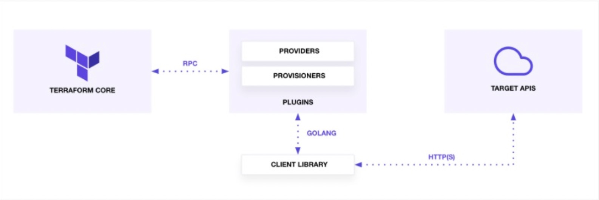

1. Terraform Core 组件负责从用户编写的 main.tf 读取配置并构建出资源依赖图。
2. Terraform Plugin 连接 Terraform Core组件以及各个provider 插件的 API， Terraform provider 插件通过其提供的 CRUD (创建、读取、更新和删除)API 来构成一个资源(resource)，并通过此资源来和提供商进行通信。

简述调用链就为，terraform core 负责读取用户编写的 *.tf 的模版文件，将配置信息通过 RPC 调用传导到 terraform plugin 组件，该组件负责调用各个云商提供的 Provider 插件里面资源的增删改查 API，从而实现对云服务资源的管控。

### 提供自定义API

这里我们使用 python 语言去创建一个服务，该服务提供一个API接口，这个接口用来模拟云计算资源的创建的 API，该接口提供了两个参数 instance_name 和 disk_size, 用来模拟服务器名称和硬盘规格。

```plain
from flask import request, Flask, jsonify

app = Flask(__name__)
app.config['JSON_AS_ASCII'] = False
# paramter instance_name string
# paramter disk_size int
@app.route('/', methods=['POST',"GET"])
def post_Data():
    instance_name = request.form.get("instance_name")
    disk_size = request.form.get("disk_size")
    recognize_info = {'instance_name': instance_name, 'disk_size': disk_size}
    return jsonify(recognize_info), 200

if __name__ == '__main__':
    app.run(debug=False, host='0.0.0.0', port=8888)

# 安装依赖 pip3 install flask
# 启动服务： python3 mock.py
```

通过如上简短的15行代码，我们启动一个模拟创建云服务器的 API，接下来，我们把这个 API 开发为一个最基础的 Provider 插件，并且来使用它。

### 配置开发环境

terraform provider 是基于 golang 语言开发，请优先配置以下开发环境

```plain
Terraform 0.13.x +  （terraform 插件版本，需要大于等于0.11版本，mac可以使用 brew install terraform 安装）
Go 1.6+ (安装go语言进行开发provider 插件)
```
### Provider 架构

首先创建一个 terraform-provider-yunjidemo 的目录用来存放我们整个项目代码，其中结构如下：
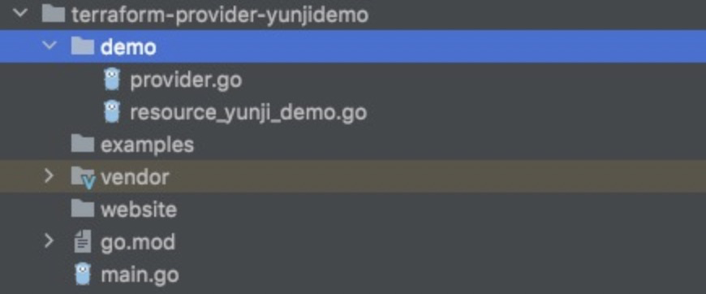

- `main.go`，provider程序入口
- `examples`，示例目录，因为你的插件最终是给用户用的，一个比较理想的示例，是用户拉到代码后，可以直接跑起来
- `demo` 目录。 最重要的目录，也就是我们的插件目录，里面都是Go文件，其中
- `provider.go` 这是插件的根源，用于描述插件的属性，如：配置的秘钥，支持的资源列表，回调配置等
- `data_source_*.go` 定义的一些用于读调用的资源，主要是查询接口
- `resource_*.go` 定义的一些写调用的资源，包含资源增删改查接口
- `service_*.go` 按资源大类划分的一些公共方法

### 定义 main.go 入口文件
main.go 这这个文件在我们项目的根目录下，作为主程序员的入口，其 main()函数主要调用了 plugin 插件的SDK，这个库主要封装了 terraform core 和插件这件的 RPC 通信。

```plain
package main

import (
	"github.com/hashicorp/terraform-plugin-sdk/plugin"
	demo "terraform-provider-yunjidemo/demo"
)

func main() {
	plugin.Serve(&plugin.ServeOpts{
		ProviderFunc: demo.Provider,
	})
}
```
### 提供 provider.go 插件文件
我们在我们接下来要开发插件的目录 "demo" 下定义 provider.go 文件。 helper/schema 库是 terraform core 库的一部分，他主要作用于Provider() 函数内用来定义所支持的两种资源 `ResourcesMap` 和 `DataSourcesMap`, 并且可以配置插件的回调，可以用来初始一些 client 以及权限校验。之后 demo 目录下开发的所有资源插件都要注册到 provider.go 文件中，以供 terraform 去调用。
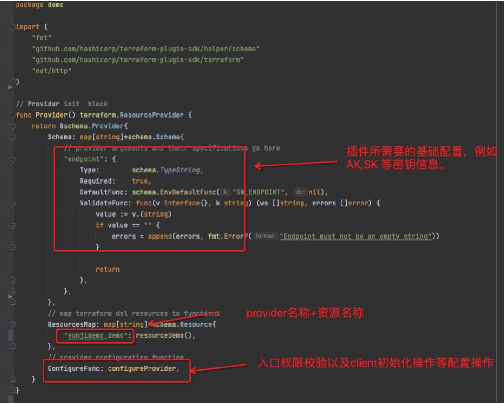

之后我们要写的资源 resourceDemo, 就会注册到 这个 resourcesMap 当中。

### 开发provider插件 （实施创建）

以下代码片段将要添加到  terraform-provider-yunjidemo/demo/resource_yunji_demo.go 文件里面， 作为通俗的约定，terraform 的插件提供者 应该把每一个资源的 CRUD 放到一个文件里面，并且用资源名称命名，文件的前缀应为 resource_.

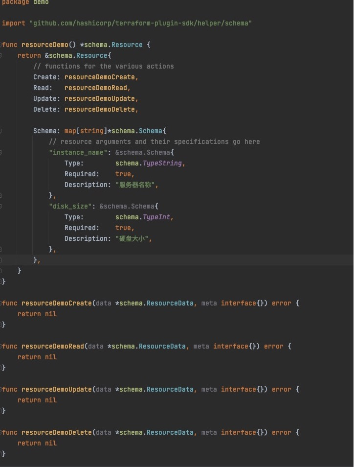

如图，我们定义了一个资源的脚手架，在 schema.Resource 结构体中定义 API 所需要的参数以及参数类型，而下面的的四个函数分别对应了 API 资源的增删改查, 我们将分别在这4个函数中去调用对应的 CRUD API 接口。
我们的 mock 服务只提供了 create 接口，那么我们先来开发一个创建方法。

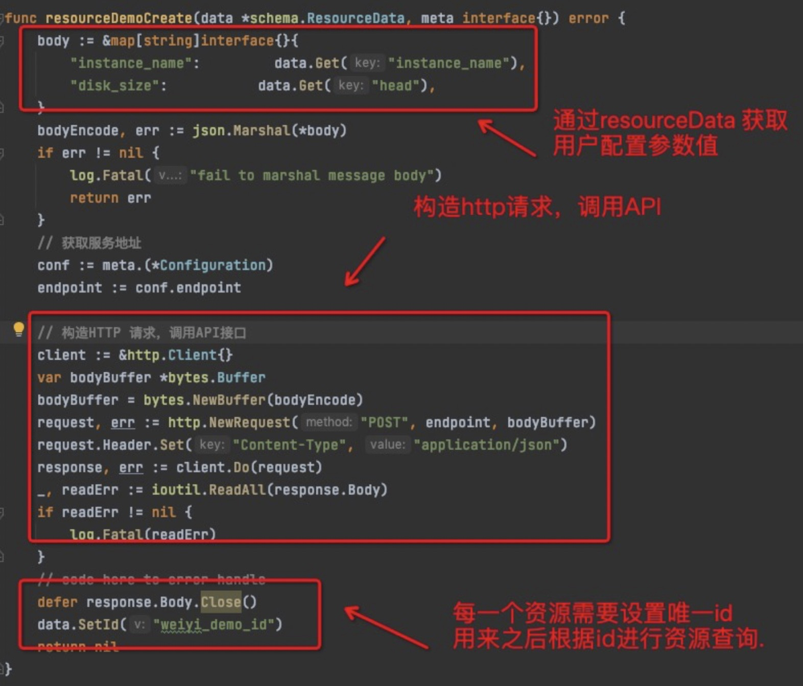

在上述函数中，主要分为三个部分，可以看到在 Create 中主要去调用我们 mock 的web 服务的创建API ,
第一部分，通过 main.tf 模版里面编写的函数，这里将通过 data.Get 去接收。
第二部分，这里通过 http 包去构造 http 请求，并且去调用我们 mock 服务的API。（其实所有的API 都应该封装到 SDK 里面后供 terraform 在去调用，这里为了方便大家直观的感受 terraform 调用 API 的过程，这里就没有在将 API 封装到 SDK 中去。)
第三部分，给资源设置一个唯一id ，后续的查询和更新以及删除，都依赖资源的唯一ID 去查找到资源，这里我们也是 mock 了一个假的ID 用来教学使用。
那么到这里为止，我们的 API ==>> terraform provider 的转换就已经完成了。 这时候我们可以进行编译使用。

### 编译使用provider

这里我们来使用我们刚刚开完的简易版的 Provider。 在terraform 0.13 +版本后, 您必须在 Terraform 配置中指定所有必需的提供程序及其各自的源。提供者源字符串由`[hostname]/[namespace]/[name]`组成。 简单说就是terraform 去哪里找我们的插件，这里我们有篇文章来详细介绍terraform 的缓存机制 [terraform cli配置](https://www.terraform.io/cli/config/config-file)

首先在 terraform-provider-yunji-demo 目录下面 执行:
```plain
go build -o terraform-provider-yunji-demo
```

这时候会在当前目录下构建出 provider 可执行文件。接下来，我们创建缓存目录，去存放我们编译好的 provider 文件，以便于 terraform 程序可以找到我们开发的插件:

```plain
mkdir -p ~/.terraform.d/plugin-cache/registry.terraform.io/yunji/yunjidemo/1.0.0/darwin_amd64

# 移动编译好的文件到上一步创建的目录中
mv terraform-provider-yunji-demo ~/.terraform.d/plugin-cache/registry.terraform.io/yunji/yunjidemo/1.0.0/darwin_amd64
```

现在我们来定义我们的模版文件 main.tf：

```plain
terraform {
  required_providers {
    yunjidemo = {
      source  = "yunji/yunjidemo"
    }
  }
}

resource "yunjidemo_demo" "test" {
  instance_name  = "aini"
  disk_size = 100
}
```

如上面代码块所示范，主要分为两部分，一是定义 terraform 的provider 配置，将我们的构建的二进制代码块放到了创建的 terraform 缓存目录下的 yunji/yunjidemo 目录下，所以这里的 source 指的是我们缓存目录的地址。他告诉 terraform 去哪里查找我们编译好的插件。

第二部分是我们的资源，resource开头，"yunjidemo_demo" 这个是我们在 provider.go 中注册的资源的名称，"test", 是我们这个资源的名称，那么里面的 instance_name 和 disk_size 就是我们调用的 API 的参数了，我们接下来，在 example/main.tf 这个目录下面去执行

```plain
terraform init --plugin-dir={你的家目录}/.terraform.d/plugin-cache

例如我这里:
terraform init --plugin-dir=/Users/evan/.terraform.d/plugin-cache
```

执行完成后：

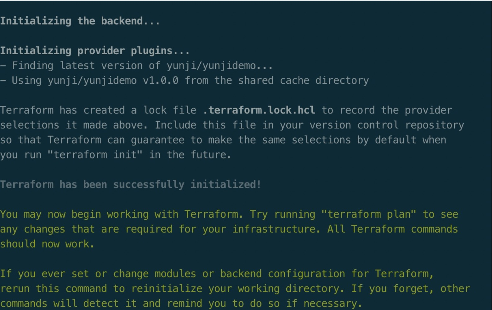

如上图所示，证明我们开发的 provider 已经成功挂在到了 terraform 并且初始化成功，之后我们执行 terraform plan 去解析我们的 resource 资源: (需要启动我们的 mock 服务)

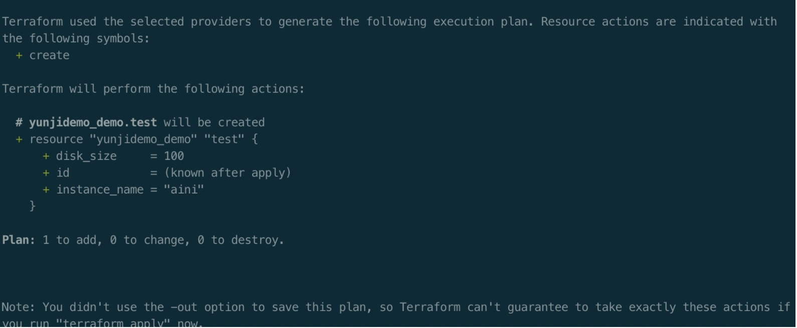

如下图所示，terraform plan 命令会告诉我们 terraform 将要去创建或者更新哪些资源，之后我们执行

```plain
terraform apply
```

该命令将通过我们开发的 resource 资源进而请求我们 mock 服务的 API 接口

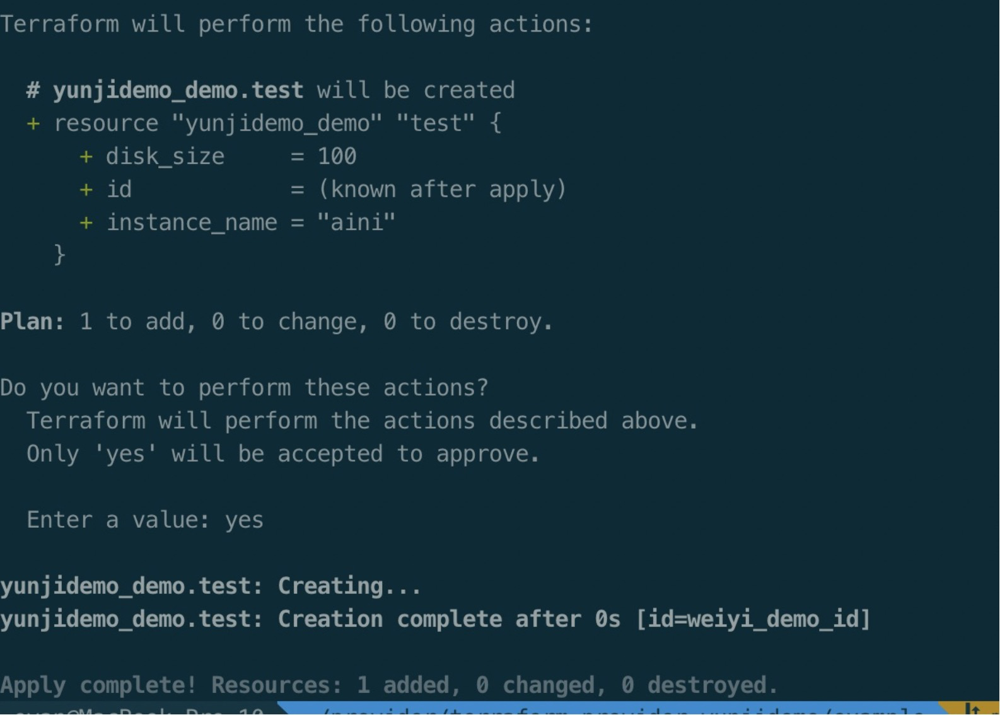

如果所示，我们的资源已经被创建出来，通过观察我们的 mock 服务的请求日志，可以看到 API 已经请求成功。至此我们的我们已经可以使用我们开发出来的 provider。

### 完善provider

在上述的方法中，我们通过简单的代码来实现了一个可用的 provider 插件，现在我们来完善我们的这个 provider 更新，删除以及查询方法。 首先我们先完善我们的 mock 服务，提供增删改查询方法：[代码地址](https://github.com/xuxiaoahang2018/terraform-provider-yunjidemo/blob/master/flaskmock/mock.py)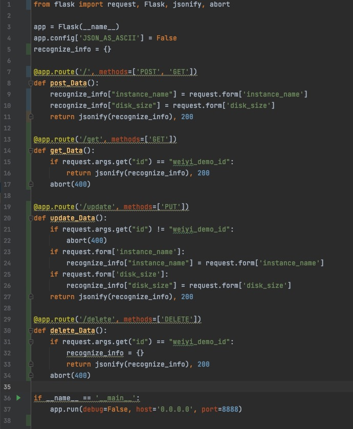

如图，还是非常简单的代码，一共37行，这里主要为了给大家 mockAPI 使用，所以没有做过多的参数校验，错误检查等等。
继续我们上面的 provider 来进行开发。

#### READ 方法

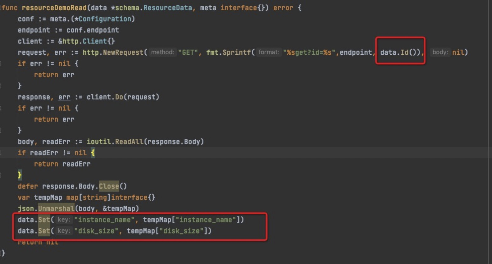

这里还是和 CREATE 方法是一样的，首先去构造 API 所需要的 http get 请求，这里通过 data.Id() 函数来获取到在 CREATE 方法中设定的资源唯一ID ,  之后通过ID去服务端进行查询。
查询到的结果值，使用 data.Set() 方法写到 terraform 的 tfstate 文件存储里面。 Terraform 会去做资源的状态保存，当你在本地去调用 terraform 的时候，每次创建成功，会将terraform 的创建的资源属性写入到当前目录下面的 terraform.tfstate 文件中，这里的 data.Set 就是将服务端查询到的属性写到本地做保存。

#### UPDATE 方法

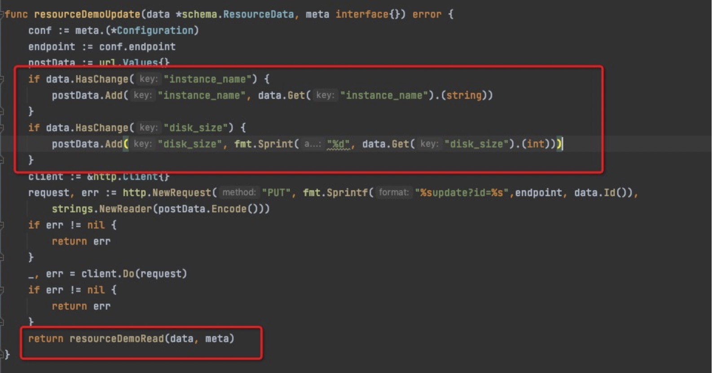

update 方法主要是当更新模版里面参数配置的时候, 再次执行apply , 此时terraform 会调用update 中所写逻辑，首先根据 data.HasChange 方法判断哪些参数进行了更新，从而获取到更新的参数值，之后调用服务端提供的PUT api 将服务端值更新，最后调用 READ 方法，把资源在服务端最新的信息查询回来，写回本地terraform.tfstate存储文件中。

#### DELETE 方法

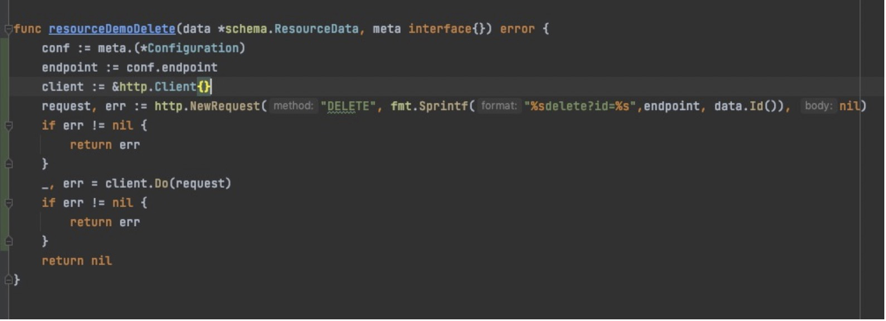

delete 方法 也是通过 data.Id() 获得资源的唯一id , 之后，通过该ID 调用服务端提供的 DELETE API 对资源进行删除。

### 小结

至此，我们一个 terraform 的 resource 就开发完成了，当然，一个完整的资源需要配套完整的单元测试，以及demo 和使用文档，这里我们主要介绍接触 resource 的开发，关于 datasource 以及 相关的单元测试大家可以通过官方文档去做一个详细的了解，后续的文章也会为大家进行更深入的介绍。