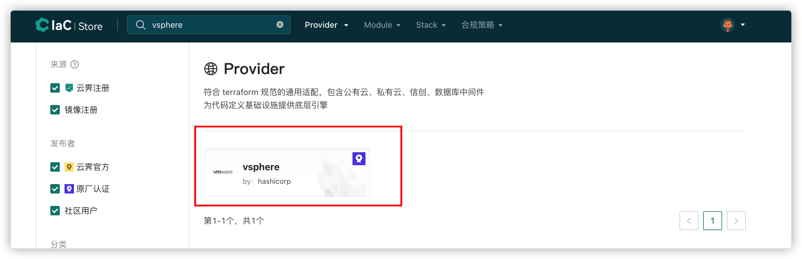
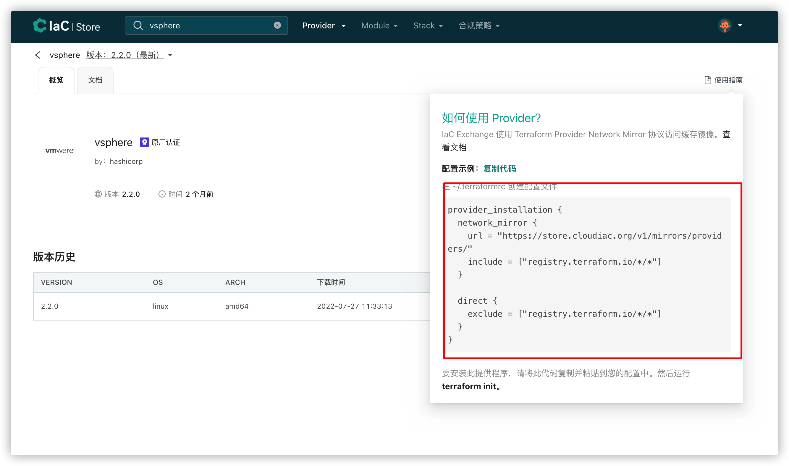
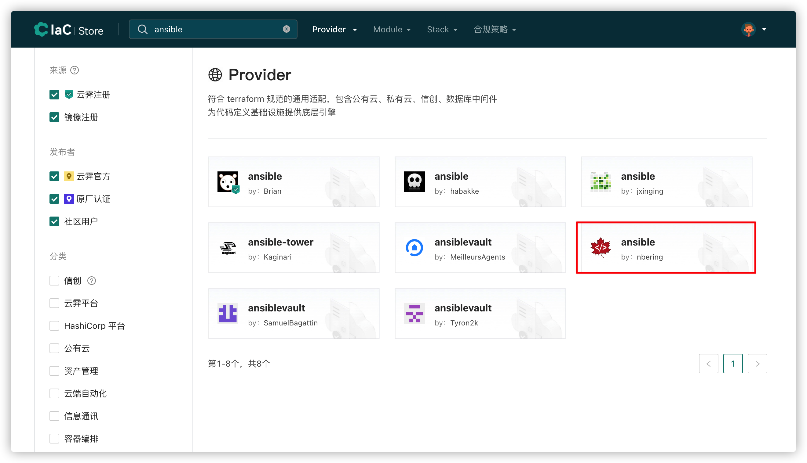
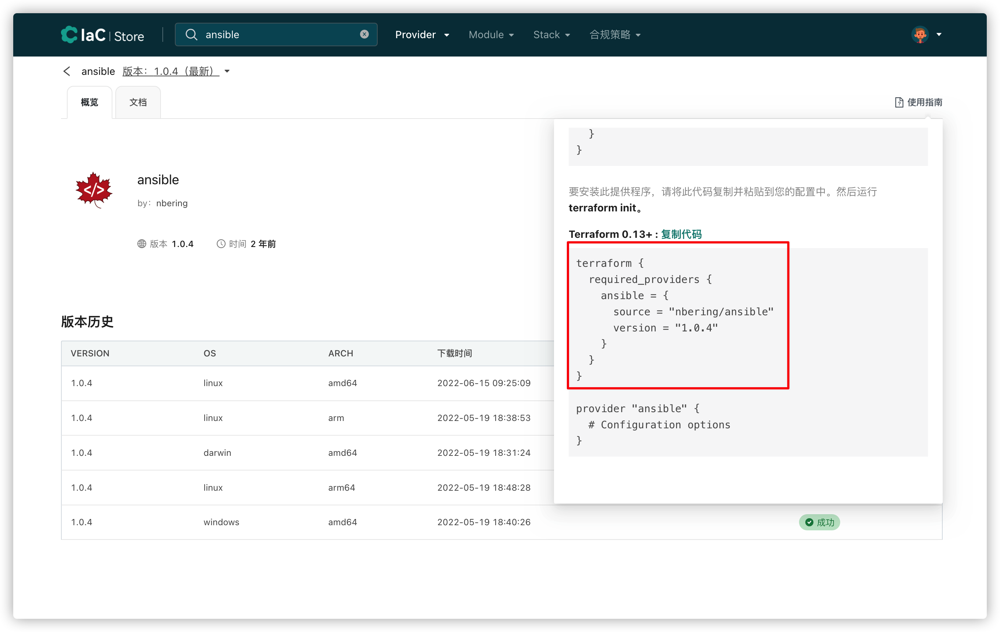
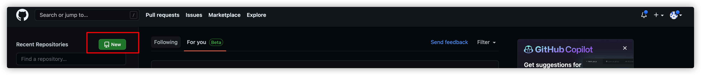
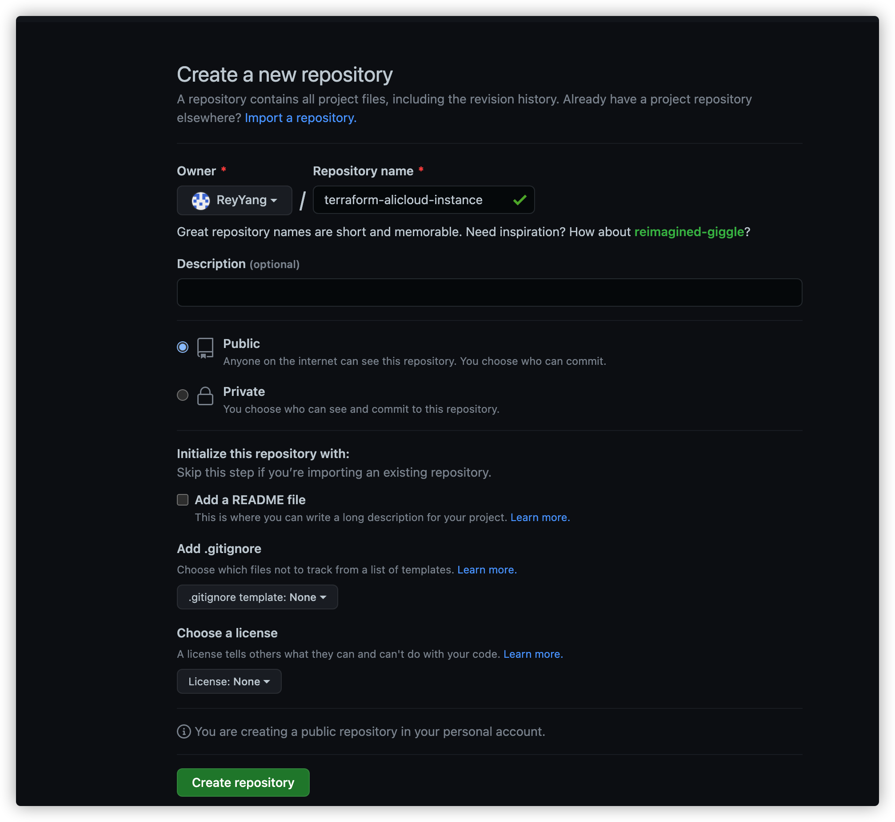
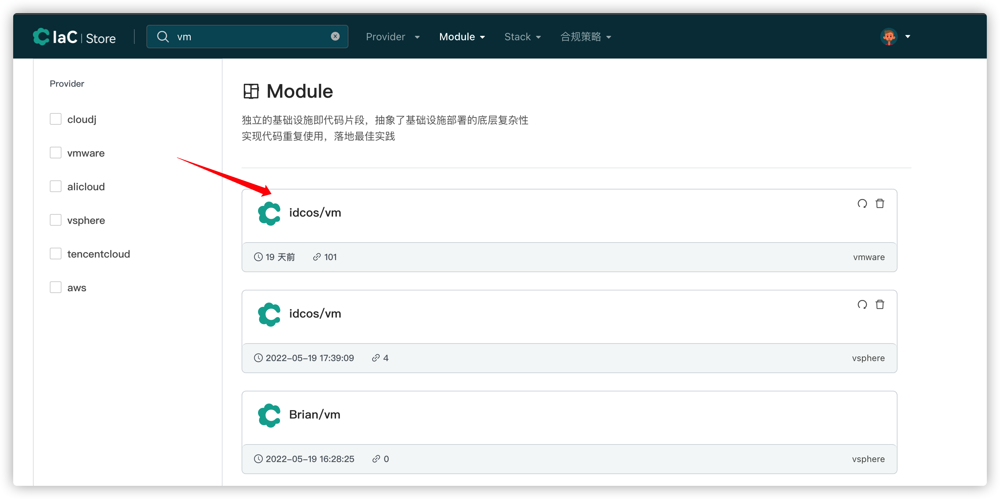
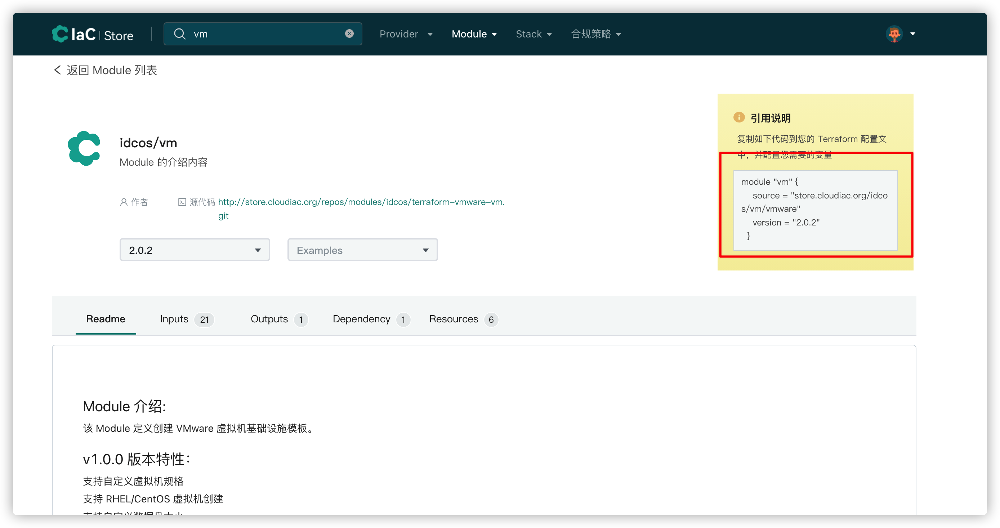
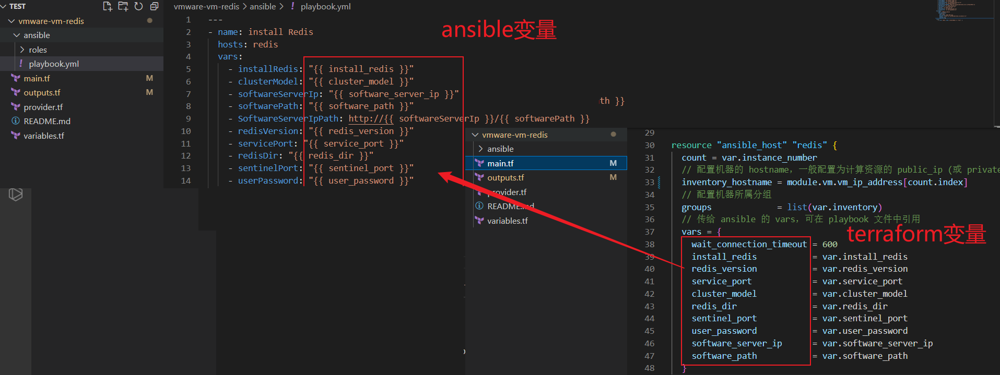

# Stack 编写
## Stack 简述

本教程中的概念适用于任何 Stack 开发流程。Stack 是代码定义的基础设施及软件最佳实践，实现应用一键部署，支持主流公有云、私有云、数据库、中间件和信创系统。通过引用 IaC Store 平台上的标准 Provider 和 Module 来完成用户需求场景的标准交付。

本教程将从零开始帮助大家开发一个可交付的 Stack，用一个完整的项目让大家理解 Stack 如何使用标准 Provider 和 Module 进行环境部署。


## 环境配置

### Terraform 配置：

Terraform 参考配置：https://www.terraform.io/downloads


## Stack 开发

以 VMWare 虚拟机安装 Redis 软件为例


### Terraform Provider配置

在 [Module 开发教程](./create-module.md)中介绍到 provider.tf 文件是指定依赖的 provider 及其适用版本。访问 IaC Store 平台将 vmware 和 ansible (通过 ansible 安装 redis 服务) 的 provider 引用信息填写到该文件中。

Store 平台：https://store.cloudiac.org

访问 Store 平台，搜索 vsphere provider,点击进入 provider 详情页，点击使用指南然后复制代码，将复制的代码填写到 provider.tf 文件









### 创建 GitHub 项目存放 Stack 代码

访问 [GitHub仓库](http://gitlab.idcos.com/iaccmptemplate) ，点击新建项目，填写项目名称（名称规范：基础设施提供商-资源名称），选择可见性级别为"公开"，勾选使用自述文件初始化仓库。





### 创建 provider.tf 文件

该项目引用了两个 provider，将两个 provider 的引用信息放在 provider.tf 文件中，整合后的格式如下:

```plain
# 本地克隆 GitLab 项目
$ git clone http://gitlab.idcos.com/iaccmptemplate/vmware-vm-redis.git
# 创建 provider.tf，填写以下内容，定义该 Stack 涉及的 provider 及其版本
$ cat provider.tf
terraform {
  required_providers {
    vsphere = {
      source  = "registry.cloudiac.org/hashicorp/vsphere"
      version = "2.0.2"
    }
    ansible = {
      source = "registry.cloudiac.org/nbering/ansible"
      version = "1.0.4"
    }
  }
}
```

## IaC Store 平台标准 Module 引用

### 创建 main.tf 文件

以 VMWare 虚拟机安装 Redis 软件演示项目包含虚拟机创建，IaC Store 平台已发布 vmware 虚拟机创建的 Module，此处直接引用 IaC Store 平台的 Module。

访问 [Store 平台](http://store.cloudiac.org)，点击『浏览 Module』，搜索 vm,点击进入 idcos/vm 详情页，查看『引用说明』，将复制的代码填写到 main.tf 文件。


查看 README.md 文件，在 main.tf 文件传入创建虚拟机所需要的参数,内容如下：

```plain
module "vm" {
  #本地路径可以使用同一项目中的子模块，无需下载相关代码即可使用。但每个云模板都要单独维护source源。
  # source                     = "./modules/vmware"
  #主推方式。将source 参数值设置为一个Git仓库源（仓库权限为公开）。支持SSH和HTTPS协议克隆仓库，无需重复维护source源
  source = "store.cloudiac.org/idcos/vm/vmware"
  version = "2.0.2"
  idc_code                   = var.idc_code
  datastore                  = var.datastore
  disk_label                 = var.disk_label
  scsi_controller            = var.scsi_controller
  data_disk_scsi_controller  = var.data_disk_scsi_controller
  data_disk_label            = var.data_disk_label
  data_disk_size_gb          = var.data_disk_size_gb
  thin_provisioned           = var.thin_provisioned
  eagerly_scrub              = var.eagerly_scrub
  domain                     = var.domain
  instance_name              = var.instance_name
  image                      = var.image
  ips                        = var.ips
  dns_server                 = var.dns_server
  netmask                    = var.netmask
  gateway                    = var.gateway
  cpu                        = var.cpu
  memory                     = var.memory
  network                    = var.network
  resource_pool              = var.resource_pool
  instance_number            = var.instance_number
}
```

### 创建 variables.tf 文件

CloudIaC 可以识别 variables.tf 文件，自动抽取该文件中的变量，提供 UI 页面传入环境创建所需变量值的功能。

在文件中声明 main.tf 创建虚拟机所需要的变量以及变量赋值（账号密码等敏感变量值只能通过 CloudIaC 传入，且声明为加密变量），内容如下：

```plain
variable "idc_code" {
    description = "(必填)数据中心"
    type = string
    default = "Datacenter-TEST"
}

variable "datastore" {
    description = "数据存储"
    type = string
    default = "datastore1"
}

variable "resource_pool" {
    description = "资源池"
    type = string
    default = ""
}

variable "instance_name" {
    description = "主机名称"
    type = string
    default = "example-01"
}

variable "network" {
    description = "网络"
    type = string
    default = "VM Network"
}

variable "image" {
    description = "操作系统"
    type = string
    default = ""
}

variable "domain" {
    description = "主机域"
    type = string
    default = "test.internal"
}

variable "cpu" {
    description = "虚拟机CPU配置"
    default = 2
}

variable "memory" {
    description = "虚拟机内存配置"
    default = 4096
}

variable "disk_label" {
    description = "系统盘标签"
    type        = list(any)
    default     = ["disk0"]
}


variable "data_disk_size_gb" {
    description = "数据盘大小列表"
    type = list
    default = ["10"]
}

variable "data_disk_label" {
    description = "数据盘标签"
    type = list
    default = []
}

variable "thin_provisioned" {
    description = "数据磁盘是否精简，默认是true"
    type = list
    default = null
}

variable "eagerly_scrub" {
    description = "数据磁盘空间是否清零"
    type = list
    default = null
}

variable "scsi_controller" {
    description = "系统磁盘控制器"
    type        = number
    default     = 0
}
variable "data_disk_scsi_controller" {
    description = "数据磁盘控制器"
    type        = list
    default     = []
}

variable "ips" {
    description = "虚拟机ip地址"
    type = string
    default = "10.0.200.203,10.0.200.204"
}

variable "netmask" {
    description = "子网掩码"
    type = string
    default = "16"
}

variable "gateway" {
    description = "网关"
    type = string
    default = "10.0.0.1"
}

variable "dns_server" {
    description = "DNS域名解析"
    type = list(string)
    default = ["10.0.0.1"]
}

variable "instance_number" {
    default = 2
    description = "创建实例数量，默认值为2台"
}
```

### 创建 outputs.tf 文件

在 outputs.tf 文件输出 Stack 的一些重要信息，此处输出了所有虚拟机的 IP 地址，内容如下：

```plain
output "vm" {
  value = module.vm.*.vm_ip_address
}
```


## Ansible Roles 开发

[ansible入门](./ansible-glide.md)

## Redis Roles 开发

```plain
# 创建 ansible 工作目录及 roles 存放目录
$ mkdir -p /root/ansible/roles 
# 切换到工作目录
$ cd /root/ansible
# 定义主机清单,在这两台 vmware 虚拟机安装 redis 服务
$ vim hosts
[redis]
192.168.100.145
192.168.100.147
# 使用 ansible-galaxy 命令初始化创建 redis roles 
$ ansible-galaxy role init redis --init-path roles/
# 通过include调用 redis_cluster.yml 的文件
$ vim roles/redis/tasks/main.yml
---
- include: redis_cluster.yml

# 在 redis_cluster.yml 文件中定义安装 redis 服务具体步骤
$ vim roles/redis/tasks/redis_cluster.yml
---
- name: 清理yum缓存
  shell: yum clean all
- name: 安装编译所需要的环境
  yum:
    name: "@Development Tools"
    state: present

- name: 创建管理用户所属组
  group:
    name: appgrp
    gid: 1000
    state: present

- name: 创建redis管理用户
  user:
    name: rtpapp
    uid: 1000
    groups: appgrp
    password: "{{ userPassword | password_hash('sha512') }}"
    shell: /bin/bash
    home: /userhome/rtpapp
    expires: -1

- name: 创建相关目录
  file:
    path: "{{ item }}"
    state: directory
    recurse: yes
    group: appgrp
    owner: rtpapp
    mode: 0755
  loop:
    - "{{ redisDir }}"
    - /approot/rtp-rcc/conf
    - /approot/rtp-rcc/data
    - /approot/rtp-rcc/pidfile
    - /applog/rtp-rcc/redis/logs
    - /appoper/pgmbak/rtp-rcc
    - /applog/nmon/logs

- name: 初始化sysctl
  lineinfile:
    path: /etc/sysctl.conf
    line: "{{ item }}"
  loop:
    - vm.overcommit_memory=1
    - vm.swappiness=1
    - net.core.somaxconn=2048
    - net.ipv4.tcp_max_syn_backlog=2048

- name: 初始化 rc.local
  lineinfile:
    path: /etc/rc.local
    line: "{{ item }}"
  loop:
    - echo never > /sys/kernel/mm/transparent_hugepage/enabled
    - echo never > /sys/kernel/mm/transparent_hugepage/defrag

- name: 初始化环境变量
  shell: "{{ item }}"
  loop:
    - echo 1 > /proc/sys/vm/swappiness
    - echo never > /sys/kernel/mm/transparent_hugepage/enabled
    - echo never > /sys/kernel/mm/transparent_hugepage/defrag
    - echo 2048 > /proc/sys/net/core/somaxconn
    - echo 2048 > /proc/sys/net/ipv4/tcp_max_syn_backlog
    - sysctl -p

- name: rc.local添加执行权限
  file:
    path: /etc/rc.d/rc.local
    mode: a+x 

- name: 下载redis安装包
  get_url:
    url: "{{ SoftwareServerIpPath }}/redis-{{ redisVersion }}.tar.gz"
    dest: "{{ redisDir }}/"
    mode: 0644
    force: yes
    validate_certs: no

- name: 解压redis安装包
  unarchive: 
    src: "{{ SoftwareServerIpPath }}/redis-{{ redisVersion }}.tar.gz"
    dest: "{{ redisDir }}/"
    remote_src: yes

- name: 编译安装redis
  make:
    chdir: "{{ redisDir }}/redis-{{ redisVersion }}"
    target: install
    file: "{{ redisDir }}/redis-{{ redisVersion }}/Makefile"
    params:
      PREFIX: "redis"

- name: 移除存量redis命令
  file:
    path: "{{ item }}"
    state: absent
  loop:
    - /usr/bin/redis-server
    - /usr/bin/redis-sentinel
    - /usr/bin/redis-cli
    - /usr/bin/redis-benchmark
    - /usr/bin/redis-check-aof
    - /usr/bin/redis-check-rdb

- name: 链接redis命令文件
  file:
    src: '{{ item.src }}'
    dest: '{{ item.dest }}'
    state: link
  with_items:
    - { src: "{{ redisDir }}/redis-{{ redisVersion }}/src/redis/bin/redis-server", dest: /usr/bin/redis-server }
    - { src: "{{ redisDir }}/redis-{{ redisVersion }}/src/redis/bin/redis-sentinel", dest: /usr/bin/redis-sentinel }
    - { src: "{{ redisDir }}/redis-{{ redisVersion }}/src/redis/bin/redis-cli", dest: /usr/bin/redis-cli }
    - { src: "{{ redisDir }}/redis-{{ redisVersion }}/src/redis/bin/redis-benchmark", dest: /usr/bin/redis-benchmark }
    - { src: "{{ redisDir }}/redis-{{ redisVersion }}/src/redis/bin/redis-check-aof", dest: /usr/bin/redis-check-aof }
    - { src: "{{ redisDir }}/redis-{{ redisVersion }}/src/redis/bin/redis-check-rdb", dest: /usr/bin/redis-check-rdb }

- name: 更改安装目录所有权
  file:
    path: "{{ redisDir }}"
    state: directory
    recurse: yes
    group: appgrp
    owner: rtpapp
    mode: 0755

- name: redis目录改名取消版本号
  copy:
    src: "{{ redisDir }}/redis-{{ redisVersion }}/"
    dest: "{{ redisDir }}/redis/"
    owner: rtpapp
    group: appgrp
    mode: 0755
    remote_src: yes

- name: 调整redis配置
  lineinfile:
    path: "{{ redisDir }}/redis/redis.conf"
    regexp: "{{ item.src }}"
    line: "{{ item.dest }}"
  loop:
    - { src: '^port 6379', dest: "port {{ servicePort }}" }
    - { src: "^bind 127.0.0.1", dest: "bind 0.0.0.0" }
    - { src: "^pidfile /var/run/redis_6379.pid", dest: "pidfile {{ redisDir }}/redis/redis.pid" }
    - { src: "^appendonly no", dest: "appendonly yes" }
    - { src: "^protected-mode yes", dest: "protected-mode no" }
    - { src: "^daemonize no", dest: "daemonize yes" }
    - { src: '^logfile ""', dest: 'logfile "{{ redisDir }}/redis/redis.log"' }
    - { src: '^logfile ""', dest: 'logfile "{{ redisDir }}/redis/redis.log"' }

- name: 配置主从模式
  lineinfile:
    path: "{{ redisDir }}/redis/redis.conf"
    line: 'slaveof {{groups["redis"][0]}} "{{ servicePort }}"'
  when: 
    - ansible_play_hosts.index(inventory_hostname) != 0
    - clusterModel  == "cluster" or clusterModel == "sentinel"

- name: 更改安装目录所有权
  file:
    path: "{{ redisDir }}"
    state: directory
    recurse: yes
    group: appgrp
    owner: rtpapp
    mode: 0755

- name: 启动redis服务
  become_user: rtpapp
  shell: "/usr/bin/redis-server {{ redisDir }}/redis/redis.conf"

- name: 配置哨兵模式参数
  lineinfile:
    path: "{{ redisDir }}/redis/sentinel.conf"
    regexp: "{{ item.src }}"
    line: "{{ item.dest }}"
  loop:
    - { src: '^port 26379', dest: "port {{ sentinelPort }}" }
    - { src: "^daemonize no", dest: "daemonize yes" }
    - { src: 'sentinel monitor mymaster 127.0.0.1 6379 2', dest: 'sentinel monitor mymaster {{groups["redis"][0]}} {{ servicePort }} 2' }
  when: clusterModel == "sentinel"

- name: 配置哨兵模式监听地址
  lineinfile:
    path: "{{ redisDir }}/redis/sentinel.conf"
    line: "bind 0.0.0.0"
  when: clusterModel == "sentinel"

- name: 启动哨兵
  become_user: rtpapp
  shell: "/usr/bin/redis-server {{ redisDir }}/redis/sentinel.conf"
  when: clusterModel == "sentinel"


# 创建 playbook.yml 文件引用 redis roles
$ vim playbook.yml
---
- name: install Redis
  hosts: redis
  vars:
    - installRedis: "{{ install_redis }}"
    - clusterModel: "{{ cluster_model }}"
    - softwareServerIp: "{{ software_server_ip }}"
    - softwarePath: "{{ software_path }}"
    - SoftwareServerIpPath: http://{{ softwareServerIp }}/{{ softwarePath }}
    - redisVersion: "{{ redis_version }}"
    - servicePort: "{{ service_port }}"
    - redisDir: "{{ redis_dir }}"    
    - sentinelPort: "{{ sentinel_port }}"
    - userPassword: "{{ user_password }}"
  pre_tasks:
    - name: 配置base yum仓库
      yum_repository:
        name: base
        description: BASE YUM repo
        baseurl: "http://{{ softwareServerIp }}/centos/7.5/"
        enabled: yes
        gpgcheck: no
  roles:
    - { role: redis, when: installRedis == "true"  }
 
# 在改roles中，暂未用到其他目录，先将其他目录删除
$ rm -rf roles/redis/{defaults,handlers,templates,.travis.yml,vars,tests,meta,files}

# 编辑 README.md 自述文件
$ vim roles/redis/README.md
该 roles 可以安装 redis 服务，支持单机，一主多从，哨兵三种模式。

使用方法：
如果使用该 roles ，需要对 tasks 步骤涉及的变量进行赋值，该 roles 安装 redis 依赖开发环境，
因此需要配置基础 yum 仓库，您可以在 playbook 的 pre_tasks 中添加以下任务：
  pre_tasks:
    - name: 配置base yum仓库
      yum_repository:
        name: base
        description: BASE YUM repo
        baseurl: "http://{{ softwareServerIp }}/centos/7.5/"
        enabled: yes
        gpgcheck: no
        
示例剧本:
---
- name: install Redis
  hosts: redis
  vars:
    - installRedis: "{{ install_redis }}"        # 是否安装 redis 服务，可选值为：true | false
    - clusterModel: "{{ cluster_model }}"        # redis 集群模式，可选值为：single|cluster|sentinel
    - softwareServerIp: "{{ software_server_ip }}"  # 存放 redis 软件介质的服务器ip
    - softwarePath: "{{ software_path }}"           # redis 软件介质在服务器的路径
    - SoftwareServerIpPath: http://{{ softwareServerIp }}/{{ softwarePath }}
    - redisVersion: "{{ redis_version }}"     # redis 版本
    - servicePort: "{{ service_port }}"       # redis 服务端口
    - redisDir: "{{ redis_dir }}"             # redis 安装路径
    - sentinelPort: "{{ sentinel_port }}"     # 哨兵模式服务端口
    - userPassword: "{{ user_password }}"     # redis 管理用户密码
  pre_tasks:
    - name: 配置base yum仓库
      yum_repository:
        name: base
        description: BASE YUM repo
        baseurl: "http://{{ softwareServerIp }}/centos/7.5/"
        enabled: yes
        gpgcheck: no
  roles:
    - { role: redis, when: installRedis == "true"  }
```

至此，完成 redis roles 开发，当前 roles 文件结构如下：

```plain
.
├── hosts
├── playbook.yml
└── roles
    └── redis
        ├── README.md
        └── tasks
            ├── redis_cluster.yml
            └── main.yml
```


## Stack 代码整合

### 代码整合

在第 3.2 节，我们引用 vmware 虚拟机的 Module 定义了两台虚拟机，作为 redis 安装对象。在 main.tf 通过ansible 的 provider 渲染生成 ansible playbook 的 inventory ，以及定义执行 redis roles 所需要的变量。

```plain
$ cat main.tf
module "vm" {
  #本地路径可以使用同一项目中的子模块，无需下载相关代码即可使用。但每个云模板都要单独维护source源。
  # source                     = "./modules/vmware"
  #主推方式。将source 参数值设置为一个Git仓库源（仓库权限为公开）。支持SSH和HTTPS协议克隆仓库，无需重复维护source源
  source = "store.cloudiac.org/idcos/vm/vmware"
  version = "2.0.2"
  idc_code                   = var.idc_code
  datastore                  = var.datastore
  disk_label                 = var.disk_label
  scsi_controller            = var.scsi_controller
  data_disk_scsi_controller  = var.data_disk_scsi_controller
  data_disk_label            = var.data_disk_label
  data_disk_size_gb          = var.data_disk_size_gb
  thin_provisioned           = var.thin_provisioned
  eagerly_scrub              = var.eagerly_scrub
  domain                     = var.domain
  instance_name              = var.instance_name
  image                      = var.image
  ips                        = var.ips
  dns_server                 = var.dns_server
  netmask                    = var.netmask
  gateway                    = var.gateway
  cpu                        = var.cpu
  memory                     = var.memory
  network                    = var.network
  resource_pool              = var.resource_pool
  instance_number            = var.instance_number
}

resource "ansible_host" "redis" {
  count = var.instance_number
  // 配置机器的 hostname，一般配置为计算资源的 public_ip (或 private_ip)
  inventory_hostname = module.vm.vm_ip_address[count.index]
  // 配置机器所属分组
  groups             = list(var.inventory)
  // 传给 ansible 的 vars，可在 playbook 文件中引用
  vars = {
    wait_connection_timeout = 600
    install_redis           = var.install_redis
    redis_version           = var.redis_version
    service_port            = var.service_port
    cluster_model           = var.cluster_model
    redis_dir               = var.redis_dir
    sentinel_port           = var.sentinel_port
    user_password           = var.user_password
    software_server_ip      = var.software_server_ip
    software_path           = var.software_path
  }
}
```

参数说明：

count  = var.instance_number ：定义 ansible 主机组存放的虚拟机数量。

groups = list(var.inventory) ：定义 ansible 主机组，在 ansible playbook 文件中指定该主机组。

inventory_hostname = module.vm.vm_ip_address[count.index] ：将 terraform 创建的虚拟机加入主机组中。

在 variables.tf 文件新增 ansible 变量的声明，内容如下：

```plain
$ vim variables.tf
variable "inventory" {
    description = "主机组名称"
    type = string
    default = "redis"
}

variable "software_server_ip" {
    description = "介质服务器IP"
    type = string
    default = "10.10.0.252"
}

variable "software_path" {
    description = "介质路径"
    type = string
    default = "soft/redis"
}

variable "install_redis" {
    description = "是否安装redis"
    type = string
    default = "true"
}

variable "redis_version" {
    description = "redis版本"
    type = string
    default = "5.0.7"
}

variable "service_port" {
    description = "redis服务端口"
    type = string
    default = "7001"
}

variable "cluster_model" {
    description = "redis集群模式"
    type = string
    default = "cluster"
}

variable "redis_dir" {
    description = "redis安装路径"
    type = string
    default = "/approot/redis"
}

variable "sentinel_port" {
    description = "哨兵模式端口"
    type = string
    default = "27001"
}

variable "user_password" {
    description = "redis管理用户密码"
    type = string
    sensitive   = true 
}
```

### Terraform 与 Ansible 变量传递流程

在 main.tf 文件中定义的 ansible_host 会在 ansible Inventory 文件中生成一条 host 记录，ansible_host 定义的 vars 会绑定到 Inventory 文件里的相应 host 记录。CloudIaC 执行环境部署时， 所选择的 playbook.yml 文件指定的主机组是 terraform 渲染的 inventory，ansible 便能引用 vars 中定义的 terraform 变量。



然后 CloudIaC 通过私钥免密登录到操作系统进行软件安装

### 创建 README.md 文件

最后创建 README.md 描述该 Stack 实现的场景，以及完成了哪些功能，内容如下：

```plain
### Stack 介绍:  
该 Stack 可以创建 RHEL/CentOS 操作系统类型的 VMware 虚拟机并安装和配置 Redis 服务。  

### v4.0.2 版本特性：   
支持自定义虚拟机规格  
支持 Redis 单机、集群、哨兵三种部署方式  
支持在 RHEL/CentOS 操作系统安装  

### 配置参考  
配置以下参数用于正常供给您的基础设施资源：  
- `idc_code` - (必填) 数据中心  
- `datastore` -（必填）数据存储  
- `resource_pool` - （必填）资源池  
- `network` - （必填）网络  
- `image` - （必填）操作系统  
- `data_disk_size_gb` - （必填）数据盘大小列表  
- `ips` - （必填）虚拟机ip地址  
- `netmask` - （必填）子网掩码  
- `gateway` - （必填）网关  
- `dns_server` - （必填）DNS域名解析  
- `data_disk_label` - （可选）数据盘标签  
- `thin_provisioned` - （可选）数据磁盘是否精简  
- `eagerly_scrub` - （可选）数据磁盘空间是否清零  
- `scsi_controller` - （可选）系统磁盘控制器  
- `data_disk_scsi_controller` - （可选）数据磁盘控制器  
- `domain` - （可选）主机域  
- `cpu` - （可选）虚拟机CPU配置  
- `memory` - （可选）虚拟机内存配置，单位MB  
- `disk_label` - （可选）系统盘标签  
- `instance_name` - （可选）主机名称  
- `instance_number` - （可选）创建实例数量  

为了安装和配置 Redis 服务，还必须设置以下变量：  
- `software_server_ip` - （必填）介质服务器IP  
- `software_path` - （必填）介质存放路径  
- `redis_version` - (必填) redis版本  
- `service_port` - （可选）redis服务端口  
- `cluster_model` - （必填）redis集群模式，默认cluster（主从模式），可选值：single、sentinel  
- `user_password` - （必填）redis管理用户密码  
- `redis_dir` - （可选）redis安装路径  
- `sentinel_port` - （可选）哨兵模式端口  

只要设置了上述变量赋值，您应该可以使用 vSphere 6.5、6.7、7.0 环境进行虚拟机创建和 `Redis` 安装和配置。  

在 CloudIaC 平台使用 `Stack` 请查阅：https://www.cloudiac.org/markdown/docs/
```

至此，完成了在vmware虚拟机安装 Redis 服务场景的 Stack 开发。此时 Stack 文件结构如下：

```plain
.
├── ansible                            # ansible 相关资源目录(可选)
│   ├── playbook.yml                   # ansible playbook文件
│   └── roles                          # ansible 角色存放目录
│       └── redis                      # ansible playbook文件引用的角色
│           ├── README.md              # roles 自述文件
│           └── tasks
│               ├── main.yml
│               └── redis_cluster.yml
├── main.tf                            # terraform 主配置文件(必选)
├── outputs.tf                         # terraform output 变量定义(必选)
├── README.md                          # Pack自述文件(必选)
├── variables.tf                       # terraform input 变量定义(必选)
└── provider.tf                        # 指定依赖的 providers 及其版本(必选)
```


## 上传 Stack 代码到 GitHub 项目

```plain
git add -A
git tag -a v1.0.0 -m 'v 1.0.0'
git commit -m "vmware-vm-redis v1.0.0"
git push -u origin master v1.0.0
```


## 参考资料：

Stack 开发规范：https://idcos.yuque.com/uvgdau/hzt3g8/pu8x2i

Stack 内容规范：https://idcos.yuque.com/uvgdau/hzt3g8/ltb9dz

Ansible中文权威指南：http://www.ansible.com.cn/index.html