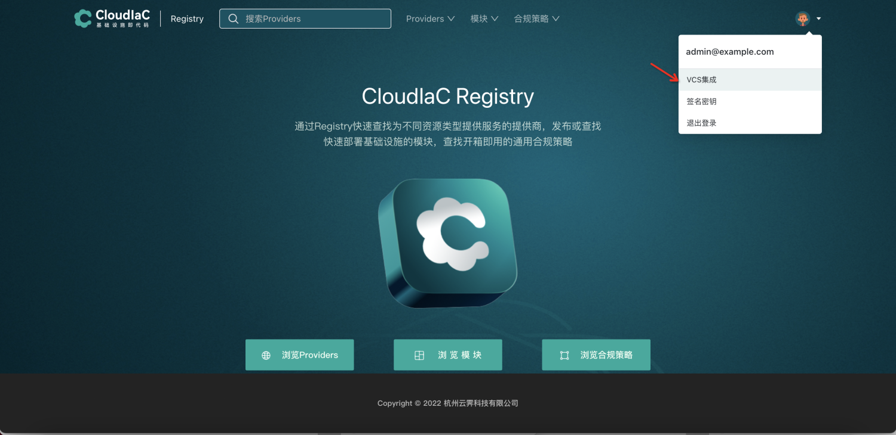
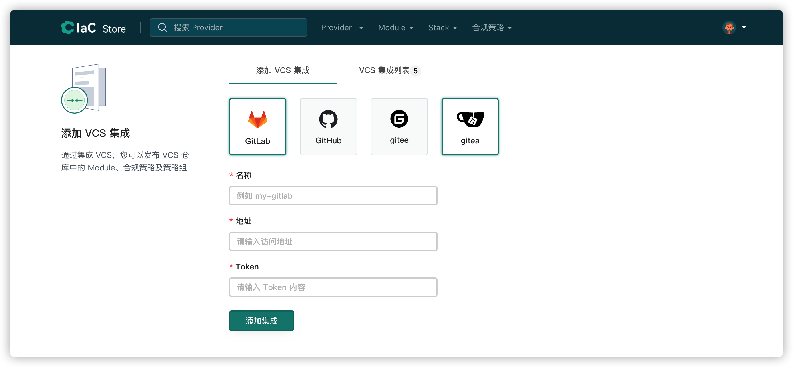

# VCS集成
## 添加 VCS
**登录 IaC Store 以后，选择 VCS 集成**

{.img-fluid}

如果是首次登录，则要求输入命名空间。

tips：命名空间相当于用户的存储空间，使用 IaC Store 发布的 provider,module，策略组将会存放在命名空间中，

如果要使用发布 provider 功能，则必须额外提供 GPG 签名密钥，有关 GPG 签名密钥的获取，请参考[GPG签名密钥的获取](#gpg)

{.img-fluid}

**选择对应的 VCS，输入 VCS 名称，VCS 地址，Token，点击添加集成，添加后可在 VCS 集成列表中查看已添加的 VCS**

{.img-fluid}
tips：如果选择 GitHub 或者 gitee，则地址为默认地址即可，不需要变更，

如果选择 GitLab 或者 gitea，因为是内网系统，则需要输入对应的内网网址

Token 为对应 VCS 平台的私人令牌，各平台 Token 的获取请参考[token获取](../manual/vcs-token.md)
