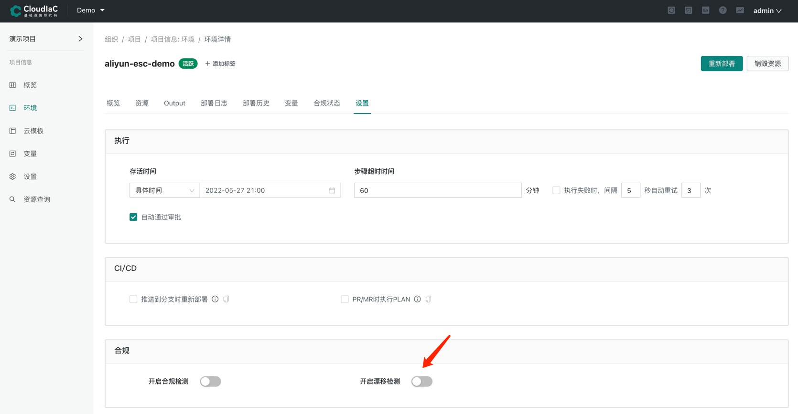
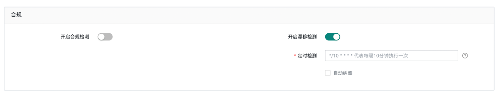
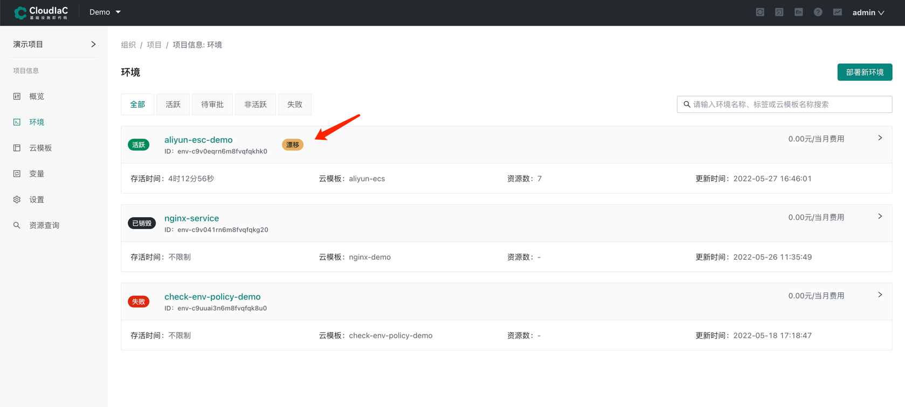
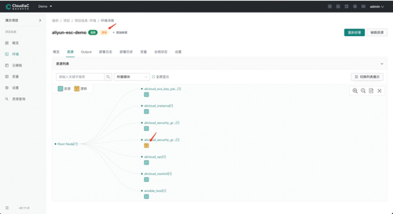
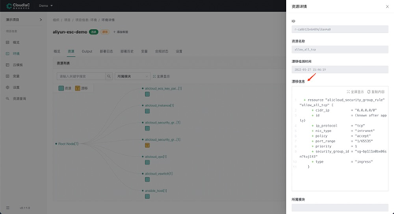

# 环境资源漂移检测

:::tip
场景描述:
场景一：在多人管理同一套环境资源时，管理员 A 在控制台对该环境的资源做了某些变更，而其他管理员并不了解该变更的发生，比如删除了安全组内某条规则，导致网络连接不通等；
场景二：环境内资源因误操作等原因被关闭或被销毁，此时与环境模板里定义的资源产生了差异。
:::

针对以上描述的类似场景，通过 CloudIaC 提供的环境漂移检测功能，可以及时发现环境资源的变更，并以可视化的方式在环境资源图中进行展示，下面我们介绍如何在环境中配置打开漂移检测功能

## 开启漂移检测
在环境详情-设置-合规这一栏『开启合规检测』

开启时需要配置一个 cron 定时任务的表达式，可以根据环境的使用情况设置一个合理的轮循时间，合规检测开启后将以后台任务的方式轮循发起检查

## 漂移展示
当后台漂移检测任务发现环境资源发生漂移时，会将漂移的资源及属性进行记录，此时在环境列表、环境详情页面均可以看到环境的当前状态中标记为『漂移』

## 自动纠正漂移
漂移检测还提供『自动纠正漂移』功能，该功能实际是对环境执行了一下 apply 操作，会将检测到的漂移按照Stack中以及环境传入的变量进行重新部署，部署完成后将恢复到该环境定义的目标状态。

:::warning
自动纠正漂移功能因为会对带外所做的变更进行恢复，请在完全了解该环境使用场景的情况下谨慎启用该功能
:::

