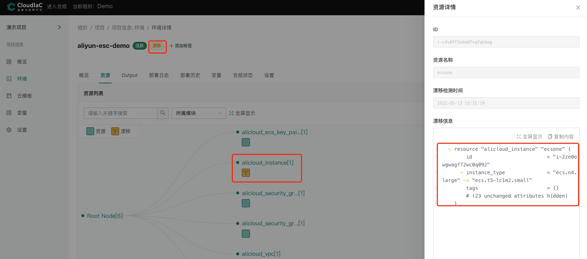
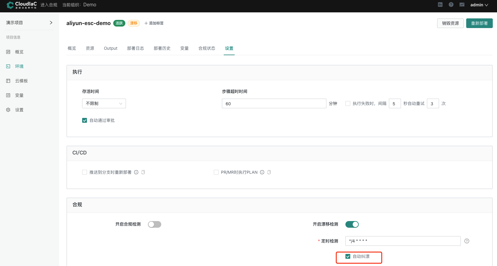
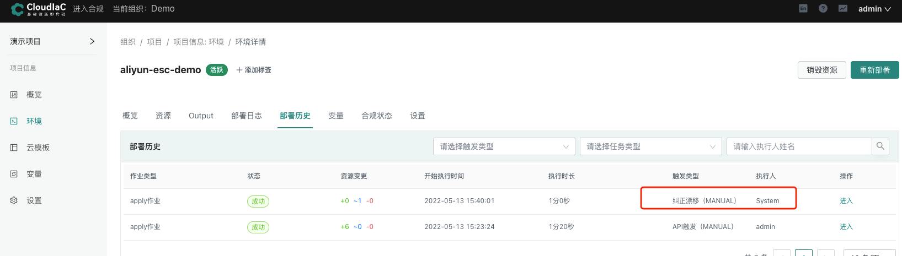

# 资源漂移检测

:::tip
场景描述:初始创建阿里云ESC资源为 1 vCPU 2 GiB,当应对突发流量新增时,
在阿里云控制台手动对资源进行扩容为 2  vCPU 4 GiB,此时可以通过cloudiac开启漂移检测监控资源信息变更,
当度过流量高峰服务恢复平稳时,
可对资源进行自动纠偏恢复为 1 vCPU 2 GiB
:::

## 当前ECS实例信息

阿里云后台ESC规格信息

##  开启漂移检测

## 阿里云控制台修改实例规格

## 漂移检测信息

## 自动纠偏
:::warning
自动纠偏可使环境恢复到云模板定义资源状态
请在需要资源恢复到云模板定义状态时使用
:::

### 纠偏信息

### 阿里云控制台信息

以上就是cloudiac可检测资源信息变更,同时提供恢复变更资源的整个生命周期

