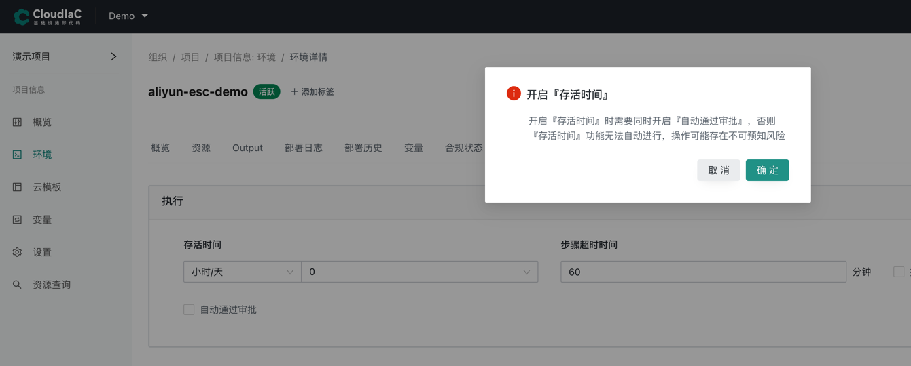
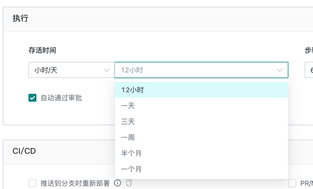
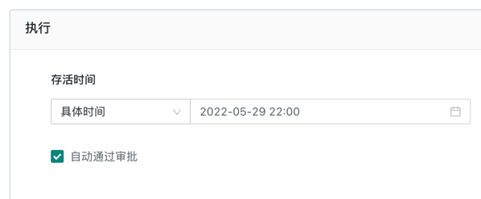
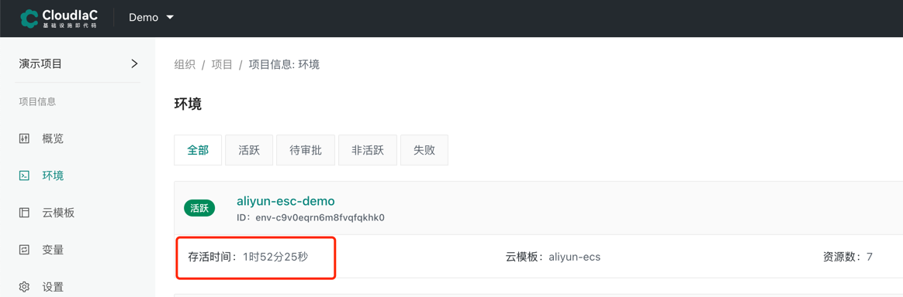
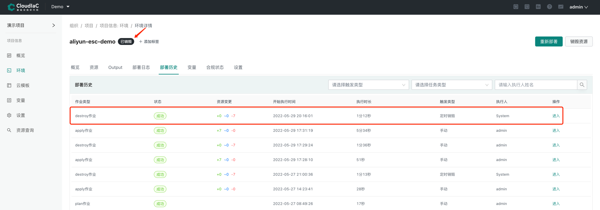
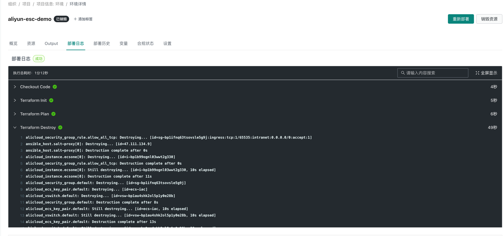

# 环境自动销毁
在环境的使用过程中，经常遇到临时申请一套环境的情况，比如基于某个历史版本部署一套测试环境用于复现并排查、修复问题，在问题修复后该套环境即可进行销毁；又或者是某些临时环境短时间用完后就不再使用，而往往这种临时环境实际使用人用完之后并没有通知环境管理员进行销毁 ，导致这些临时环境一直存活，占用资源且产生不必要的费用。

针对这种情况，CloudIaC 对环境提供了存活时间管理，可以设置环境相对或绝对存活时间，在存活时间到期后则自动进行环境资源的销毁，从而释放临时资源并节约费用。

## 环境存活时间
环境的存活时间可以在部署环境时设置，也可以在环境创建之后进行设置

环境存活时间可设置相对存活时间和绝对存活时间
### 相对存活时间
相对存活时间是从设置并保存时开始计算，可在若干小时、若干天之后进行环境的自动销毁动作，因为自动销毁是后台触发的自动任务，在开启存活时间配置时会提示需要勾选『自动通过审批』，否则自动销毁操作会卡在审批这个环节

### 绝对存活时间
绝对存活时间是设置一个固定的时间，在到达这个时间点时自动触发环境资源销毁操作

## 自动销毁
环境存活时间设置成功后，在环境列表和环境详情中将以倒计时的方式显示该环境的剩余存活时间

在存活时间到期后，系统将自动发起该环境的自动销毁动作，在『部署历史』中可以看到该任务的执行情况

