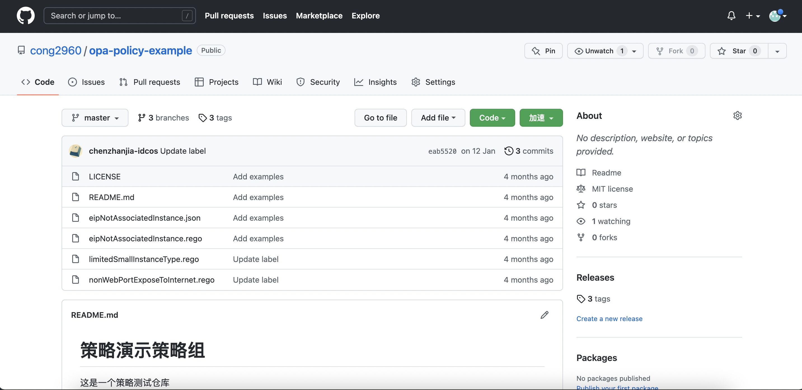
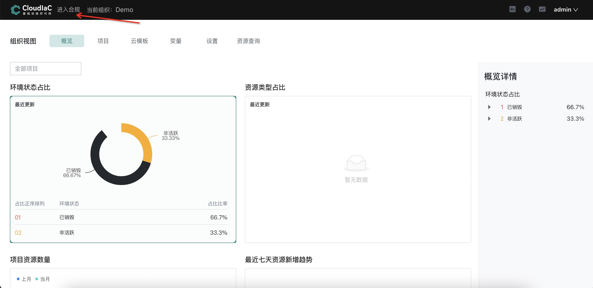
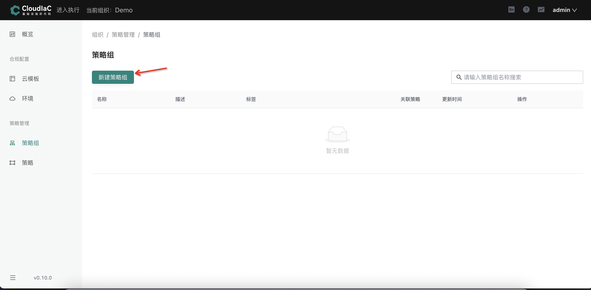
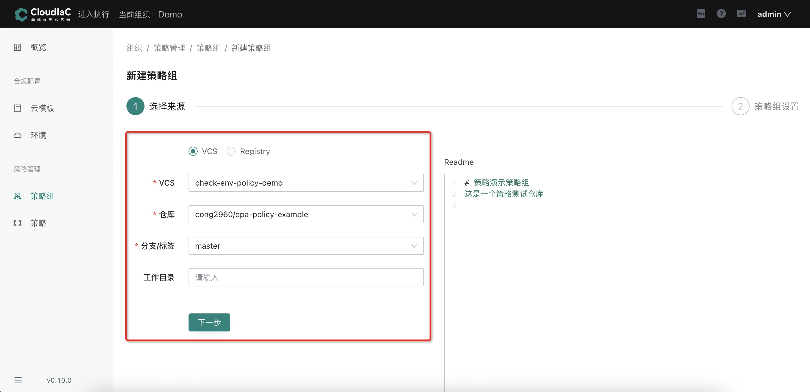
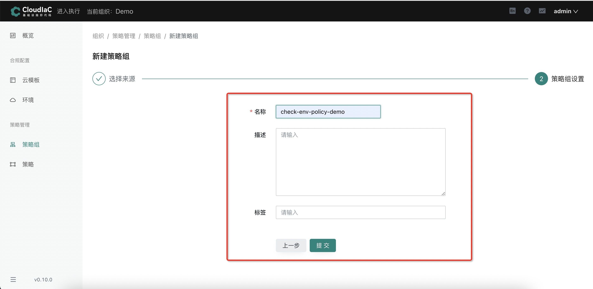

# 使用自定义合规策略

## 场景描述

在使用 cloudiac 中的策略组功能时，如果内置的策略组或者 IaC Store 中的策略组不满足您的需求，您可自行编写合规策略，并上传到代码仓库中，即可在 cloudiac 中使用您仓库中的合规策略

## 场景示例

在 CloudIaC 中，集成了 OPA 引擎，使用 Rego（声明式语言）来定义策略规则，一条合规策略对应一个 rego 文件，若干个 rego 文件组成一个策略组；

跟Stack一样，我们通过 VCS 来管理策略组，一个策略组对应一个代码仓库，该仓库下的若干 rego 文件即代表若干条合规策略。

有关合规策略的具体编写方法，请参考[Policy Language](https://www.openpolicyagent.org/docs/latest/policy-language/)

### 创建策略组

进入系统页面后，选择【进入合规】

选择菜单【策略管理】下的【策略组】，点击【新建策略组】按钮

先选择【VCS】，再选择其中需要新建的【VCS】、【仓库】、【分支】、【工作目录】(可选)，点击【下一步】

可以配置策略组的【名称】，【描述】(可选)和【标签】(可选)。配置之后点击【提交】按钮。

