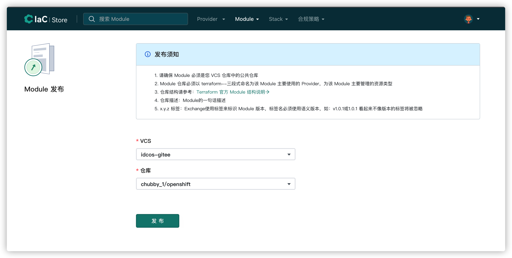

# Module发布

## 准备 Module

### Module规范

- 请确保 Module 必须是您 VCS 仓库中的公共仓库
- Module仓库必须以 terraform--三段式命名为该 Module 主要使用的 Provider，为该 Module 主要管理的资源类型
- 仓库结构请参考：[Terraform官方模块结构说明](https://www.terraform.io/registry/modules/publish)
- 仓库描述：Module 的一句话描述
- x.y.z 标签：IaC Store 使用标签来标识 Module 版本，标签名必须使用语义版本，如：v1.0.1或1.0.1 看起来不像版本的标签将被忽略

以 terraform-alicloud-vpc 为例：[https://github.com/terraform-alicloud-modules/terraform-alicloud-vpc](https://github.com/terraform-alicloud-modules/terraform-alicloud-vpc)

## 发布module

### 集成VCS

参考 [VCS集成](../cases/create-vcs.md)

**注意：VCS 集成时请使用您自己的 VCS 平台**

### 发布 Module

**必填参数：VCS，代码仓库，输入完毕后，点击发布**

发布后的 Module 可在 IaC Store 查看