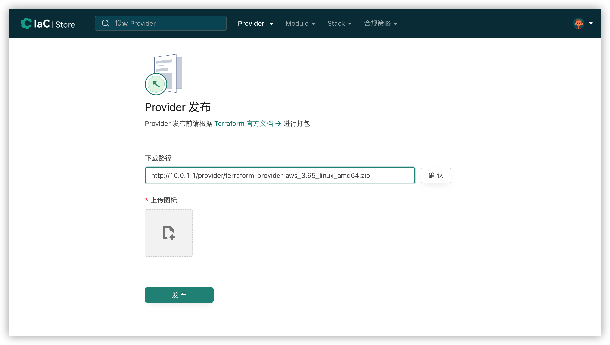

# provider发布

## 构建provider
构建provide前，需要准备以下环境:

- [Terraform](https://www.terraform.io/downloads.html) 0.12.x
- [Go](https://golang.org/doc/install) 1.17 (to build the provider plugin)

以 terraform-provider-http 演示：[https://github.com/hashicorp/terraform-provider-http](https://github.com/hashicorp/terraform-provider-http)

### clone 仓库

```
$ mkdir -p $GOPATH/src/github.com/terraform-providers
$ cd $GOPATH/src/github.com/terraform-providers
$ git clone git@github.com:terraform-providers/terraform-provider-http
```

### build provider

```
$ cd $GOPATH/src/github.com/terraform-providers/terraform-provider-http
$ make build
```


## 打包provider

### 生成GPG密钥

参考[获取签名密钥](../cases/create-gpg-key.md)

### 添加GPG密钥到namespace

参考[添加签名密钥](../cases/add-gpg-key.md)

**注意：添加签名密钥时请将签名密钥换成自己的**

### 打包zip文件并生成SHA256SUMS文件

编译打包 provider zip 包，并生成SHA256SUMS文件,执行以下命令
```
1. 首先，将代码编译成二进制可执行文件。
GOOS=darwin GOARCH=amd64 go build -o terraform-provider-{$NAME}_v{$VERSION}

2. 将第一步生成的二进制可执行文件打包成压缩包
zip terraform-provider-{NAME}_{VERSION}_{OS}_{ARCH}.zip terraform-provider-{$NAME}_v{$VERSION}

3. 生成SUMS文件
shasum -a 256 *.zip > terraform-provider-{NAME}_{VERSION}_SHA256SUMS

4. 使用上面生成的 GPG 密钥对 SHA256SUMS 文件进行签名:
gpg -u "$GPG_EMAIL" --detach-sign terraform-provider-${NAME}_${VERSION}_SHA256SUMS


如果想发布的provider在多个平台可用，build 不同平台可执行文件，并且分别打包：
如下生成linux 和 windows 平台的可执行文件，重复1，2步，讲这些二进制文件分别打到不同的压缩包中。
GOOS=windows GOARCH=amd64 go build -o terraform-provider-{$NAME}_v{$VERSION}.exe
GOOS=linux GOARCH=amd64  go build -o terraform-provider-{$NAME}_v{$VERSION}
```
### 打包 docs (可选):

[terraform docs 规范文档](https://www.terraform.io/docs/registry/providers/docs.html)

docs 编写完成后打为 zip 包：zip terraform-provider-${TYPE}_${VERSION}_docs.zip -r docs

此时目录中的文件列表如下(cloudiac_1.0.0 为示例):

```bash
terraform-provider-cloudiac_1.0.0_docs.zip
terraform-provider-cloudiac_1.0.0_linux_amd64.zip
terraform-provider-cloudiac_1.0.0_linux_386.zip
terraform-provider-cloudiac_1.0.0_SHA256SUMS
terraform-provider-cloudiac_1.0.0_SHA256SUMS.sig
```

## 发布provider

### 将打包好的 Provider 上传到服务器

将上一步生成的所有 zip 文件、SHA256SUMS 文件和 SHA256SUMS.sig 文件上传到任意 http 服务器，

保证上传后我们可以通过类似下面的 url 下载文件:  

https://static.example.org/providers/cloudiac/1.0.0/terraform-provider-cloudiac_1.0.0_linux_386.zip


### 登录 registry 执行发布:

**必填参数：下载路径，图标**




下载路径可以是 zip 包或者是 SHA256SUMS 文件，如果下载路径是 SHA256SUMS 文件则会发布文件中包含的所有 zip 包,
如果下载路径同目录下有 terraform-provider-${TYPE}_${VERSION}_docs.zip 文件，则在发布时也会同时下载 docs 并解析生成 provider 文档，生成的文档可以在 registry 平台查看
