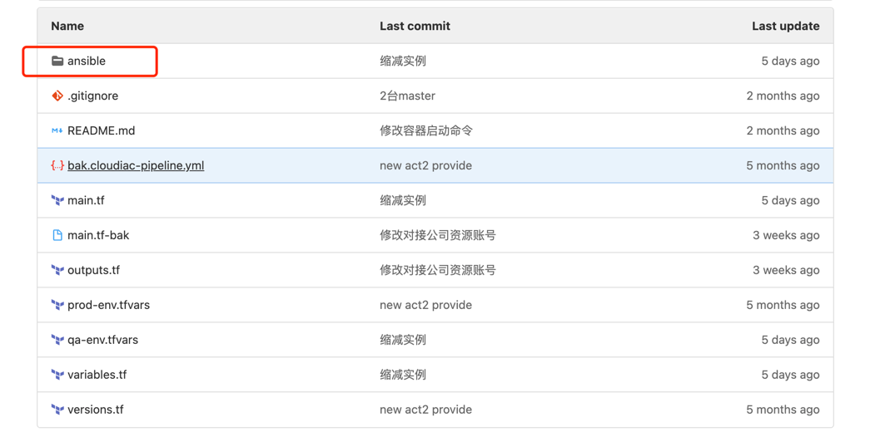
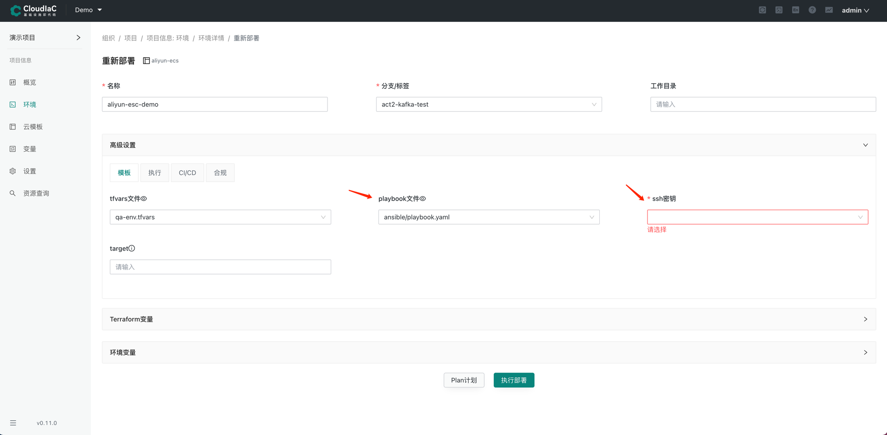

# 在环境资源中部署应用

CloudIaC 的云模板除了用于环境资源的创建，还可以通过引入 ansible provider 来映射资源与应用的关系，既而在部署环境时通过引用 playbook 来触发执行 ansible 实现部署应用的目的。

## 云模板中建立 ansible_host
在云模板中，通过引入 ansible provider，建立资源与应用分组的关系映射。
```terraform
resource "ansible_host" "salt-proxy" {
  count = 1

  // 配置机器的 hostname，一般配置为计算资源的 public_ip (或 private_ip)
  inventory_hostname  = alicloud_instance.ecsone[count.index].public_ip

  // 配置机器所属分组
  groups = ["salt-proxy"]

  // 传给 ansible 的 vars，可在 playbook 文件中引用
  vars = {
    wait_connection_timeout   = 60
    proxy_private_ip          = alicloud_instance.ecsone[count.index].private_ip
    proxy_docker_tag          = var.proxy_docker_tag
  }
}
```

## 编写 playbook
编写好应用部署的 ansible playbook，并将 playbook 文件放入云模板仓库的 ansible 目录中。


## 添加 ssh 密钥
ansible 通过 ssh 来连接服务器资源实现应用部署，那么我们在部署环境时则需要通过选择相应的 ssh 密钥来进行服务器的远程连接；

CloudIaC 提供 ssh 密钥管理功能，可以在组织中添加 ssh 密钥，以支持 playbook 的执行；

CloudIaC 不生成密钥，只支持添加己生成的 ssh 私钥，私钥可以是您手动生成，或者在云平台创建后导出；

为了能进行 ssh 认证，需要在创建计算资源时绑定对应的公钥；同时，为计算资源绑定公钥通常需要先在云商创建 ssh 密钥对，以上过程需要您通过云模板进行配置或者手动创建。

在组织中找到设置,点击添加密钥,注意这里添加是的上面生成的id_rsa私钥
{.img-fluid}

## 部署应用
部署环境时在『高级设置』中选择相应的 playbook 文件，同时选择用于 ssh 连接的密钥，即可在资源创建后执行 ansible 进行应用部署。

