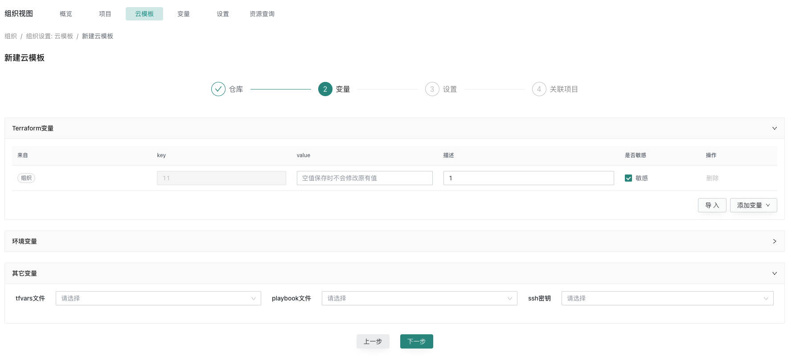
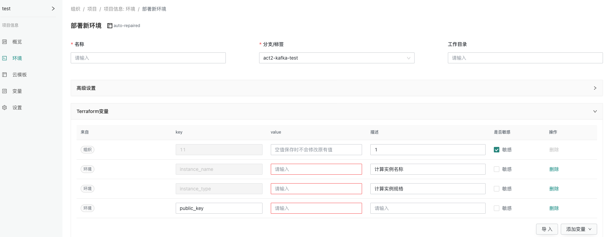
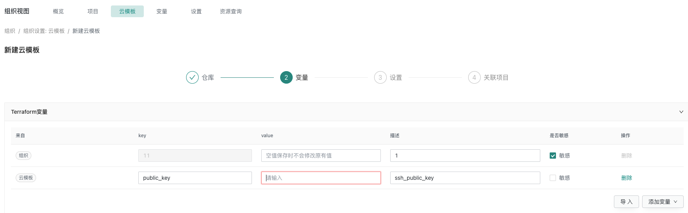

# 添加ssh密钥

cloudiac 提供 ssh 密钥管理功能，可以在组织中添加 ssh 密钥，以支持 playbook 的执行。

cloudiac 不生成密钥，只支持添加己生成的 ssh 私钥。私钥可以是您手动生成，或者在云商平台创建后导出。

因为使用 ssh 连接执行 playbook，所以若环境配置了 playbook 时，则必须为其配置 ssh 密钥。

为了能进行 ssh 认证，需要在创建计算资源时绑定对应的公钥；同时，为计算资源绑定公钥通常需要先在云商创建 ssh 密钥对，以上过程需要您通过云模板进行配置或者手动创建

## 生成ssh密钥
```shell
#指定邮箱
ssh-keygen -t rsa -b 4096 -C "someone@sina.com"
#在 .ssh目录下会有公钥和私钥存在
#id_rsa (私钥)
# id_rsa.pub（公钥）
```

## 在组织中添加ssh私钥
在组织中找到设置,点击添加密钥,注意这里添加是的上面生成的id_rsa私钥
{.img-fluid}


## 创建资源选择ssh私钥

### 方式一 创建云模板的时候,选择添加ssh私钥
{.img-fluid}

### 方式二 部署环境的时候,选择添加ssh私钥
{.img-fluid}

## 添加公钥
### 方式一 部署环境添加公钥
部署新环境,找到terraform变量,选择导入或者添加变量,输入云模板中定义的公钥变量名和对应的公钥内容id_rsa.pub,如变量public_key作为公钥变量
{.img-fluid}

### 方式二 创建云模板的时候添加公钥
创建云模板,找到terraform变量,选择导入或者添加变量,输入云模板中定义的公钥变量名和对应的公钥内容id_rsa.pub,如变量public_key作为公钥变量
{.img-fluid}