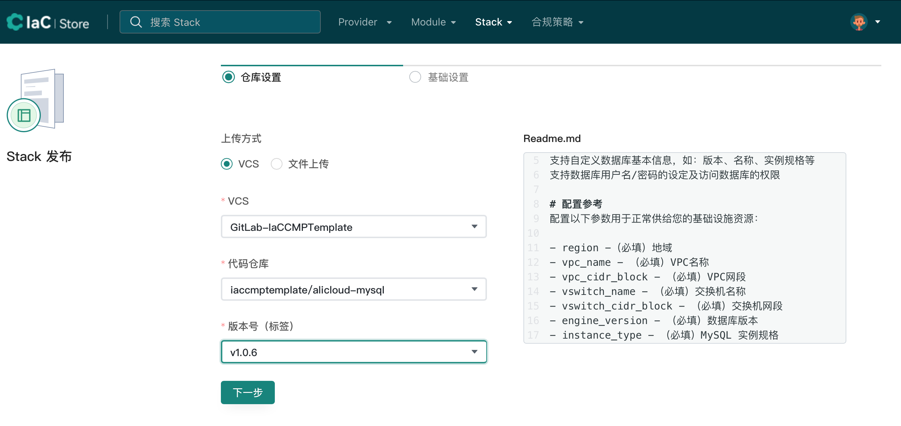
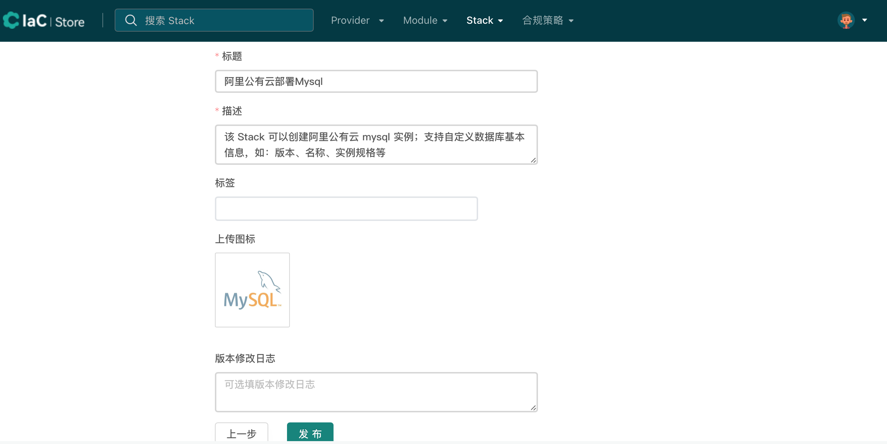

# stack发布

## 准备stack

### stack规范

- 仓库命名规则应遵循『基础设施提供商』-『应用』的形式，并且命名必须全为小写字母，之间使用『-』连接
- 请确保代码存放必须是『VCS仓库中的公共仓库』
- 标签规范：IaC Store使用标签来标识Stack版本，标签名必须使用语义版本，如：『v1.0.1』，不符合标签规范的将自动被忽略
- 发布Stack时需要一句话描述该Stack用途，尽量『言简意赅』
- 上传图标时，先检查『内置图标』是否有对应的『应用图标』，有则选择『内置的应用图标』，没有则检查『内置图标』是否有对应的『基础设施提供商图标』，有则选择『内置的基础设施提供商图标』，没有则『自定义图标』。『建议』优先上传应用图标

## 发布stack

### 集成vcs

参考[vcs集成](./create-vcs.md)

### 发布stack

#### 使用代码仓库方式发布

- 选择VCS
- 代码仓库
- Tag

点击『下一步』

- 标题
- 描述
- 标签
- 上传图标

点击『发布』

发布后的stack可在IaC Store查看

