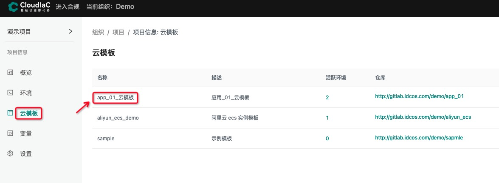
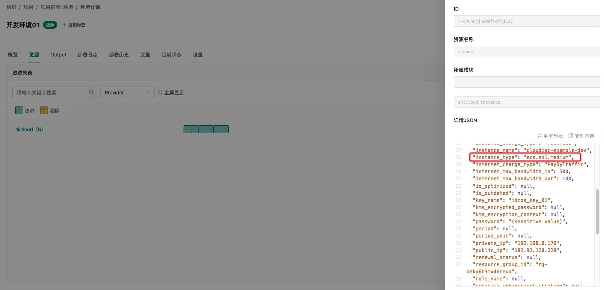

## 通过 tfvars 文件预定义变量

### CloudIaC 向环境传递 terraform 变量

在 CloudIaC 中, 用户可以通过同一套云模板创建出多个环境; 而在部署环境之前, 用户还可以向环境传递变量从而覆盖已有的 terraform 变量, 这样灵活的修改环境的规格属性从而创建出不同的实例资源(本次修改仅在本次创建实例时生效);

### CloudIaC 传递 terraform 变量的几种方法

#### 1. 环境部署时, 在「高级设置」中选择不同的 tfvars 文件;

用户可以在 VCS 仓库中, 将不同的 terraform 变量分别写入到不同的 tfvars 文件中(这通常适合有大量 terraform 变量需要临时选择的场景); 


#### 2. 环境部署时, 在 「terraform 变量」 一栏的右下角选择「添加变量」;

部署环境之前, 用户通过「添加变量功能」, 可以将云模版中预先定义好的 terraform 变量导入, 然后在在表单中修改其 value (这通常适合需要改动少量 terraform 变量的场景);


#### 3. 同时采用以上两种方式

当 terraform 变量较多时, 可以根据不同的场景将 terraform 变量进行分组, 保存为不同 tfvars, 这样用户在使用时, 可以针对不同的使用场景在环境部署前进行导入;  
同时在本次部署环境时, 用户也可以使用「导入变量」功能修改特定的 terraform 变量;

:::note 关于变量优先级
如果 tfvars 与「导入变量」出现同名变量, tfvars 将会拥有更高的优先级;
:::

### 本篇案例说明

本实例主要演示 tfvars 的使用, 我们会定义两个不同的 tfvars 文件( ***dev.tfvars*** 和 ***prod.tfvars***，它们分别用于开发环境和生产环境部署，其中使用的 vpc、实例规格等都不同);
然后基于同一套云模版, 使用不同 tfvars 创建出不同规格的环境实例;  

> 说明: 本次使用阿里云的资源账号, 每个部署环境都拥有一台阿里云 ecs; 

### 云模版展示

```bash
# 使用 VCS 仓库叫做 「aliyn_ecs」, 顾名思义这是一个用于创建阿里云 ecs 的代码仓库;
$ cd aliun_ecs && tree .
/USERS/NO.074/CODE/IAC_TF/ALIYUN_ECS
├── .gitignore
├── README.md
├── dev.tfvars
├── main.tf
├── outputs.tf
├── prod.tfvars
├── variables.tf
└── versions.tf
```

### dev.tfvars 内容

```terraform
# 开发环境配置
zone = "cn-beijing-c"

instance_name = "cloudiac-example-dev"
# 2c4g
instance_type = "ecs.sn1.medium"

vpc_name = "vpc-cloudiac-example-dev"
sg_name = "sg-cloudiac-exapmle-dev"
cidr_block = "192.168.0.0/24"
```

### prod.tfvars 内容

```terraform
# 生产环境配置
zone = "cn-beijing-c"

instance_name = "cloudiac-example-prod"
# 1c1g
instance_type = "ecs.n2.small"

vpc_name = "vpc-cloudiac-example-prod"
sg_name = "sg-cloudiac-example-prod"
cidr_block = "10.1.0.0/16"
```

### 创建一个云模板

基于「aliyn_ecs」 vcs 创建一个「app_01_云模板」的模板;



### 分别创建生产、开发两个环境

在同一个项目「演示项目」下创建两套环境分别叫做生产环境01, 开发环境01;

#### 生成环境01

使用 `prod.tfvars` 作为配置规格;


#### 开发环境01

使用 `dev.tfvars` 作为配置规格;


### 基于相同的云模版部署不同的环境

可以从下面两图的 CloudIaC 的环境的资源列表中看到, 两次部署的环境规格实例不相同;

#### 生产环境01


#### 开发环境01



就这样我们基于不同的 tfvars 文件创建出了不同规格的环境资源;