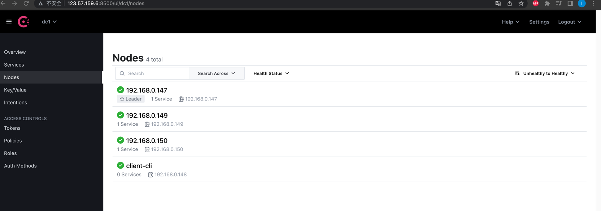

# consul 集群部署

:::tip
consul 作为 cloudiac 的服务注册与发现中心, 同时也是存储 cloudiac 资源状态相关信息

为了数据的安全,和服务性能的保障,提供 consul 的高可用部署

并且提供开启 consul 的 acl 访问 以及 client + server 通信 tls 加密

acl 和 tls 相关 文件均放在服务器的 `/opt/consul` 下,挂载到consul 容器的 `/consul/config` 下

如果不开启acl 和 tls 可以在启动容器的时候,去掉挂载目录
:::

## 开启 acl 和 tls 准备文件
:::note
如果不需要开启 acl 和 tls 直接跳转集群部署

配置文件主要有开启 acl 的配置,开启 tls 的配置,需要的 token,证书相关文件

tls 证书可以使用 openssl , 官方发布的证书,以及 consul 自身生成的证书,此处我们使用 consul 自身生成的证书来演示

acl 的 token 和 tls 的证书均可复用,建议自己单独启动 consul 服务生成

证书,配置文件均可在本地生成,后续上传到服务器
:::
### acl 配置准备
:::important
配置准备部分均在本地操作
:::

#### 1. 启动 consul 容器

```shell
# /opt/consul 证书生成的目录
$ mkdir -p /opt/consul

$ docker run  -v  /opt/consul:/consul/config -d --name=acl-server-consul -p 8500:8500 consul:latest
```

#### 2.  开启 acl

```shell
$ cd /opt/consul
# cat acl.json
{
  "acl":{
    "enabled": true,
    "default_policy": "deny",
    "enable_token_persistence":true
  },
  "datacenter":"dc1",
  "primary_datacenter": "dc1"
}
```

#### 3. 重启consul

```shell
$ docker resrat acl-server-consul
```

#### 4. 生成token

```shell
# 生成 acl 的 token
# 进入容器
➜  docker exec -it acl-server-consul sh
# 生成 key
$ consul acl bootstrap
AccessorID:       dbeae895-cb7c-0bb4-b6fe-f49bad9d7526
SecretID :        5ecc86f0-fa68-6ddc-e848-ef382d7737ec
Description:      Bootstrap Token (Global Management)
Local:            false
Create Time:      2022-04-18 06:29:28.7108916 +0000 UTC
Policies:
   00000000-0000-0000-0000-000000000001 - global-management
   
# 把生成的 SecretID 写入 acl.json
/consul/config # cat acl.json

{
  "acl":{
    "enabled": true,
    "default_policy": "deny",
    "enable_token_persistence":true,
    "tokens":{
      "master":"5ecc86f0-fa68-6ddc-e848-ef382d7737ec"
    }
  },
  "datacenter":"dc1",
  "primary_datacenter": "dc1"
}
```


### tls 证书准备

#### 1. 证书生成

```shell
# 进入 consul 容器  
$ docker exec -it acl-server-consul sh
cd /consul/config
/consul/config # ls
acl.json
/consul/config # consul tls ca create
==> Saved consul-agent-ca.pem
==> Saved consul-agent-ca-key.pem
/consul/config # ls
acl.json                 consul-agent-ca-key.pem  consul-agent-ca.pem
/consul/config #  consul tls cert create -server -dc dc1
==> WARNING: Server Certificates grants authority to become a
    server and access all state in the cluster including root keys
    and all ACL tokens. Do not distribute them to production hosts
    that are not server nodes. Store them as securely as CA keys.
==> Using consul-agent-ca.pem and consul-agent-ca-key.pem
==> Saved dc1-server-consul-0.pem
==> Saved dc1-server-consul-0-key.pem
/consul/config # ls
acl.json                     consul-agent-ca-key.pem      consul-agent-ca.pem          dc1-server-consul-0-key.pem  dc1-server-consul-0.pem

```

:::tip
挂载目录下 /opt/consul 的文件说明

acl.json  开启 acl 配置 以及 token配置

consul-agent-ca.pem：CA公共证书

dc1-server-consul-0.pem：数据中心的 Consul 服务器节点公共证书 `dc1`

dc1-server-consul-0-key.pem：数据中心的 Consul 服务器节点私钥` `dc1`
:::

---


## consul基于docker环境的集群部署
:::tip
模式采用3节点 server+1节点 client 端 ,同时支持开启 acl 控制访问和 tls 通信保护

TLS：使用 https 加密 consul 的 API、GRPC 

ACl：控制 Services、Nodes、KV 的读写权限
:::

### 配置说明

#### 1. server 端配置

```shell
$ cat server-acl.json
{
  "acl":{
    "enabled": true,
    "default_policy": "deny",
    "enable_token_persistence":true,
    "tokens":{
      "master":"5ecc86f0-fa68-6ddc-e848-ef382d7737ec"
    }
  },
  "datacenter":"dc1",
  "primary_datacenter": "dc1"
}

# tls配置
$ cat server-tls.json
{
  "verify_incoming": true,
  "verify_outgoing": true,
  "verify_server_hostname": true,
  "ca_file": "/consul/config/consul-agent-ca.pem",
  "cert_file": "/consul/config/dc1-server-consul-0.pem",
  "key_file": "/consul/config/dc1-server-consul-0-key.pem",
  "auto_encrypt": {
    "allow_tls": true
  }
}

```


#### 2. client 端配置

```shell
$ cat client-acl-tls.json
{
  "verify_incoming": false,
  "verify_outgoing": true,
  "verify_server_hostname": true,
  "ca_file": "/consul/config/consul-agent-ca.pem",
  "auto_encrypt": {
    "tls": true
  },

  "acl":{
    "enabled": true,
    "default_policy": "deny",
    "enable_token_persistence":false,
    "tokens":{
      "agent":"5ecc86f0-fa68-6ddc-e848-ef382d7737ec"
    }
  },
  "datacenter":"dc1",
  "primary_datacenter": "dc1"
}
```


### docker 启动部署
:::tip
如果不需要开启 acl 和 tls ,docker 启动 consul 的时候,去掉挂载目录参数 -v /opt/consul/:/consul/config
:::

#### 1. server 端
:::note
上传 server 端配置文件至服务器目录 /opt/consul
- server-acl.json
- server-tls.json
- consul-agent-ca.pem
- dc1-server-consul-0.pem
- dc1-server-consul-0-key.pem
:::

服务器列表

| 服务器 ip     | 节点    | 类型         |
| :------------ | ------- | ------------ |
| 192.168.0.147 | server1 | server主节点 |
| 192.168.0.149 | server2 | server       |
| 192.168.0.150 | server3 | server       |


```shell
#主节点 server1 启动
docker run -d --name consul-1 --net host -v /opt/consul/:/consul/config  consul:latest agent -server -bootstrap-expect 3 -ui -bind 0.0.0.0 -client 0.0.0.0  -advertise 192.168.0.147  -node 192.168.0.147   -enable-script-checks=true

#节点 server2 启动
docker run -d --name consul-2  --net host -v /opt/consul/:/consul/config consul:latest agent -server -ui -bind 0.0.0.0 -client 0.0.0.0 -retry-join 192.168.0.147 -advertise 192.168.0.149 -node 192.168.0.149 -enable-script-checks=true

#节点 server3 启动
docker run -d --name consul-2  --net host -v /opt/consul/:/consul/config consul:latest agent -server -ui -bind 0.0.0.0 -client 0.0.0.0 -retry-join 192.168.0.147 -advertise 192.168.0.150 -node 192.168.0.150 -enable-script-checks=true
```


#### 2. client 端
:::note
上传客户端配置文件至服务器目录 /opt/consul
- client-acl-tls.json
- consul-agent-ca.pem
:::

服务器列表

| 服务器 ip     | 节点       | 类型   |
| :------------ | ---------- | ------ |
| 192.168.0.148 | client-cli | client |

```shell
# client 节点启动
docker run -d --name consul-2 --net host -v /opt/consul/:/consul/config  consul:latest agent -client -ui -bind 0.0.0.0 -client 0.0.0.0 -retry-join 192.168.0.147 -advertise  192.168.0.148  -node client-cli  -enable-script-checks=true
```

### consul 集群演示


---

## consul 集群应用

### cloudiac 连接 consul 集群

修改 .env 配置文件,新增如下配置

文件路径 /usr/yunji/cloudiac/.env，内容如下:

```yaml
#consul 地址(必填)，示例: private.host.ip:8500
CONSUL_ADDRESS="http://192.168.0.148:8500"
  # consul 配置
  ## 是否开启consul acl认证
CONSUL_ACL=true
  ## consul token信息(开启acl认证必填)
CONSUL_ACL_TOKEN="5ecc86f0-fa68-6ddc-e848-ef382d7737ec"

```

> 配置说明

::: important
`.env` 中 **consul**  相关配置说明
- CONSUL_ADDRESS="http://192.168.0.148:8500"  # consul 客户端地址信息
- CONSUL_ACL=true #是否开启了 acl 访问
- CONSUL_ACL_TOKEN="5ecc86f0-fa68-6ddc-e848-ef382d7737ec" #开启 acl 访问的 token
:::