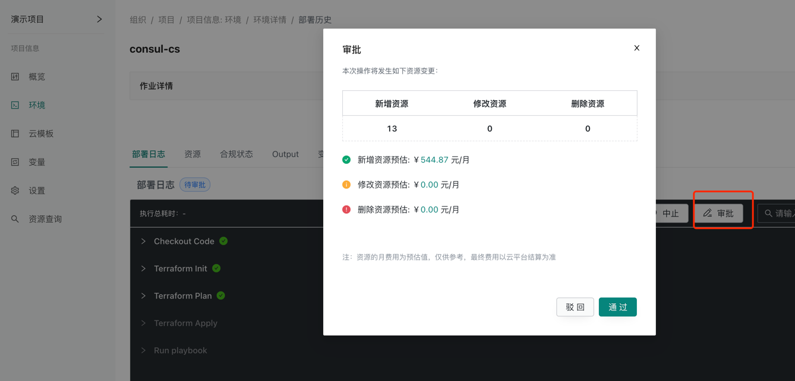
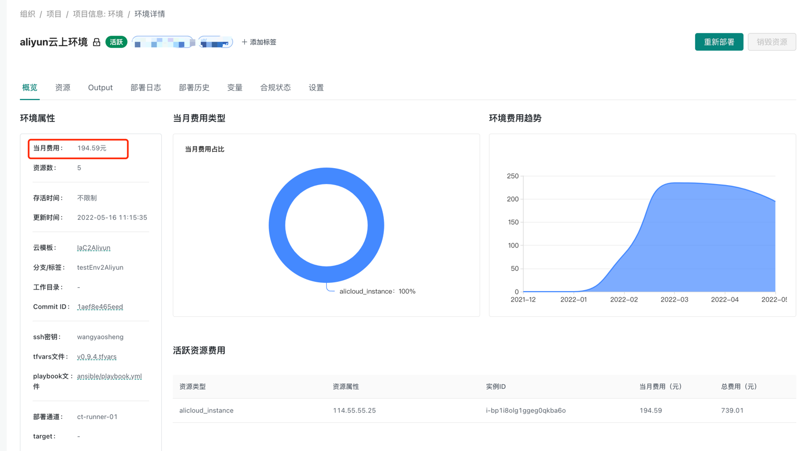
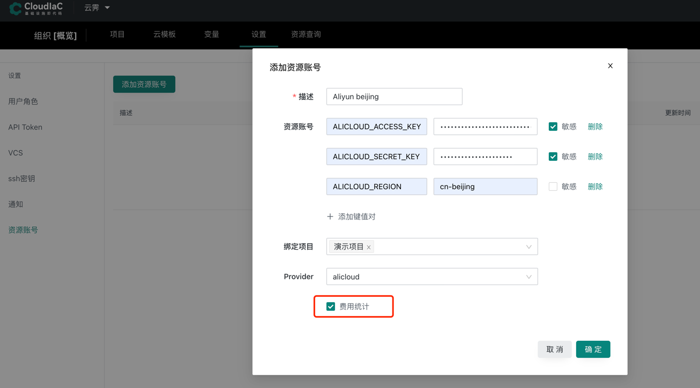

# 费用预估和统计
为了方便用户对部署的资源进行费用的预估和使用过程中费用的统计,
cloudiac 提供了不同厂商云资源的费用预估和统计信息,目前主要支持阿里云产品

## 费用预估
费用预估主要是在创建资源时,依赖创建的资源类型进行价格估算,以月为单位

## 费用统计
费用统计主要是基于创建环境资源时,对应厂商资源使用收费,以天为单位进行统计
可在设置资源账号时进行开启操作

### 开启费用统计

## 支持产品
:::note
目前主要支持阿里云的部分云服务,后续会继续支持华为云,腾讯云,AWS等
:::

### 阿里云
#### 已支持的云服务
- ECS
- RDS
- Redis
- SLB
- EIP
- NAT网关
- Disk
- Memcached
- MongoDB
