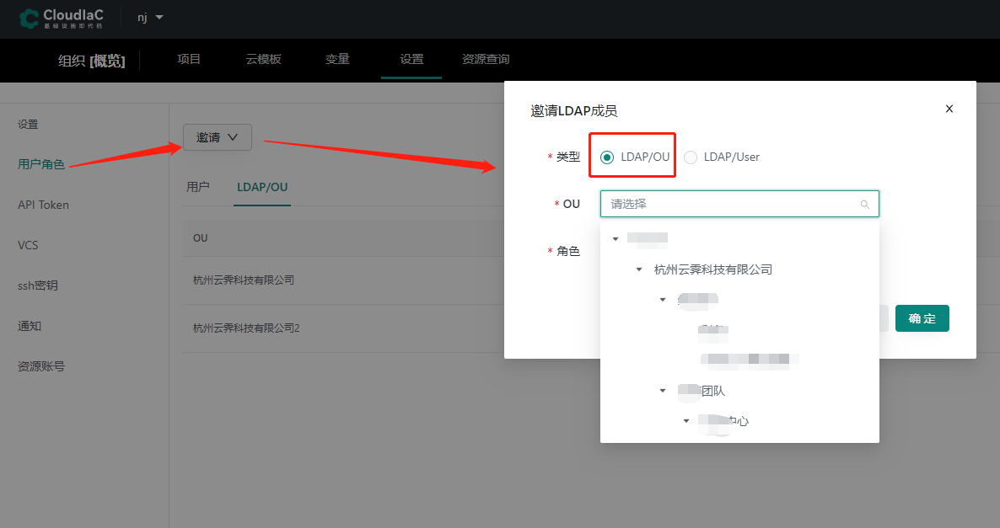
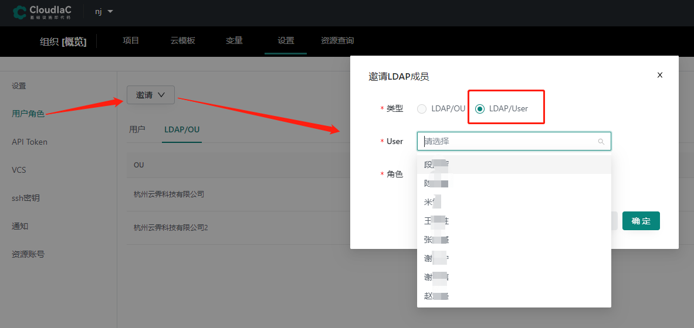
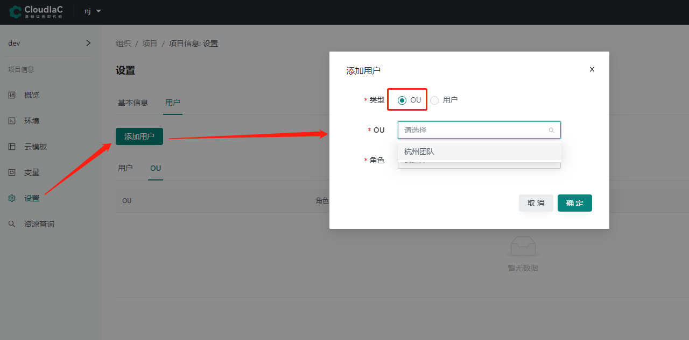
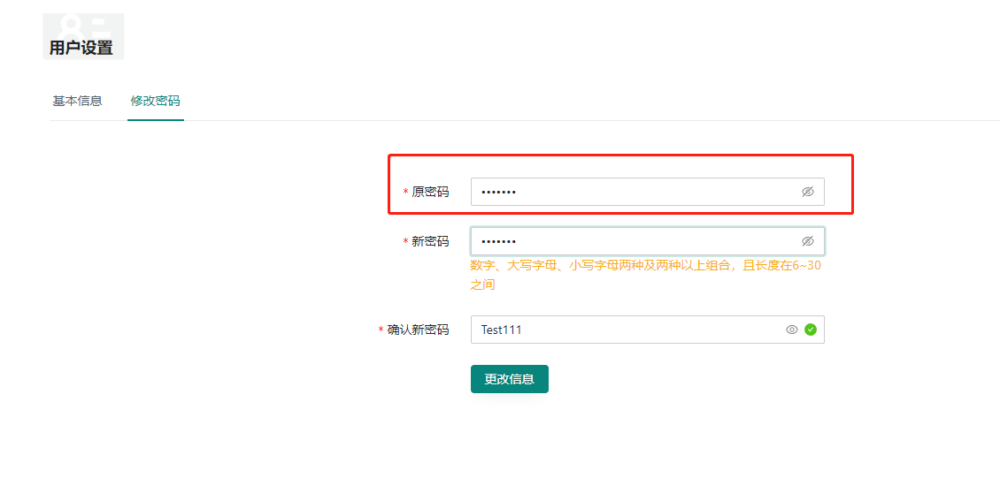

# LDAP 登录和授权

## 什么是 LDAP

LDAP（轻型目录访问协议）是一种软件协议 ，使任何人都可以在公共互联网或公司内网上查找网络中的组织，个人和其他资源（例如文件和设备）的数据 。LDAP 是目录访问协议（DAP）的“轻量级”版本，它是 X.500（ 网络中目录服务的标准 ）的一部分。

LDAP 官网：https://ldap.com/

## cloudiac 的 LDAP 配置

cloudiac 结合已有的 LDAP 服务，LDAP 中的用户直接使用 cloudiac 系统中的功能。

LDAP 相关配置：

```yaml
ldap:
  admin_dn: "cn=All,dc=idcos,dc=com" # ldap 管理员根目录
  admin_password: "admin_password" # ldap 管理员密码
  ldap_server: "192.168.0.1" # ldap 服务器地址
  ldap_server_port: 389 # ldap 服务器端口
  search_base: "dc=idcos,dc=com" # ldap 检索根目录
  search_filter: "" # ldap 检索过滤条件
  email_attribute: "mail" # email 对应ldap中的key
  account_attribute: "uid" # uid 对应ldap中的key
  ou_search_base: "ou=Employee,dc=idcos,dc=com" # ldap ou授权组织根目录
```

## cloudiac 的 LDAP 授权

### 组织中的授权

配置 LDAP 之后，组织设置页面的【用户角色】菜单中，可以给 LDAP 的组织或者用户授权。

LDAP 组织授权：
{.img-fluid}

LDAP 用户授权：
{.img-fluid}

### 项目中的授权

项目中也可以直接给 LDAP 的 OU 授权，但是只能选择当前组织中已有授权的 OU。

LDAP 项目授权：
{.img-fluid}

## cloudiac 的 LDAP 登录

cloudiac 会在本地用户登录失败时，自动尝试 LDAP 用户的登录。
如果是 LDAP 用户，会在每次登录成功后更新用户最新的 LDAP OU 授权。

{.img-fluid}

## cloudiac 的 LDAP 密码验证

如果是 LDAP 用户，更新密码的时候，除了可以使用系统本地的密码，也可以使用 LDAP 的密码来验证。

{.img-fluid}

上图红框中的【原密码】，可以是系统本地的密码，也可以是当前用户的 LDAP 密码。
