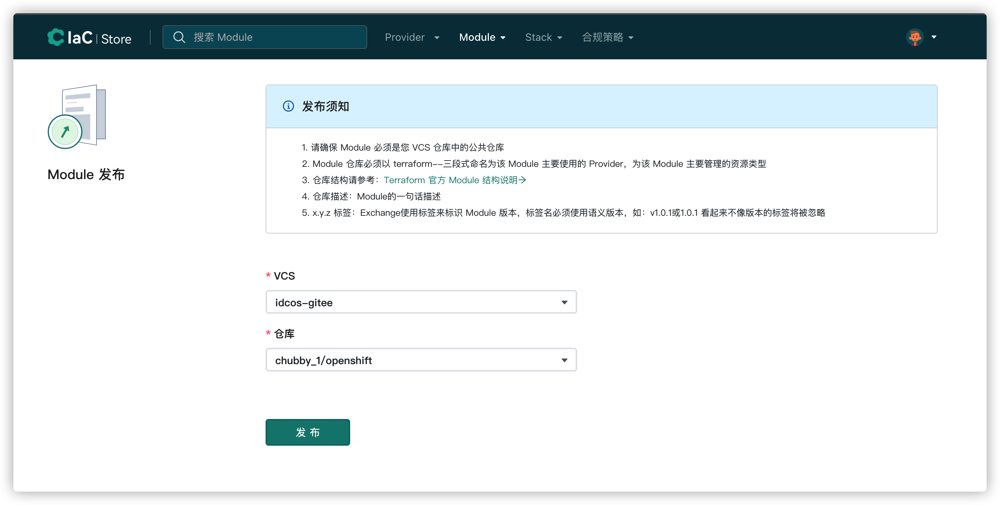

# module发布流程（暂只介绍cloudiac登录方式）

要想使用module发布流程，则必须先登录，下面介绍以cloudiac登录实现module发布的流程：

1.登录registry

2.完成vcs的集成，vcs集成步骤参考[vcs集成](../registry/#vcs_3)（如果已经集成vcs，则直接进行步骤3）

3.完成vcs集成以后，即可开始module的发布，点击发布模块

{.img-fluid}

4.选择vcs和仓库，所选择仓库的要求请参考发布须知,点击发布

{.img-fluid}

