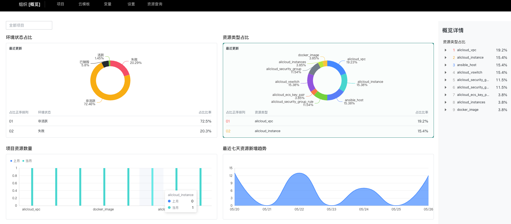
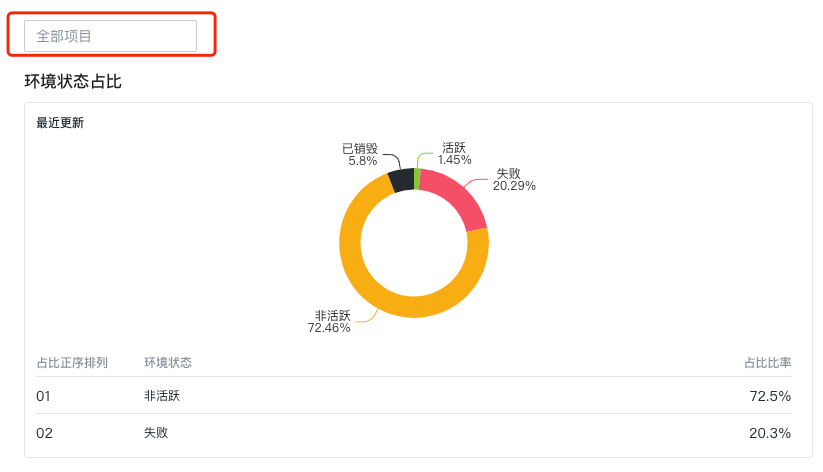
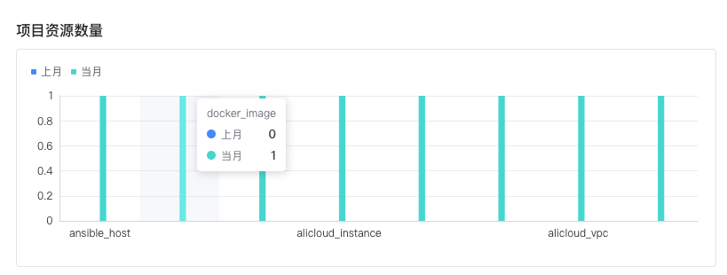
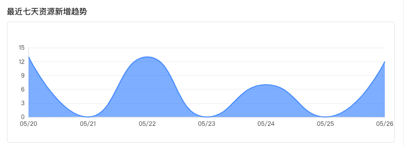

## 组织/项目概览
组织/项目概览是 cloudiac 提供的一种可视化信息展示,囊括了环境状态,资源类型,项目资源等

可视化信息展示,可以方便的浏览当前组织/项目下的各种资源信息

---

### 1. 环境状态占比
环境状态占比可以很直观的审视整个组织/项目所有环境分布状态,如失败的环境,已销毁的环境,非活跃的环境,
活跃的环境,同时可以在全部项目选择想要审视的具体项目的环境状态占比

### 2. 资源类型占比
资源类型占比可以直观的审视整个组织/项目下,所有的资源类型占比情况

### 3. 项目资源数量
项目资源数量可以看到所有组织/项目下的资源具体数量

### 4. 最近七天资源新增趋势
最近资源新增变化,可以直观的查看最近组织/项目资源变化情况

