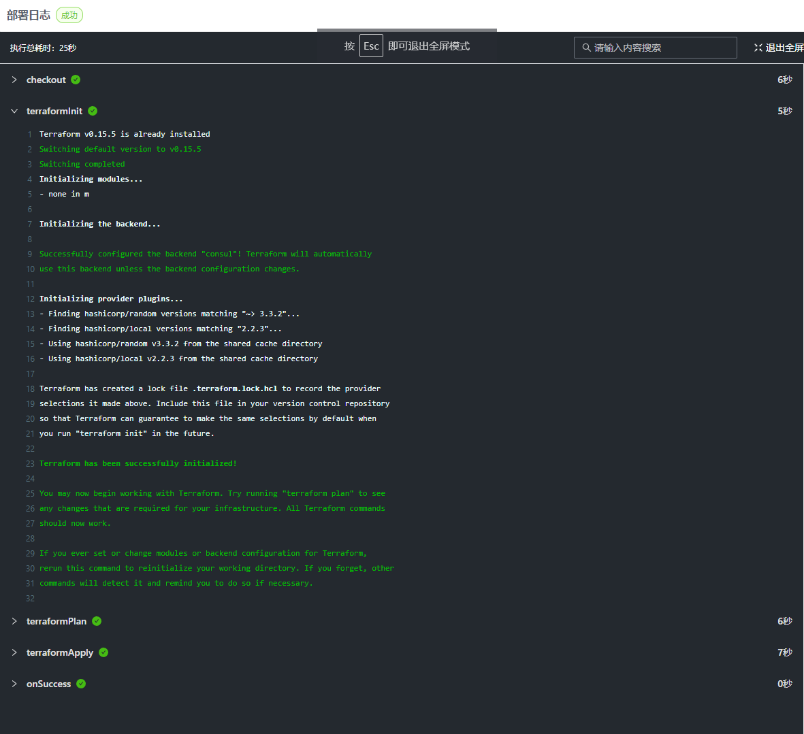
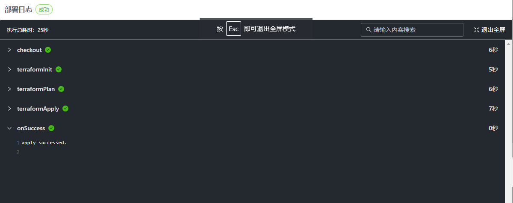

# Stack Pipeline

CloudIaC 支持 Pipeline 功能，通过 Pipeline 来对环境的 Plan、部署、销毁流程进行定义，默认的我们为所有任务类型定义了标准步骤流程，用户可以自定义 Pipeline，来增加步骤、调整步骤执行顺序等。

执行任务时，部署日志会按 Pipeline 定义的步骤进行分步展示：
{.img-fluid}

## 如何使用 Pipeline

自定义 Pipeline 通过在Stack代码库中增加 Pipeline 文件实现，文件名为 `.cloudiac-pipeline.yml`。

文件查找逻辑如下:

1. 如果Stack设置了工作目录，则在工作目录下查找 `.cloudiac-pipeline.yml`，存在则使用
2. 如果工作目录不存在则在代码库根目录下查找 `.cloudiac-pipeline.yml`，存在则使用
3. 否则使用默认的 Pipeline 标准流程模板

## Pipeline 的任务类型和步骤

从标准 Pipeline 模板中可以看到，CloudIaC 支持对 plan、apply、destroy 三种任务进行自定义，分别对应环境的 Plan、部署任务、销毁任务。

:::tip
自定义 Pipeline 时可以只对指定的任务类型做定义，未定义的任务类型会使用标准 Pipeline 流程步骤。
:::

每一个任务类型都可以定义各自的步骤列表，CloudIaC 支持的步骤列表如下:

| 步骤类型         | 说明              |
| ---------------- | ----------------- |
| checkout         | 代码检出          |
| terraformInit    | terraform init    |
| terraformPlan    | terraform plan    |
| terraformApply   | terraform apply   |
| terraformDestroy | terraform destroy |
| ansiblePlay      | ansible-playbook  |

1. 每个 step 可以配置 before（前处理） 和 after（后处理）
2. 每个 step 可以配置超时时间，单位秒
3. plan/apply/destroy 中的 steps 中的每个步骤顺序固定，如果缺失则补全
4. destroy 的 steps 中， terraformPlan 步骤的 args 默认包含 "-destroy"

## Pipeline 回调

除了给任务定义步骤之后 CloudIaC 还支持定义回调步骤，回调步骤基于任务的运行状态选择性执行。目前支持的回调类型有 `onSuccces` 和 `onFail`，onSuccess 步骤在任务所有步骤执行成功时回调，onFail 步骤在任务任意步骤执行失败时回调。

回调使用示例:

```yaml
apply:
  onSuccess:
    name: 任务成功
    type: command
    args:
      - echo "apply successed"

  onFail:
    name: 任务失败
    type: command
    args:
      - echo "apply failed"

  steps: # 流程步骤省略
```

在 command 步骤中可以引用环境变量的值，通过判断变量值来执行不同的操作。如示例中基于环境在任务启动时的状态来判断是创建环境还是恢复失败状态的环境。

回调步骤总是在流程的最后展示，流程步骤展示效果:
{.img-fluid}

## 完整的自定义 Pipeline 示例

```yaml
version: 0.5

plan:
  onFail:
    args:
      - echo "plan failed."
  onSuccess:
    args:
      - echo "plan successed."

  steps:
    checkout:
      name: Checkout Code
      timeout: 30
      before:
        - echo "before checkout"
      after:
        - echo "after checkout"

    terraformInit:
      name: Terraform Init
      timeout: 30
      before:
        - echo "before terraform init"
      after:
        - echo "after terraform init"

    opaScan:
      name: OPA Scan

    terraformPlan:
      name: Terraform Plan
      before:
        - echo "before terraform plan"
      after:
        - echo "after terraform plan"

apply:
  onFail:
    args:
      - echo "apply failed."
  onSuccess:
    args:
      - echo "apply successed."

  steps:
    checkout:
      name: Checkout Code

    terraformInit:
      name: Terraform Init

    opaScan:
      name: OPA Scan

    terraformPlan:
      name: Terraform Plan

    terraformApply:
      name: Terraform Apply

    ansiblePlay:
      name: Run playbook

destroy:
  onFail:
    args:
      - echo "destroy failed."
  onSuccess:
    args:
      - echo "destroy successed."

  steps:
    checkout:
      name: Checkout Code

    terraformInit:
      name: Terraform Init

    terraformPlan:
      name: Terraform Plan

    terraformDestroy:
      name: Terraform Destroy
```

apply 和 destroy 中的 steps 也是可以配置 before/after/timeout，为了简化显示只在 plan 中的 steps 中配置了 before/after/timeout。

## 简化版本示例

pipeline 默认会对 steps 进行补全。
所以，如果没有 before/after/timeout 等额外的操作，可以不用具体配置 steps，系统会自动补全缺失的 step。

```yaml
version: 0.5

plan:
  onFail:
    args:
      - echo "plan failed."
  onSuccess:
    args:
      - echo "plan successed."

  steps:
    checkout:
      name: Checkout Code
      timeout: 30
      before:
        - echo "before checkout"
      after:
        - echo "after checkout"

    terraformPlan:
      name: Terraform Plan
      before:
        - echo "before terraform plan"
      after:
        - echo "after terraform plan"

apply:

destroy:
```

plan 任务中，因为 checkout/terraformPlan 有 before/after 之类的操作，所以显式配置。
虽然 terraformInit 步骤没有配置，实际执行时，系统会自动补充此步骤。

对于 apply/destroy 任务，没有 before/after/timeout 之类的特殊配置，
所以 steps 不用配置，系统会自动补全缺失的步骤。
