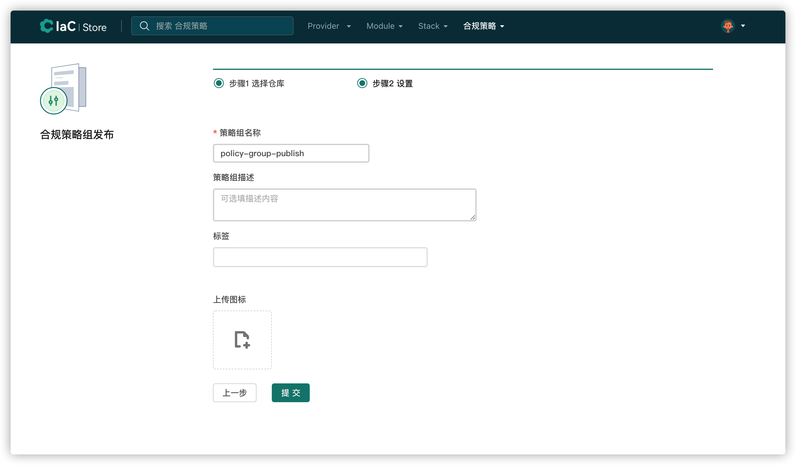

# 策略组发布流程（暂只介绍cloudiac登录方式）

要想使用策略组发布流程，则必须先登录，下面介绍以cloudiac登录实现策略组发布的流程：

1.登录了registry以后， 进行vcs集成，相关步骤参考[vcs集成](../registry/#vcs_3)（如果已经集成vcs，则直接进行步骤3）

2.添加vcs后，则可以发布合规策略组，点击发布合规策略

{.img-fluid}

3.选择vcs和代码仓库，点击下一步

{.img-fluid}

tips：请确保选择的仓库含有.rego为后缀名的文件，此文件格式如图：

{.img-fluid}

4.输入策略组名称，策略组描述（可选），标签（可选），上传图标（可选），点击提交

{.img-fluid}