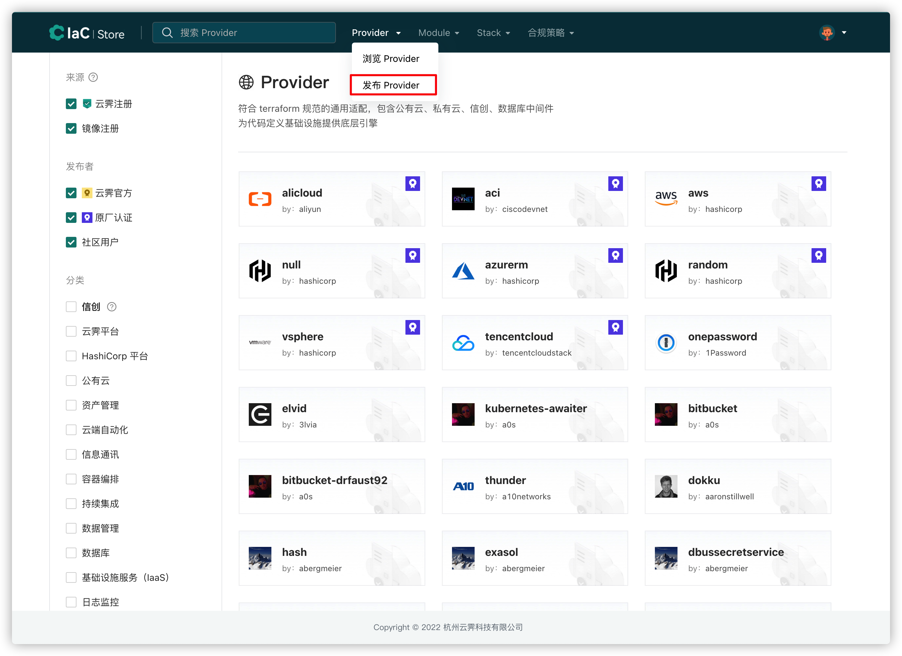
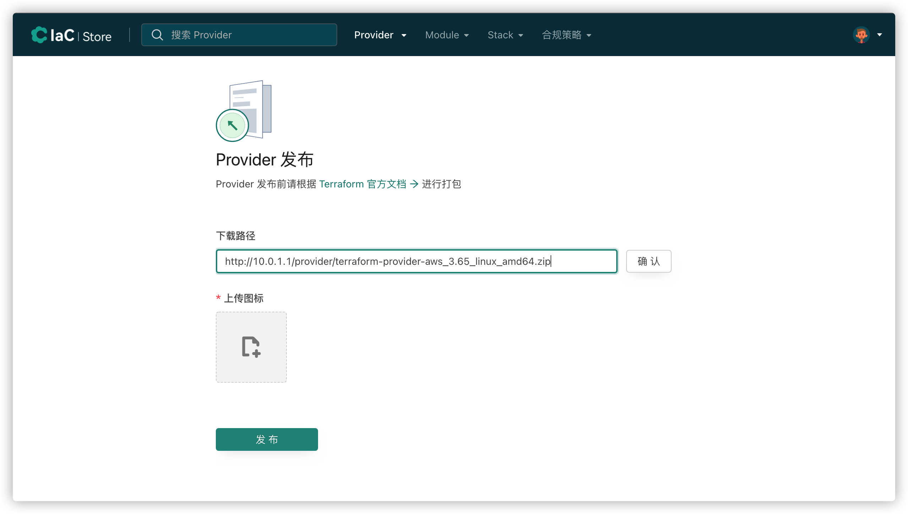

# provider发布流程（暂只介绍cloudiac登录方式）

要想使用provider发布流程，则必须先登录且配置了gpg密钥，下面介绍以cloudiac登录实现provider发布的流程：

1、生成GPG密钥

此步骤参考[GPG签名密钥获取](../registry/#gpg)

2、添加GPG密钥到namespace

添加GPG密钥步骤参考[添加签名密钥](../registry/#_4)

3、编译打包 provider zip 包，并生成SHA256SUMS文件，这部分请参考[terraform文档](https://www.terraform.io/docs/registry/providers/publishing.html#manually-preparing-a-release)

4、使用上面生成的GPG密钥对SHA256SUMS文件进行签名:

```bash
gpg -u "$GPG_EMAIL" --detach-sign terraform-provider-${TYPE}_${VERSION}_SHA256SUMS
```

5、打包 docs (可选):

[terraform docs 规范文档](https://www.terraform.io/docs/registry/providers/docs.html)

docs 编写完成后打为 zip 包：zip docs.zip -r docs

此时目录中的文件列表如下(cloudiac_1.0.0 为示例):

```bash
docs.zip
terraform-provider-cloudiac_1.0.0_linux_amd64.zip
terraform-provider-cloudiac_1.0.0_linux_386.zip
terraform-provider-cloudiac_1.0.0_SHA256SUMS
terraform-provider-cloudiac_1.0.0_SHA256SUMS.sig
```

6、将上一步生成的所有 zip 文件、SHA256SUMS 文件和 SHA256SUMS.sig 文件上传到任一 http 服务器

要求上传后我们可以通过类型这样的 url 下载文件:  

https://static.example.org/providers/cloudiac/1.0.0/terraform-provider-cloudiac_1.0.0_linux_386.zip

7、登录 registry 执行发布:

下载路径可以是 zip 包或者是 SHA256SUMS 文件，如果是 zip 包则只发布指定的平台，如果是 SHA256SUMS 文件则发布 SHA256SUMS 文件中包含的所有 zip 包。

如果下载路径同目录下有 docs.zip 文件，则在发布时也会同时下载 docs 文件并解析生成 provider 文档。生成的文档可以在 registry 平台查看。

{.img-fluid}

{.img-fluid}