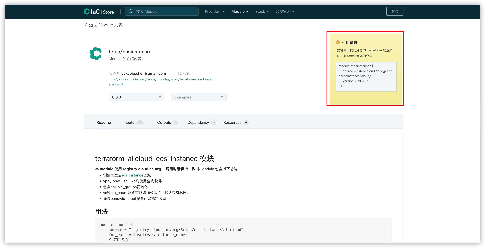

# Modules

## Modules 是什么
Terraform Module 是独立的基础设施即代码片段，抽象了基础设施部署的底层复杂性，简单理解就是包含一组 Terraform 代码的文件夹，由此来达到代码复用的效果。

## 如何使用 Module
CloudIaC Registry 上提供了大量常用的云平台资源抽象的 Module，用户可以在 Terraform 代码中直接引用这些 Module，从而降低 Terraform 代码编写的复杂性。

引用方法：

## 发布自定义 Module
对于自己开发的 Moudle，可以发布到 Registry，具体发布方法参见教程：[Module发布](/tutorials/mkdocs/cases/module-publish.md)
