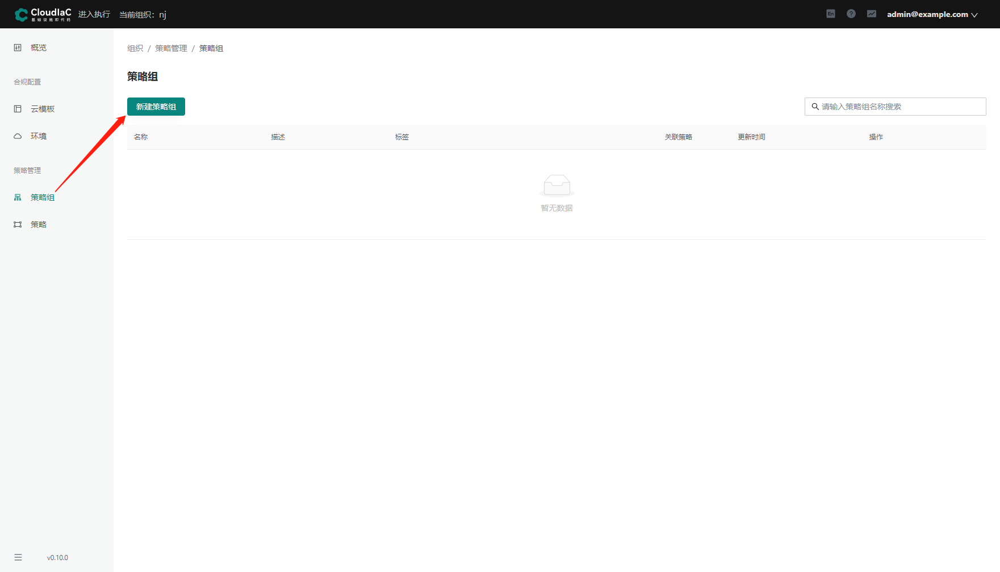
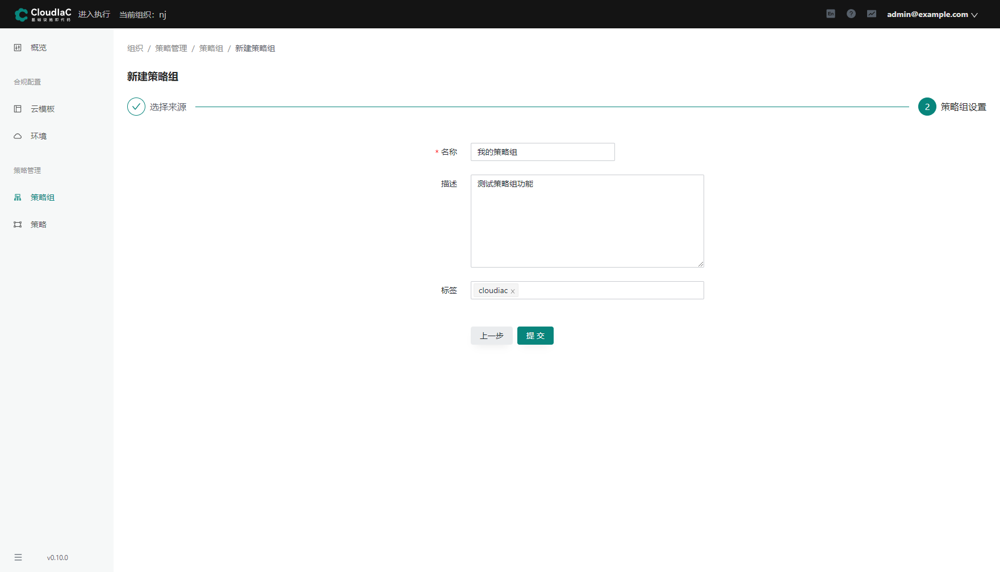
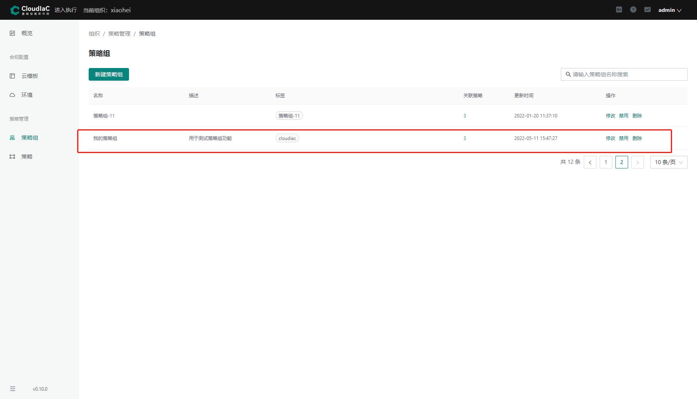
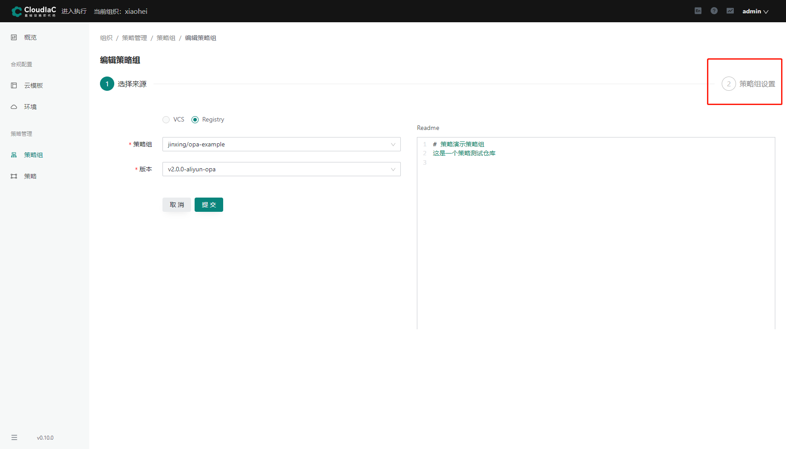
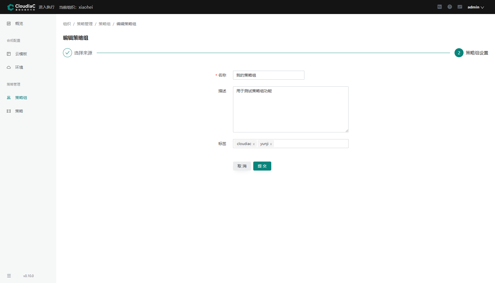
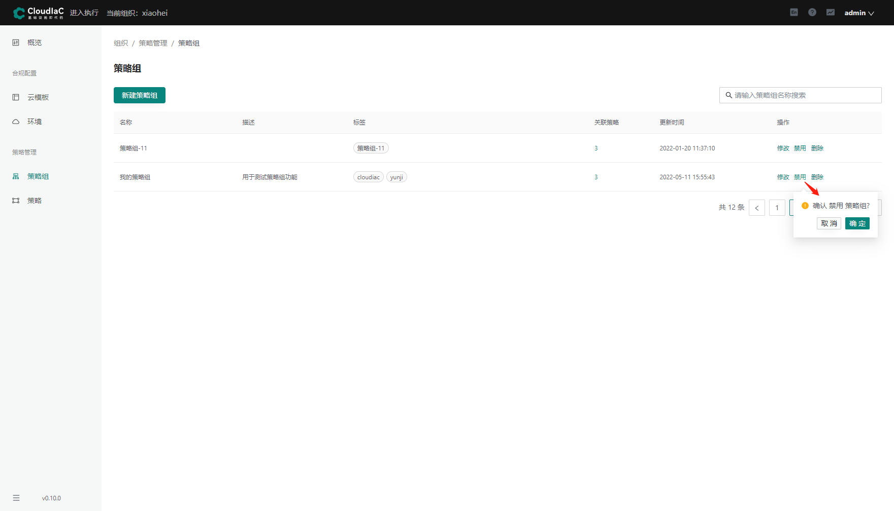
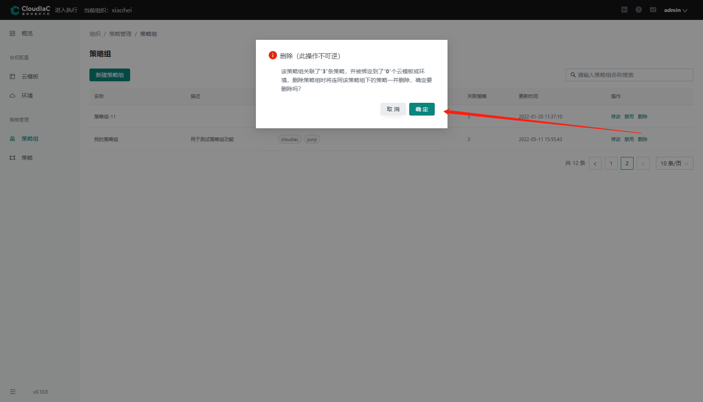

# Regitstry 中的策略组使用

## 配置 Registry 地址

### 系统设置

选择页面右上角 用户信息 -> 【系统设置】

{.img-fluid}

### Registry 配置

选择 【Registry 配置】，然后在 【Registry 地址】 文本框中输入地址并【保存】

{.img-fluid}

## 新建策略组

### 进入合规

进入系统页面后，选择【进入合规】

{.img-fluid}

### 新建策略组

选择菜单 【策略管理】下的【策略组】，点击【新建策略组】按钮

{.img-fluid}

### 选择来源

新建策略组第一步：【选择来源】

先选择【Registry】，再选择其中需要新建的【策略组】和【版本】。

{.img-fluid}

### 策略组设置

新建策略组第二步：【策略组设置】

可以配置策略组的【名称】，【描述】和【标签】。配置之后点击【提交】按钮。

{.img-fluid}

## 编辑策略组

### 进入修改

上一步新建的策略组可以在策略组列表中查看，点击【修改】按钮可以修改策略组。

{.img-fluid}

### 修改已有的来源

修改策略组和新建策略组一样，第一步可以修改已有的来源。

这里修改之后，可以直接提交，如果还要修改策略组的名称和描述等信息，点击图片上的【策略组设置】

{.img-fluid}

### 修改策略组的描述信息

第二步中，可以修改策略组的【名称】，【描述】和【标签】，修改后点击【提交】保存修改内容。

{.img-fluid}

## 禁用/启用策略组

在策略组列表页面，点击策略组的【禁用】按钮，设置是否禁用策略组。
{.img-fluid}

禁用之前需要进一步确认。
禁用成功之后，该条策略组的相应操作变成【启用】，启用的操作方式和禁用一样。

## 删除策略组

删除策略组之前有警告信息，也有该条策略组和其他云模板，环境的关联说明。
请仔细阅读后慎重删除。

{.img-fluid}
