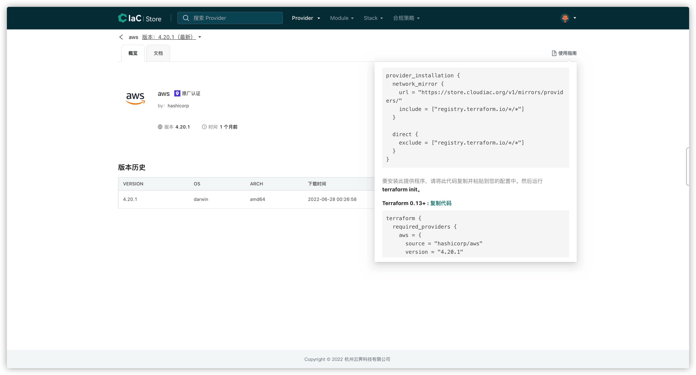
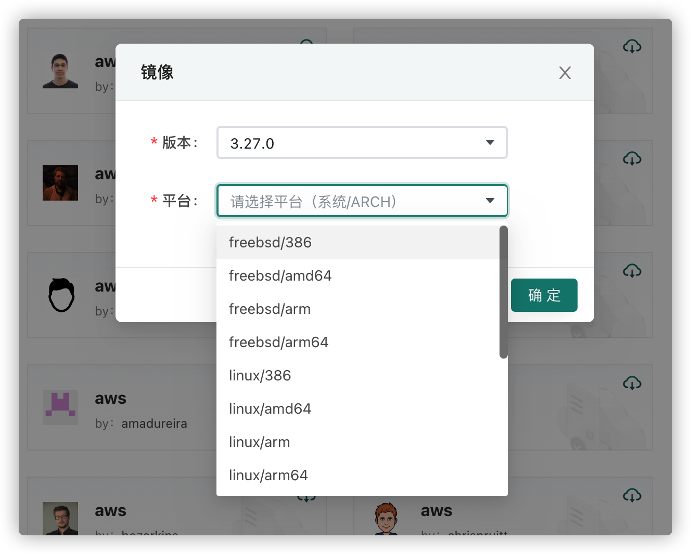
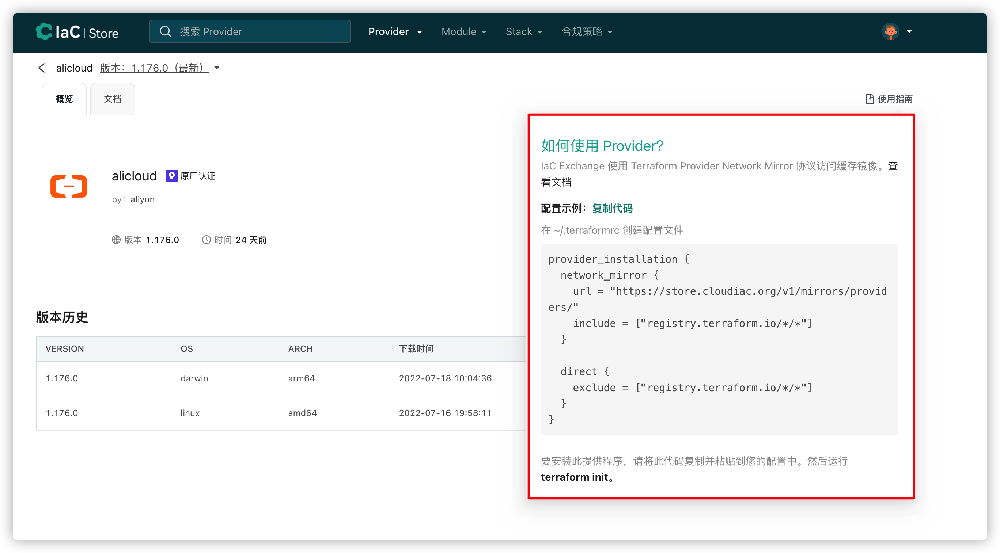

# Providers

Terraform 通过插件机制（Provider）来完成对基础设施资源的管理，以此来接入各种资源，如虚拟机，存储，网络和各种应用服务，不同的基础设施提供商都需要提供一个 Provider 来实现对自家基础设施的统一管理。

## 插件运行机制


## 浏览 Providers
Registry 实现了 Terraform 的 provider registry 协议以及 network mirror 协议，用户可以直接配置 network mirror 以代理的方式实现 Provider 的缓存和下载，也可以提前在CloudIaC Registry网站上选择要使用的provider进行预下载，从而解决国内 Terraform 用户因为网络原因导致的使用困难问题。




## 预下载 Provider
用户可以在 Registry 中搜索常用的 Provider 来进行预下载，预下载的 Provider 会在 Registry 中缓存，可以加快后续下载该 Provider 的速度。

搜索时选择从 Terraform registry 搜索，搜索出来的 Provider 卡片右上角可以进行『预下载』操作


选择想要使用的版本、平台进行预下载


## 配置 network mirror
对于已经缓存和预下载的 Providers，Terraform 用户可以通过配置~/.terraformrc文件来开启network mirror，通过CloudIaC Registry来进行 Provider 下载

```hcl
provider_installation {
  network_mirror {
    url = "https://registry.cloudiac.org/v1/mirrors/providers/"
    // hostname 为 registry.terraform.io 的 provider 走代理
    include = ["registry.terraform.io/*/*"]
  }

  direct {
    // hostname 为 registry.terraform.io 的 provider 避免直接访问
    exclude = ["registry.terraform.io/*/*"]
  }
}
```

## 发布自定义 Provider
对于自己开发的 Provider，可以发布到 Registry，具体发布方法参见教程：[Provider发布](../cases/provider-publish.md)

## 如何使用自定义发布的 Provider
在 Registry 详情页，打开右上角使用指南，即可看到该 Provider 的引用方法


