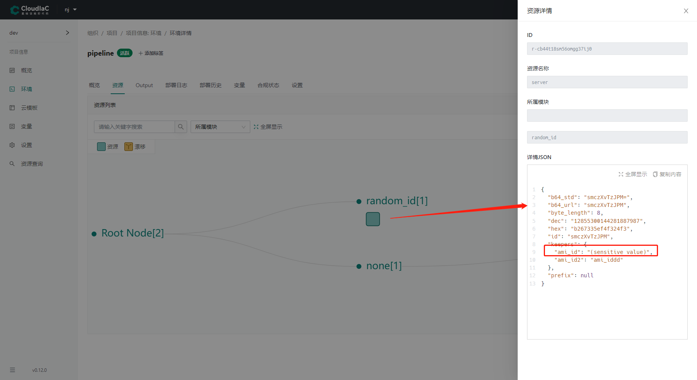
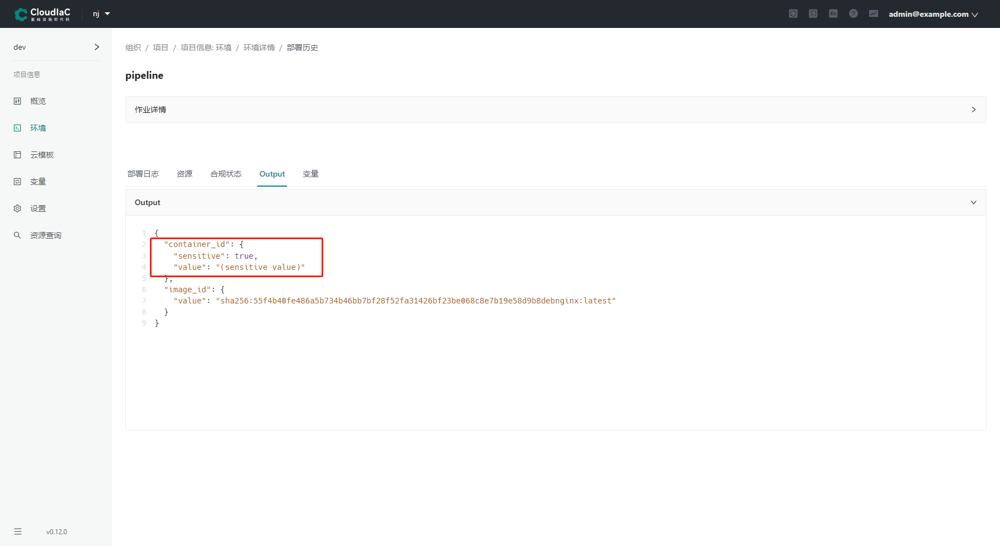
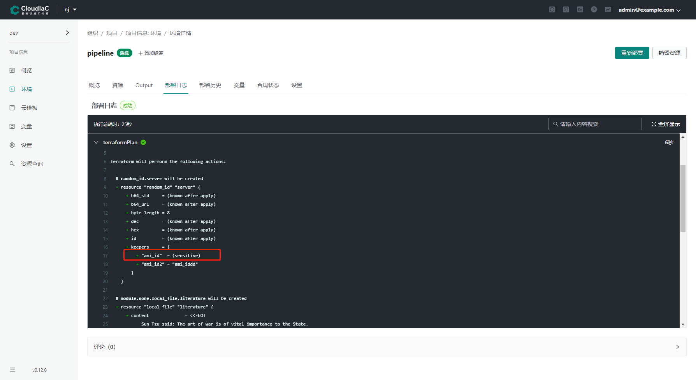
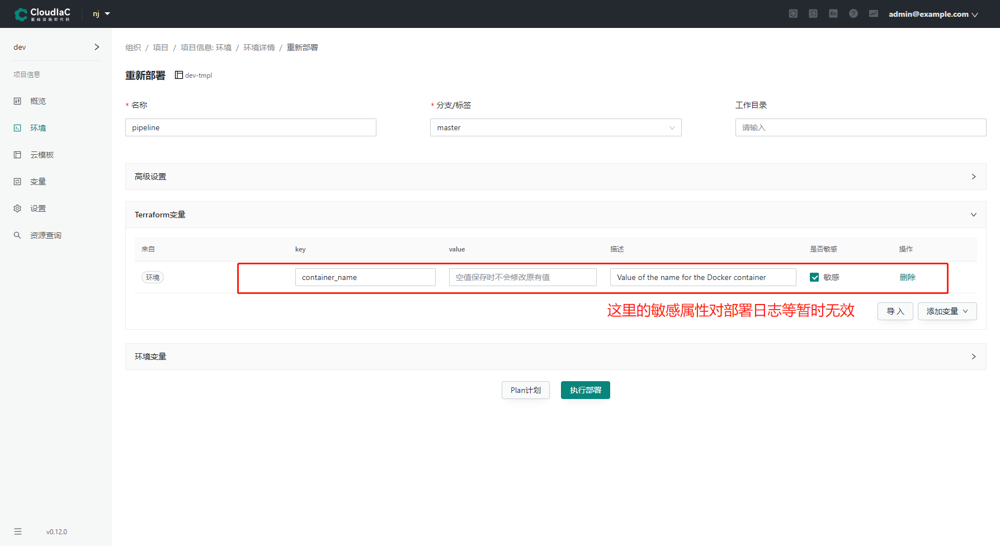

# Sensitive values

## 什么是敏感变量

敏感变量指的是不希望在任何显示的地方暴露出来的信息。
比如，连接数据库的用户名和密码，访问 API 的 token，个人账号相关的信息等等。
也可以是其他希望隐藏的信息。

敏感变量在 terraform 中，通过设置 sensitive 属性来实现。
比如，下面的代码中，`my_port` 变量设置成敏感变量。

```hcl
variable "container_name" {
  description = "Value of the name for the Docker container"
  type        = string
  default     = "example-docker"
}

variable "my_port" {
  description = "my port"
  default     = 8001
  sensitive   = true
}
```

## 敏感变量的显示

目前 cloudiac 系统中，环境部署后，敏感变量显示的位置有 3 个。

- 环境详情资源页面
  {.img-fluid}
- 环境详情 Output 页面
  {.img-fluid}
- 环境详情部署日志页面
  {.img-fluid}

## 未完成的部分

系统部署时，通过页面可以设置 terraform 变量的敏感属性，这里设置的敏感属性在【环境详情资源页面】和【环境详情部署日志页面】中不生效的。
{.img-fluid}
