# VCS Token 获取
## gitlab
访问 gitlab，并输入账号密码进行登录（ gitlab 为内网系统，账号密码需管理员分发）

点击设置，再点击访问令牌

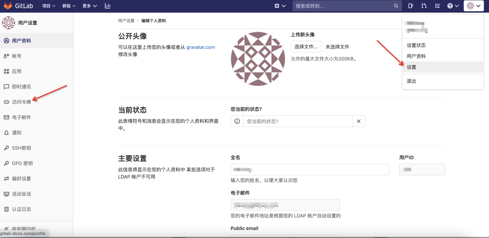{.img-fluid}

输入创建令牌需要的信息，点击创建个人访问令牌

tips：名称为该令牌的名称，到期时间为该令牌的有效时间（不填则表示该令牌永不过期），范围指该令牌的权限

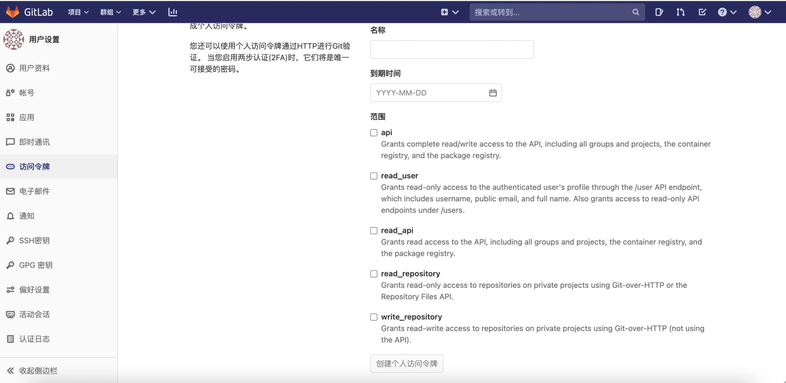{.img-fluid}

令牌成功创建，此令牌即可在 IaC Store 中使用

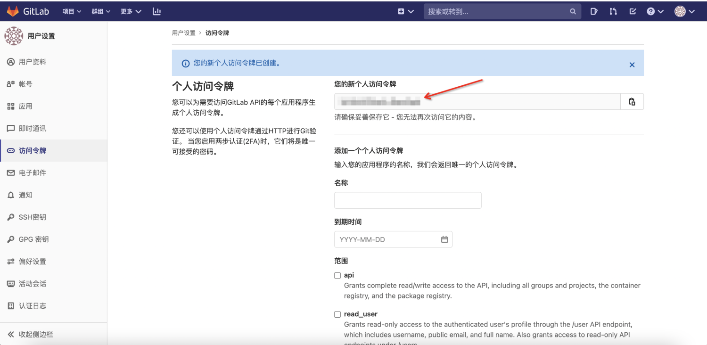{.img-fluid}

## github

访问 github 官网，进行登录

点击 Settings

{.img-fluid}

点击 Developer settings

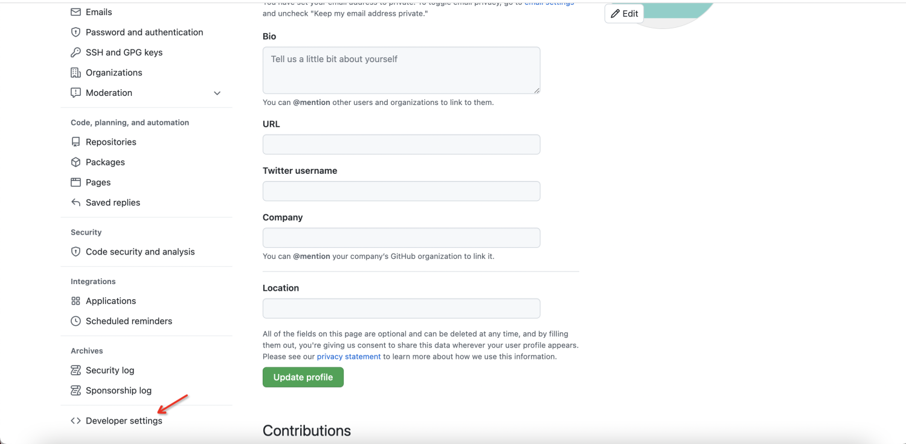{.img-fluid}

点击 Personal access tokens

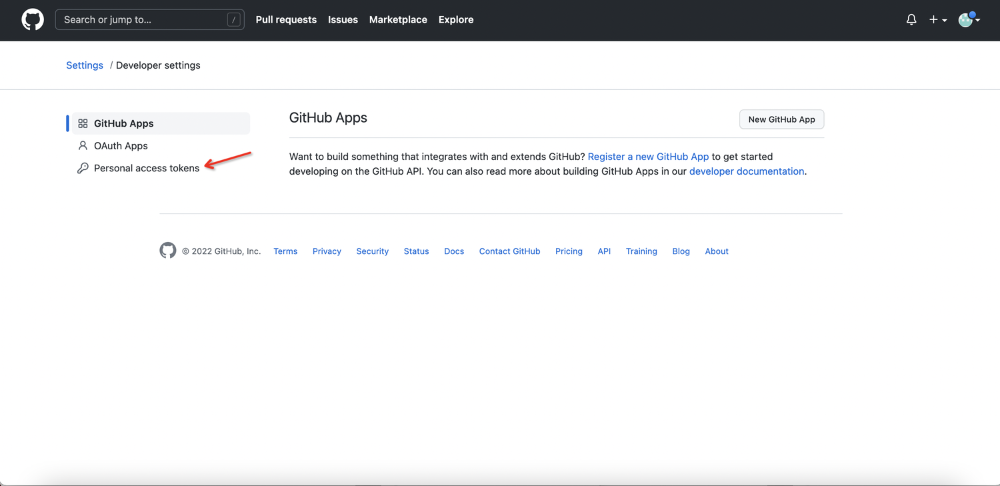{.img-fluid}

点击 Generate new token

{.img-fluid}

输入对应参数，点击 Generate token

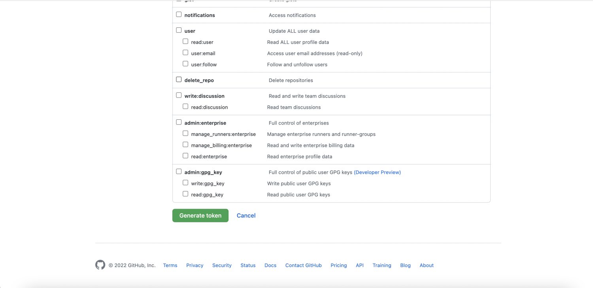{.img-fluid}

此 token 即可在 IaC Store 中使用

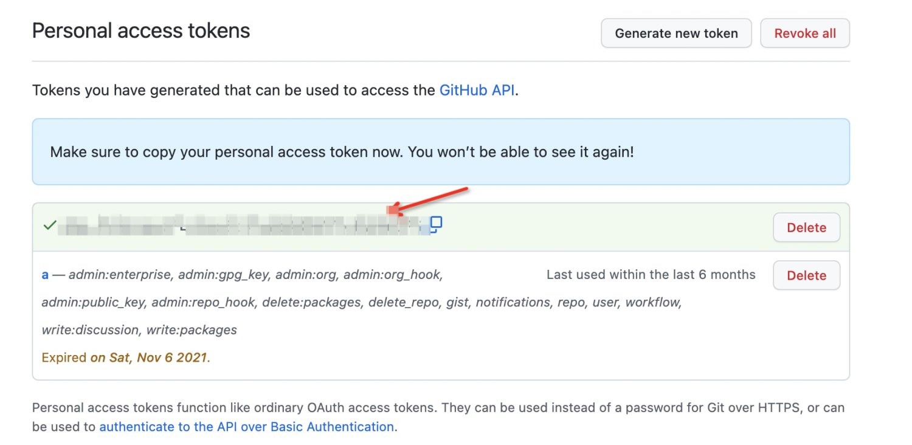{.img-fluid}

## gitee

访问 gitee 官网，输入账号密码进行登录

点击设置

{.img-fluid}

点击私人令牌

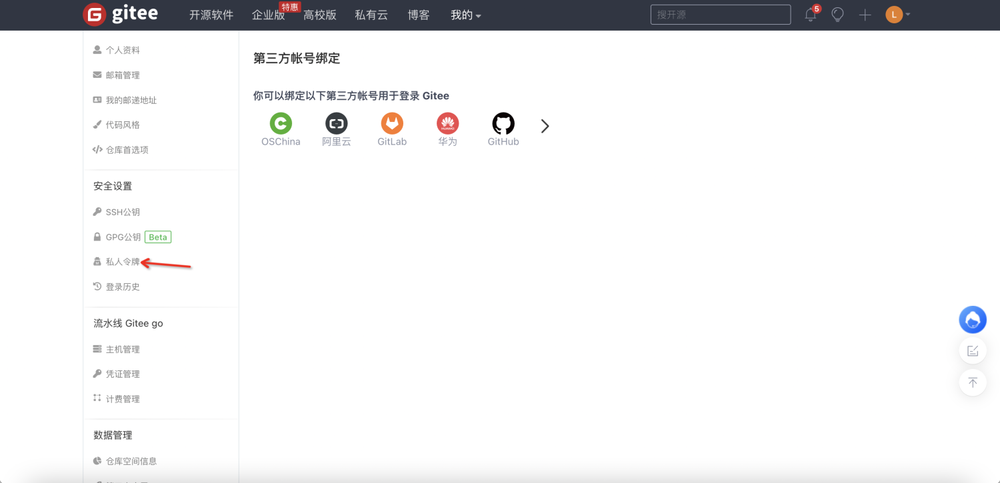{.img-fluid}

点击生成新令牌

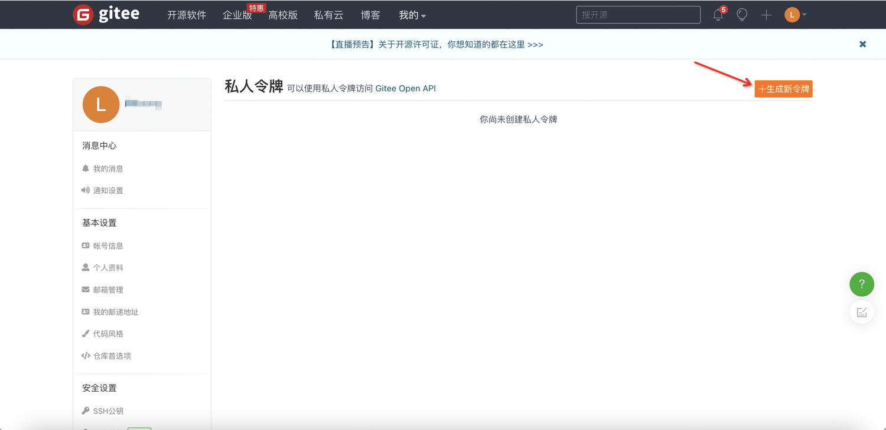{.img-fluid}

输入相关参数，点击提交

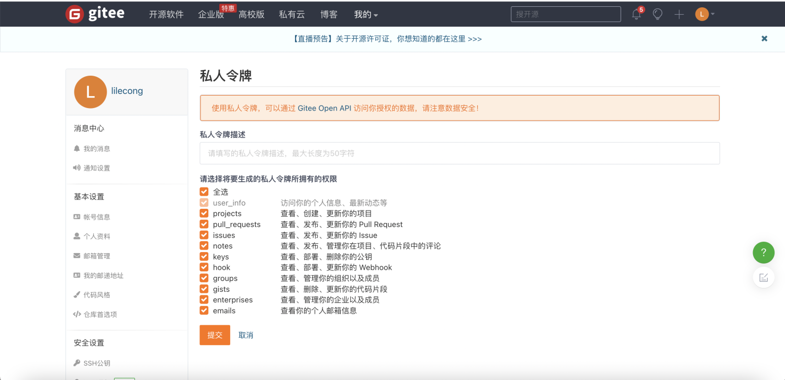{.img-fluid}

输入密码，点击验证

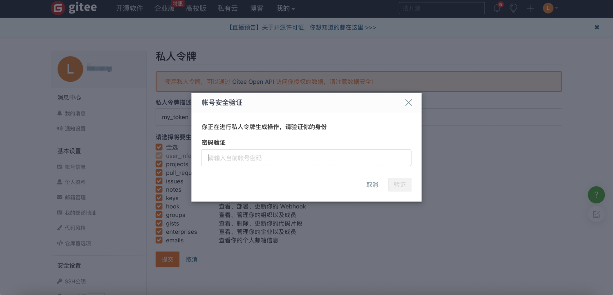{.img-fluid}

此 token 即可在 IaC Store 中使用

{.img-fluid}
