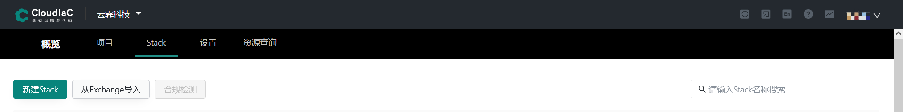
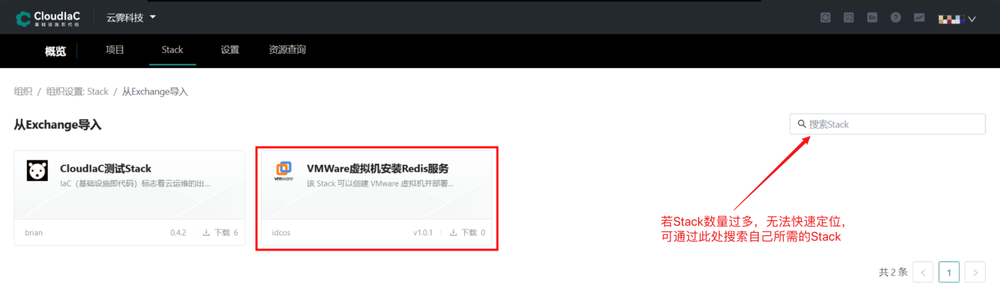
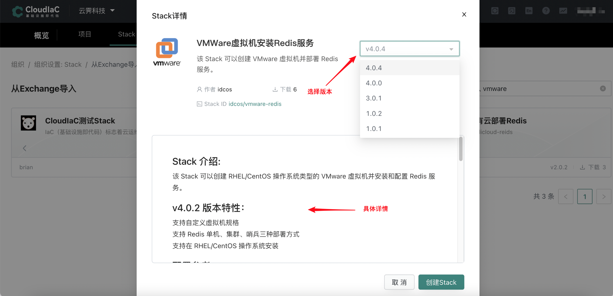
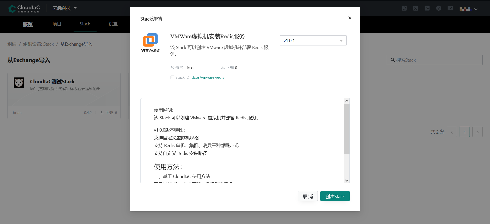
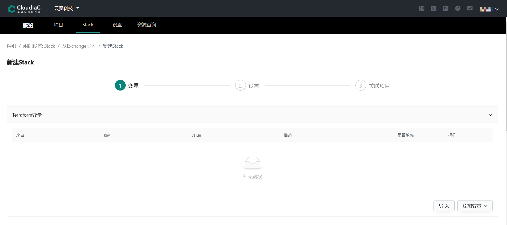
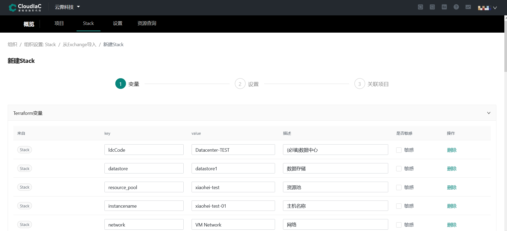
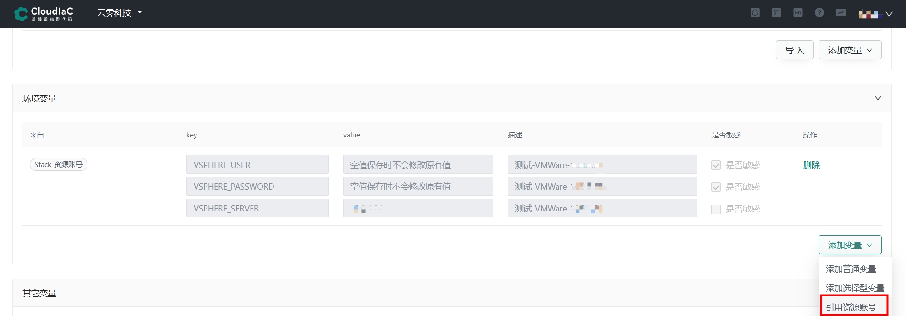
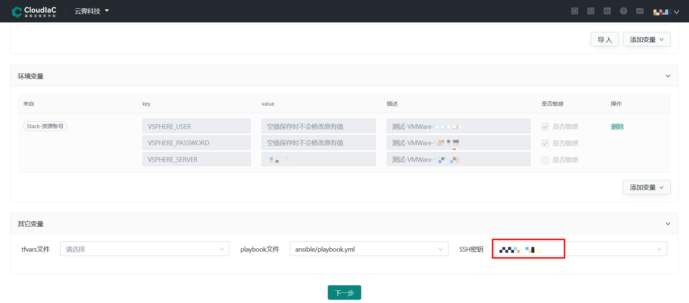
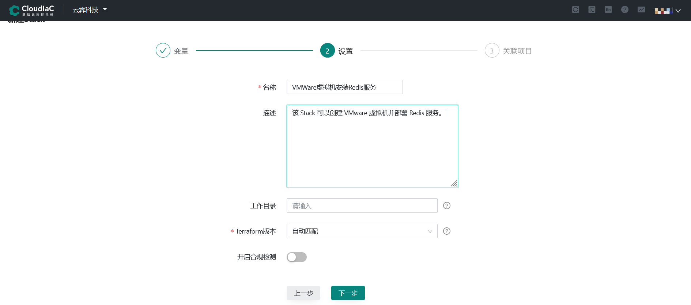
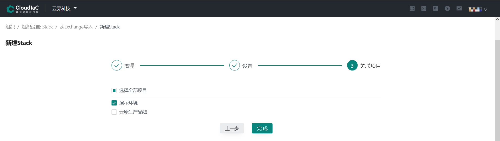

:::tip
以下步骤说明如何从IaC Store导入Stack并通过CloudIaC实现快速部署(以VMWare虚拟机安装Redis服务为例)
:::
#### 导入Stack

在『Stack』页面点击『从IaC Store导入』
{.img-fluid}

#### 选择Stack

若无法快速定位所需的『Stack』，可通过『搜索Stack』搜索框查找所需的『Stack』。定位到所需的『Stack』之后，可点击要使用的『Stack』查看详情，并选择要使用的『Stack』版本
{.img-fluid}
{.img-fluid}

#### 创建Stack

选择好『Stack』之后，可点击『创建 Stack』进行创建
{.img-fluid}

#### 设置变量

在新建Stack界面『导入Terraform变量』，并赋予变量值
{.img-fluid}
{.img-fluid}

#### 关联资源账号

关联您基础设施认证信息的『资源账号』
{.img-fluid}

#### 选择相应文件

选择您『ansible playbook』文件以及『ssh密钥』(『小提示：』不一定每个Stack部署都需要)。此处因以VMWare虚拟机安装Redis服务为例，以便于在虚拟机上部署Redis服务。完成之后点击『下一步』
{.img-fluid}

#### 基础设置

填写Stack在CloudIaC平台的『显示名称』和『描述』，以及『Terraform版本』，完成之后点击『下一步』
{.img-fluid}

#### 关联项目

最后『关联项目』，点击『完成』，即可在项目部署该环境
{.img-fluid}

**Stack创建完成后即可进行下一步，[部署环境](./deploy-env.md)。**

