## 使用云模板创建 aliyun ecs

一般来说, 如果我们想要在云平台上创建一台 vps 实例, 通常有以下几种方案  

1. 在阿里云门户上选择规格类型, 点击创建;
2. 编写程序, 调用阿里云 api 创建;
3. 使用 Terraform;

CloudIaC 借助 terraform 提供了另一种方案: 通过从 vcs 仓库导入 terraform 代码生成一套云模板, 再使用这套云模版创建资源环境, 用户可以在 CloudIaC 图形界面上以一种交互友好的方式来管理这套环境;

我们接下来演示 CloudIaC 创建阿里云 ecs 再到销毁的全过程;

> #### 前置要求
> 
> 假设你已经拥有了一个 CloudIaC 的账号, 并创建或者加入到一个组织中;  

### 流程简介

#### 准备工作

为了能够创建一个 aliyun ecs 资源, 我们至少需要以下内容:

- 一个阿里云的资源账号和用于授权的 acesss_key、 secret_key;
- 一个事先准备好 terraform 的 vcs 仓库和用于 CloudIaC 导入使用的访问令牌(access_token);
- 一对 ssh 密钥, 用于登录 ecs 实例使用;


### 实战

#### 创建一个项目

> 如果你已经创建好了项目, 可以跳过这一步;

在「组织视图」界面, 选择「项目」选项卡, 点击红框中的创建项目创建一个新项目, 这里我们使用一个新创建好的 aliyun_ecs 作为演示项目;

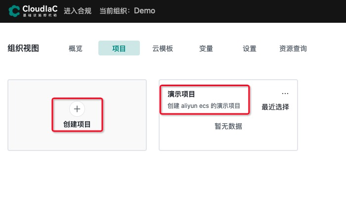

#### 设置阿里云资源账号

CloudIaC 需要用户提供阿里云账号的 access_key 与 secret_key;

在「设置」-「资源账号」点击「添加资源账号」按钮添加阿里云资源账号;
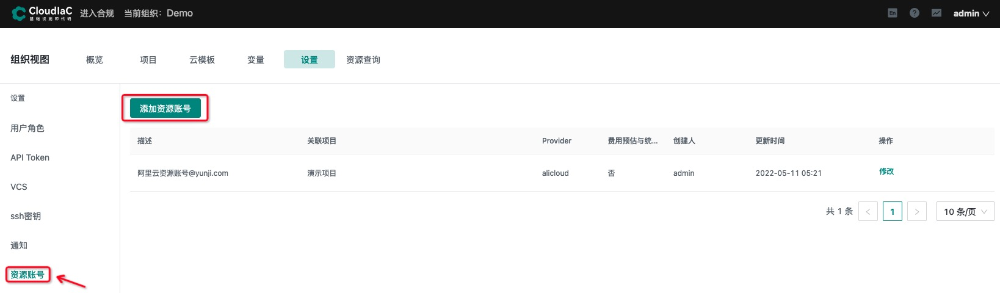

点击 「添加资源账号」后, 你要输入对应阿里云账号信息, 这里主要是 access_key 与 secrete_key, 需要注意ak/sk变量需要勾选敏感使其不可见;
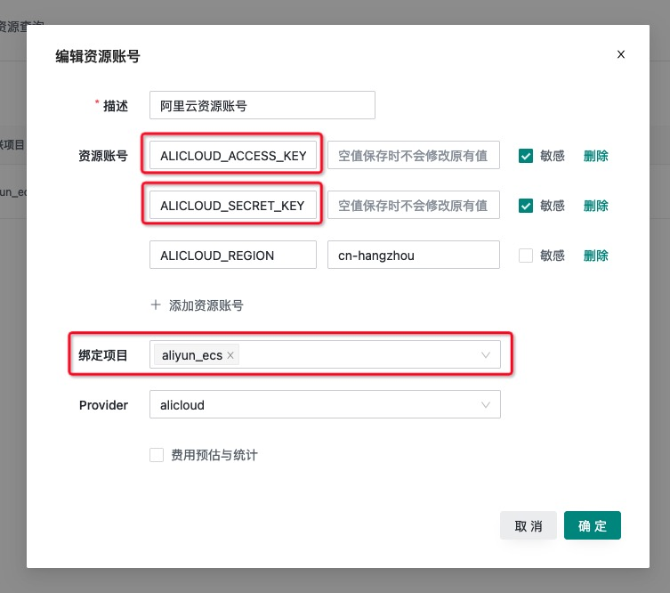

图中主要填写的值如下

```bash
ALICLOUD_ACCESS_KEY="你的 access_key"
ALICLOUD_SECRET_KEY="你的 secret_key"
```

资源账号与我们要创建的 aliyun ecs 项目进行关联绑定;

#### 生成 ssh 密钥

如果你的操作系统是 MacOS 或者任意常见的 Linux 发行版, 可以在终端下执行以下命令生成 ssh 所需的密钥;  
如果你的操作系统是 windows, 可以使用 GitBash 执行此命令;

```bash
# 如果你已经有了 ssh 密钥, 可以跳过此命令;
ssh-keygen -t rsa -b 4096 -f ~/.ssh/vm_rsa -N ""

# 执行完成后, 你会在 ~/.ssh/ 目录下看到 vm_rsa 与 vm_ras.pub 两个文件
ls ~/.ssh/
vm_rsa vm_rsa.pub
```

:::caution 安全提示
请妥善保管你的密钥, 不要轻易泄漏给任何人;
:::

在「设置」-「ssh密钥」界面点击「添加密钥」按钮
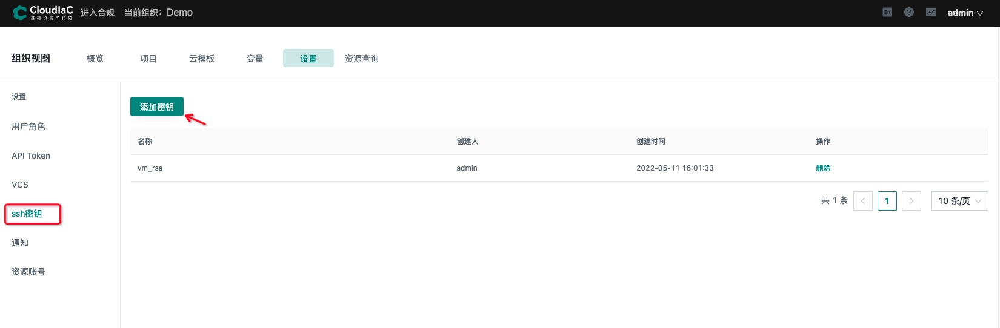

我们将刚才创建好的**私钥**内容粘贴到「私钥」文本框中, 点击「确定」按钮保存;
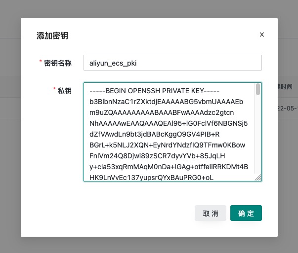

:::note 密钥说明
在 CloudIaC 中, ssh 密钥添加后就无法再修改了, 如果你有修改错误的密钥的需求哦, 可以通过删除重建到方式实现;
:::

#### 导入 VCS acess_token

CloudIac 支持主流的 vcs 仓库, 为了能让 iac 访问你仓库, 需要先获取对应 vcs 平台上获取安全访问令牌, 然后添加到 CloudIaC 中;

在 「设置」-「VCS」界面中, 点击「添加VCS」

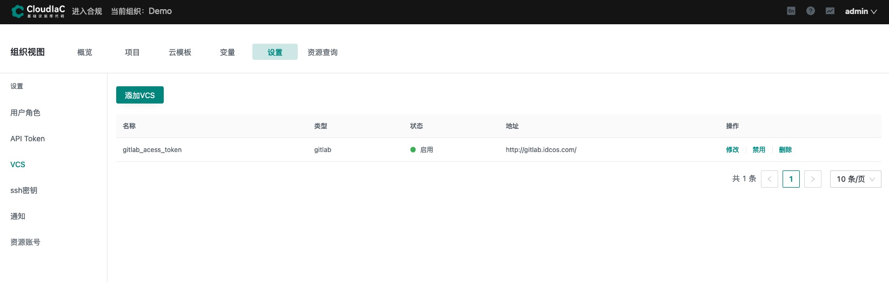

在 「添加VCS」界面中, 输入你 VCS 信息与 access token;


如上图所示, 共有四个信息需要填写:

- **名称** 用来描述 VCS 的来源与目的;  
- **类型** 为一个下拉选择框, 代表你的 VCS 平台类型, 目前 CloudIaC 支持 Gitlab, GitHub, Gitea, Gitee 四种常见 vcs 平台;   
- **地址** 是用户使用的 VCS 平台的 URL;  
- **token** 则是 VCS 平台的安全令牌, 不同 VCS 平台生成令牌的规则不同;  

以 GitLab 为例, 一个填写好的 VCS 信息应如下所示
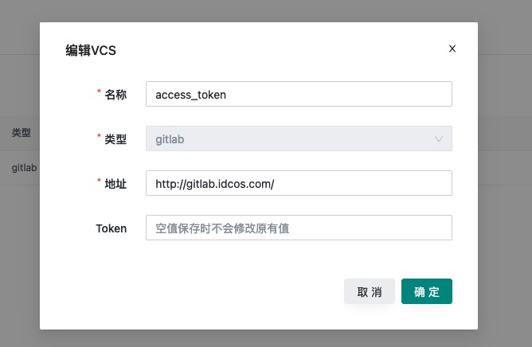

#### 导入云模板
在添加 VCS 完成后, 用户就可以选择自己的代码仓库导入来生成云模版;

在归属的某个组织下, 选择 「云模板」, 点击「新建云模板」按钮
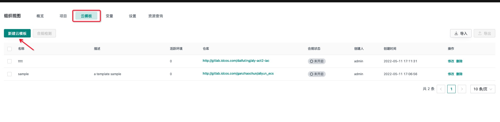

在「新建云模版」界面, 进入第一步, 填写必要的 VCS 仓库信息;
这里以一个准备好的 GitLab 仓库 aliyun-ecs 为例;

**VCS** 选择之前添加的 vcs, 此处选择了名为 `gitlab_acesss_token` 的 vcs;
**仓库名称** 选择准备好的 vcs 仓库名, CloudIaC 会自动导入远程仓库的信息数据;
**分支/标签** 选择 vcs 仓库的一条分支, 此处选择了 master 分支;
**工作目录** Terrafrom 运行时的工作目录
**Terraform 版本** 可以选择自动选择

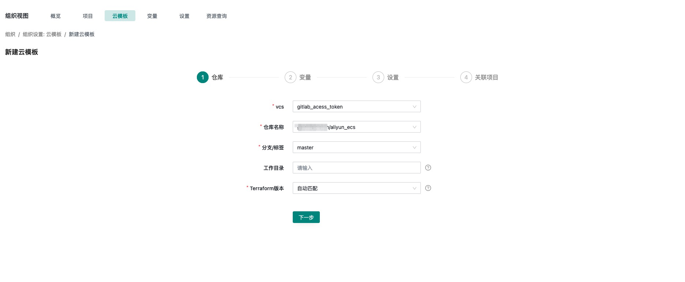


填写完成后, 选择下一步, 进入到「变量」步骤;
在此页面, 我们可以定义额外的 terraform 变量, 环境变量以及额外变量;
在「环境变量」一栏中, 我们选择右侧的「添加变量」按钮, 导入阿里云资源账号的 acess_key 和 secre_key;
本次仅仅创建 ecs, 故只在「额外变量」一栏中引入 ssh 密钥, 并指定代码仓库中的 tfvars 文件;

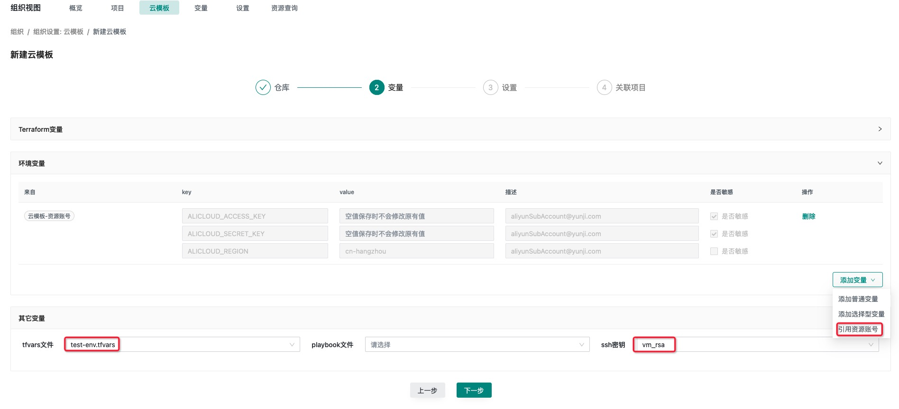


填写完成后, 选择下一步, 进入「设置」步骤;
在此界面, 我们可以设置此云模板的名字和描述信息, 如下图所示, 我们将本次创建的云模版命名为 aliyun_ecs_demo;


当填写完成后, 选择下一步, 进入「关联项目」步骤;
在这一步, 我们关联好我们创建的项目即可;

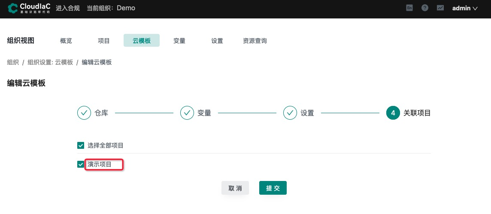

这样子, 我们就完成了一个云模板的创建;

#### 创建环境

我们可以使用已经准备好的云模板来创建期望的环境;  
在「项目」界面, 选择已经创建好的项目「aliyun-ecs」, 点击进入;  

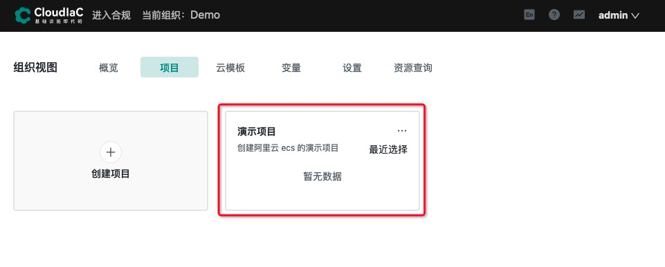

点击左侧选项卡中的「环境」选项, 再点击左侧右上角的「部署新环境」按钮;
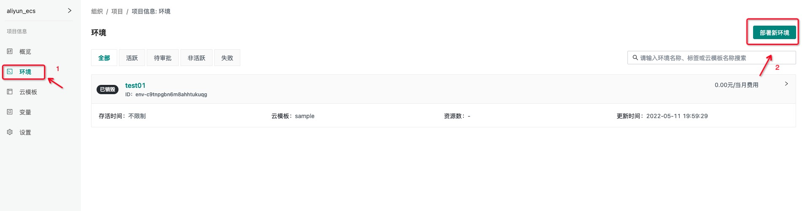

我们会来到云模板界面, 你能看到目前所在项目下的所有云模板, 选择你想使用的云模板, 点击「部署」;
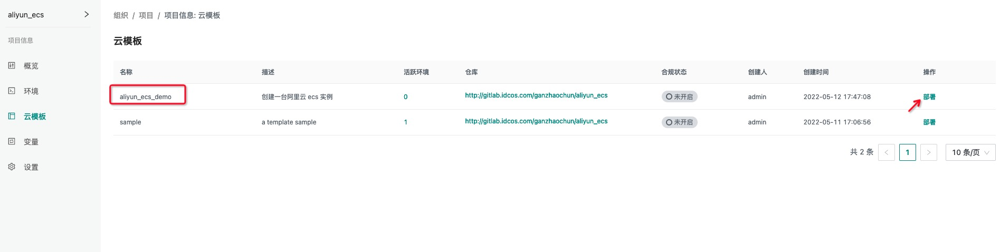

在部署之前, 我们将会看到本次部署的环境信息, 新环境默认会继承选中的云模版本身的各种变量(terraform 变量、环境变量、其他变量), 当然你你也可以根据需求修改变量值来创建一个不同规格的环境(本次修改仅本次生效), 我们这里就不修改任何变量;

给这个环境命名为「阿里云ecs实例环境」, 在「执行」选项卡下选择任一个执行通道标签;  

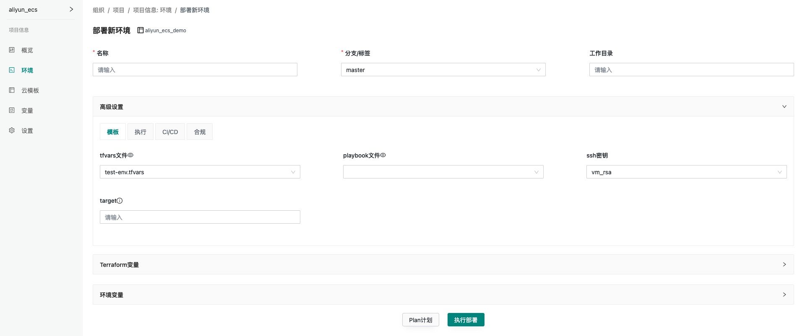

##### plan 

在「环境信息」页面最下方有两个按钮: 「plan 计划」与「执行部署」;  
二者的区别在于, 「plan 计划」只会展示本次环境将要变更的资源数据但不会创建环境, 而「执行部署」会先执行 terraform plan 展示变更的资源, 等审批通过后再执行部署;  

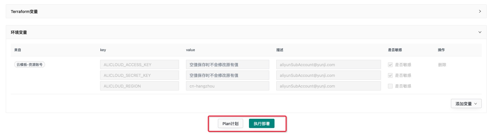

这里我们选择点击「执行部署」, iac 会执行到 plan 阶段, 展示本次涉及到的变更数据, 等待审核;
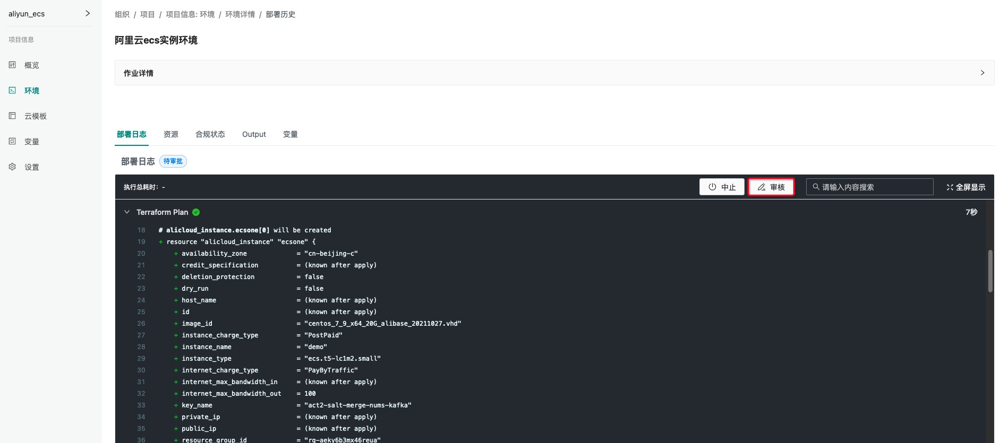

##### apply
点击「审核」按钮, 检查确认过这次的变更数据之后, 选择点击「通过」, 让 iac 继续执行 apply;  
接下来 iac 就会开始进入到 apply 阶段, 开始执行真正的变更, 仅仅需要耐心等待一会, 一台 aliyun esc 实例就会创建出来了;


现在让我们在终端上用之前创建的 ssh 密钥登陆验证一下;


##### destory
当 aliyun ecs 使用完后, 可以在「环境详情」页面通过点击右上角的「销毁资源」来销毁这台机器
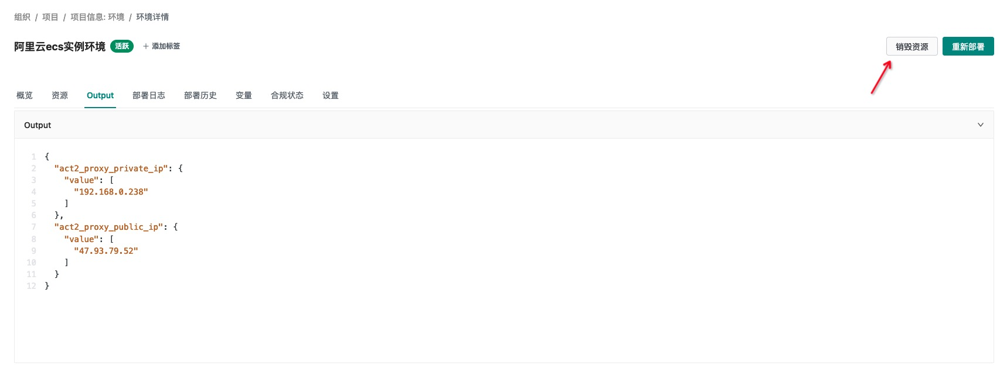

等待审批通过后, 远程机器就会被销毁掉;
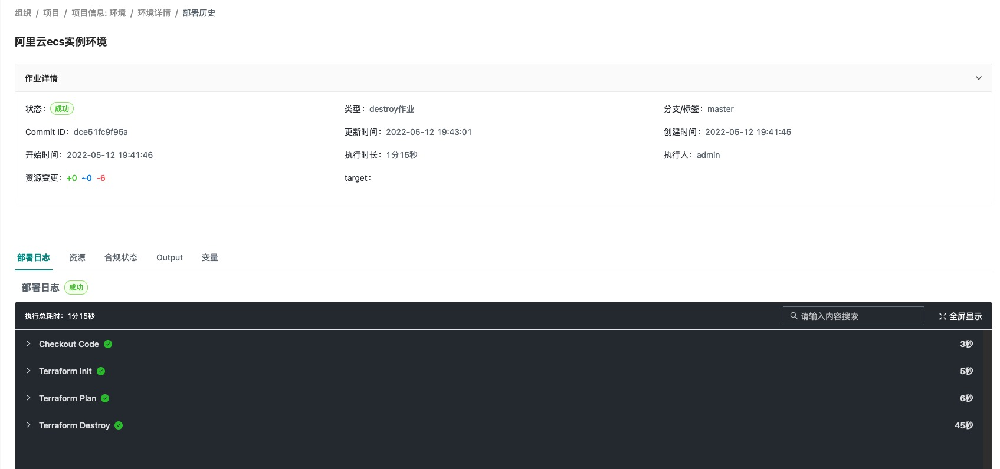

至此, 我们通过 CloudIaC 就完成对一台阿里云 ecs 实例从创建到销毁的全过程;