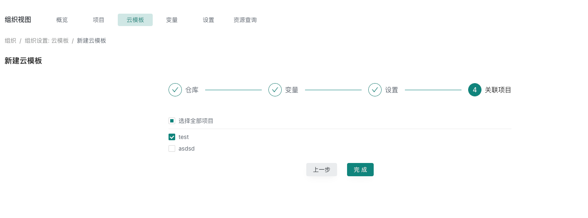
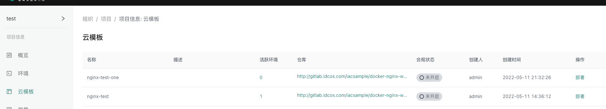
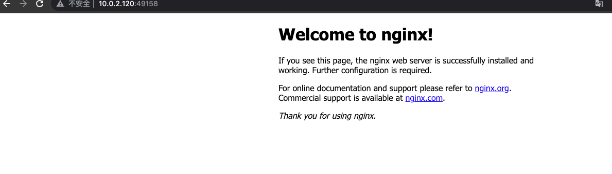

# 环境创建

## 获取基础云模板
把样板代码保存到自己的vcs仓库
```shell
#基础样板代码仓库,创建一个nginx服务
https://github.com/xiaodaiit/terraform-local-nginx
```


##  创建云模板

### 找到组织点击 [新建云模板] 选择vcs仓库,找到刚才新增的样板代码分支
{.img-fluid}

### 设置云模板变量
选择需要导入的变量,进行修改
{.img-fluid}

### 设置名称和关联项目

{.img-fluid}
{.img-fluid}


## 使用云模板创建ECS资源设置
在组织,云模板列表,找到刚才创建的云模板,点击 [部署]
{.img-fluid}

设置名称和执行部署通道然后点击 [执行部署]
{.img-fluid}


## 执行部署

### 部署信息,点击  [审核], 选择 [通过]
{.img-fluid}

### 审核通过,部署成功
{.img-fluid}

### 访问nginx
通过部署服务的ip地址加上资源创建输出的端口,即可访问nginx服务
{.img-fluid}

### 资源概览
可以通过环境详情页,点击 [资源] 查看具体资源信息
{.img-fluid}

以上就是通过样板预制云模板创建nginx服务的流程

## 销毁资源
点击 [销毁资源] 输入环境名称
{.img-fluid}

销毁审核 点击 [审核] 通过
{.img-fluid}

销毁资源完成
{.img-fluid}

查看环境详情资源状态
{.img-fluid}

以上就是整个环境创建到销毁的完整生命周期

