# 检测资源合规

## 场景描述

通常我们想要检查terraform变更资源的合规性，比如想要检查ecs实例必须绑定弹性公网ip，ecs实例开放80端口或443端口，ecs实例的类型，只能通过人工方式检查terraform代码，耗时耗力

为了解决以上问题，cloudiac提供了合规检测功能，通过合规检测功能，您只需在cloudiac中创建策略组，并将策略组绑定到环境，即可实现自动检测资源的合规性

目前cloudiac可以使用vcs仓库和registry中的策略组，如果registry中无满足您需求的策略组，您还可自行编写合规策略并上传到自己的vcs仓库或者我们的registry平台，即可在cloudiac中使用

有关合规策略的详细介绍，请参考[安全合规](/docs/mkdocs/manual/compliance.md)

## 场景演示

使用以下环境作为示例说明：

演示环境和策略组如下：

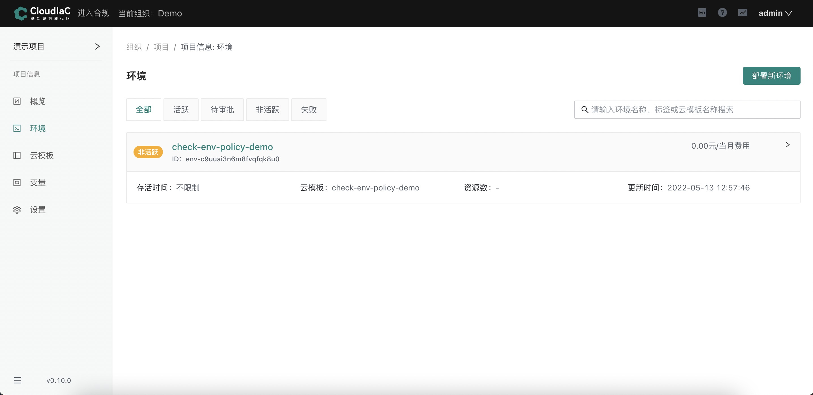

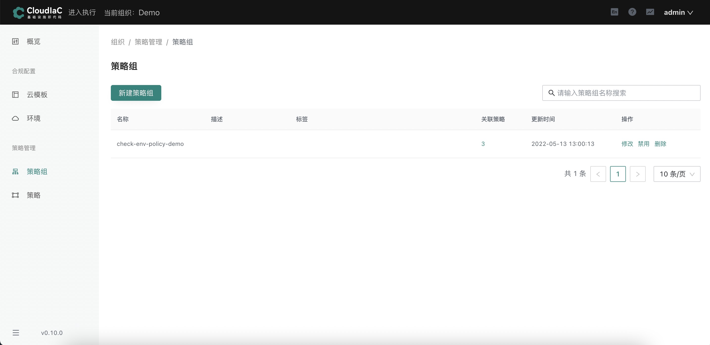

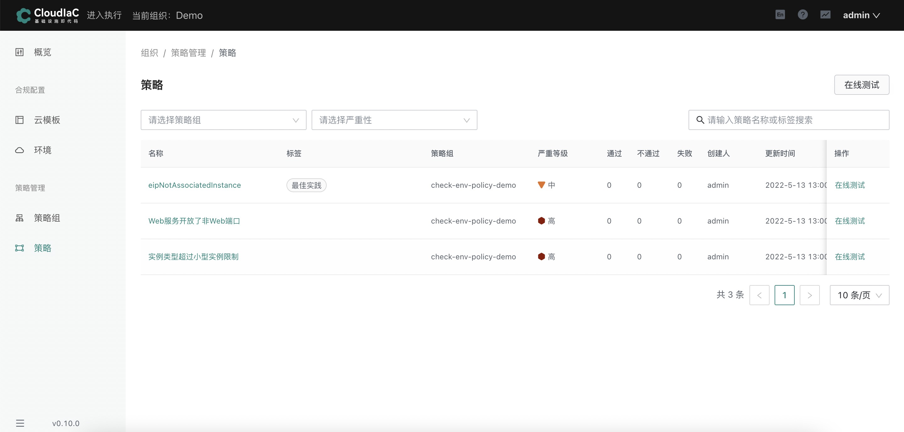

该环境用来在阿里云创建ecs服务器

同时策略组包含了3条合规策略，每条策略都对资源的创建进行合规检测

**名称为eipNotAssociatedInstance的合规策略要求创建出来的ecs服务器必须绑定弹性公网（eip）**

**名称为Web服务开放了非Web端口的合规策略要求创建出来的ecs服务器必须只能开放（80端口或者443端口）**

**名称为实例类型超过小型实例限制的合规策略要求创建出来的ecs服务器类型只能为 small 或者 nano 类型的小型实例**

### 环境合规开启方式

#### 方式一：在执行页面部署新环境或者重新部署旧环境时同时绑定策略组

选择菜单【项目信息】下的【环境】，点击【设置】按钮

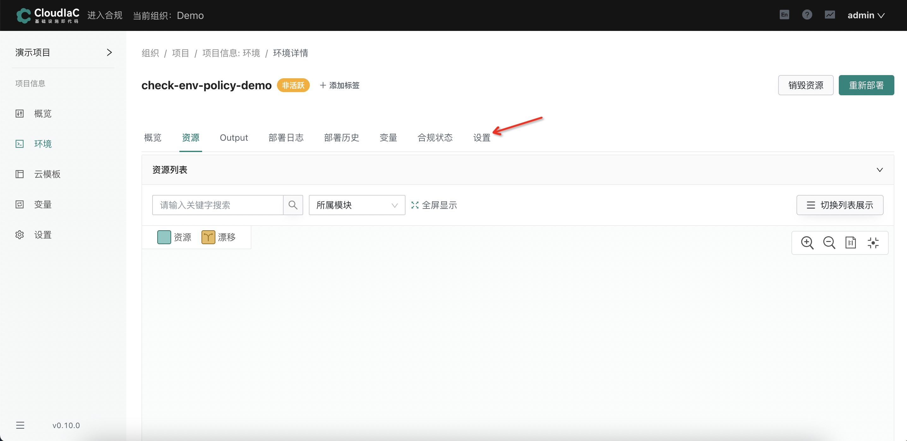

在【合规】栏中点击开启合规检测并绑定策略组

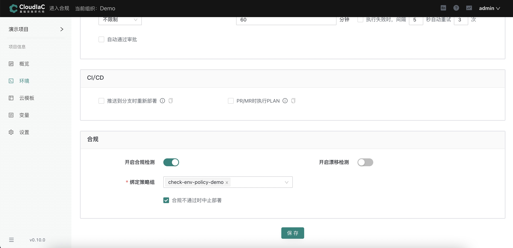

若勾选了 "合规不通过时中止部署"，那么环境将会中止这次资源变更

若没勾选 "合规不通过时中止部署"，那么环境依然会去变更资源

#### 方式二：在合规页面为已存在的环境绑定策略组

点击【进入合规】

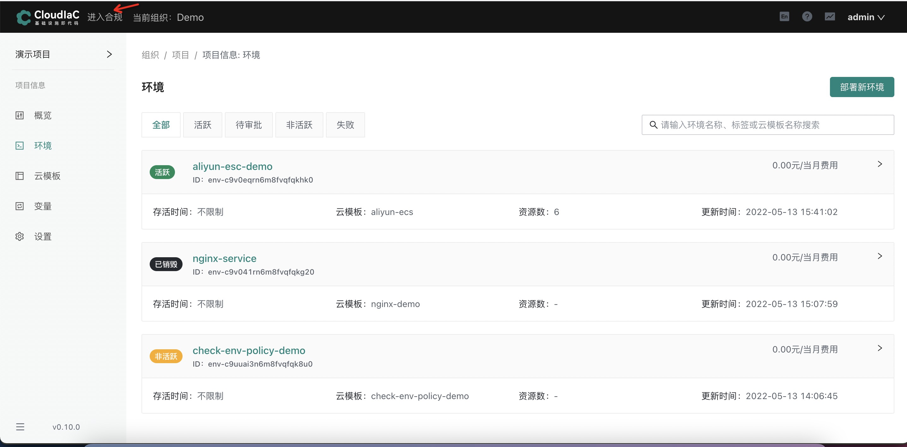

选择菜单【合规配置】下的【环境】

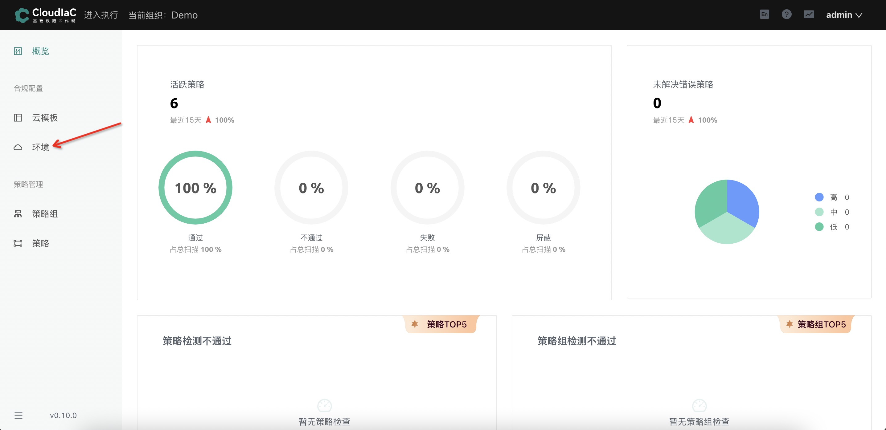

点击【开启检测】，并绑定策略组

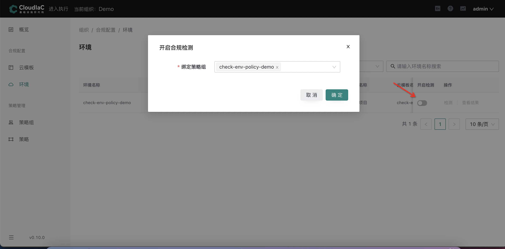

### 云模板合规开启方式

点击【进入合规】


选择菜单【合规配置】下的【云模板】

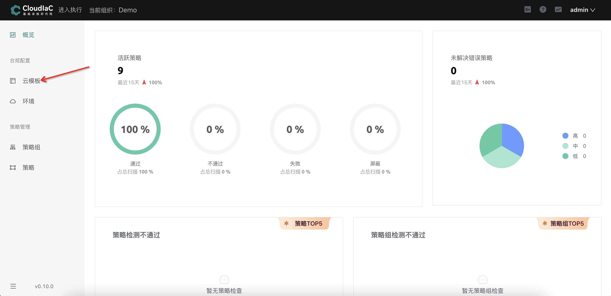

点击【开启检测】，并绑定策略组

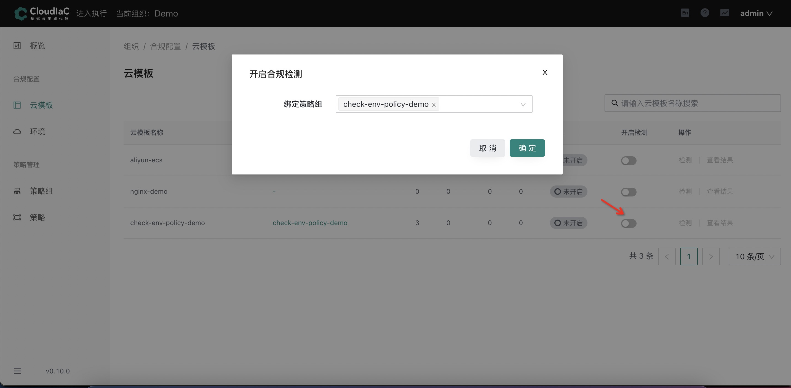

### 环境合规检测效果展示

#### 资源不合规

执行 terraform plan 操作过后，会去执行合规策略检测的步骤

其中 Passed 代表环境将要创建的资源满足该条合规策略，Violated 代表环境将要创建的资源不满足该条合规策略

如下图：Web服务开放了非web端口这条合规策略的类型为 Violated，即说明该资源开放了除80端口或者443端口以外的端口，
由此cloudiac根据合规策略自动对将要变更的资源进行了合规性检测，您可根据检测结果更改terraform代码以满足合规性

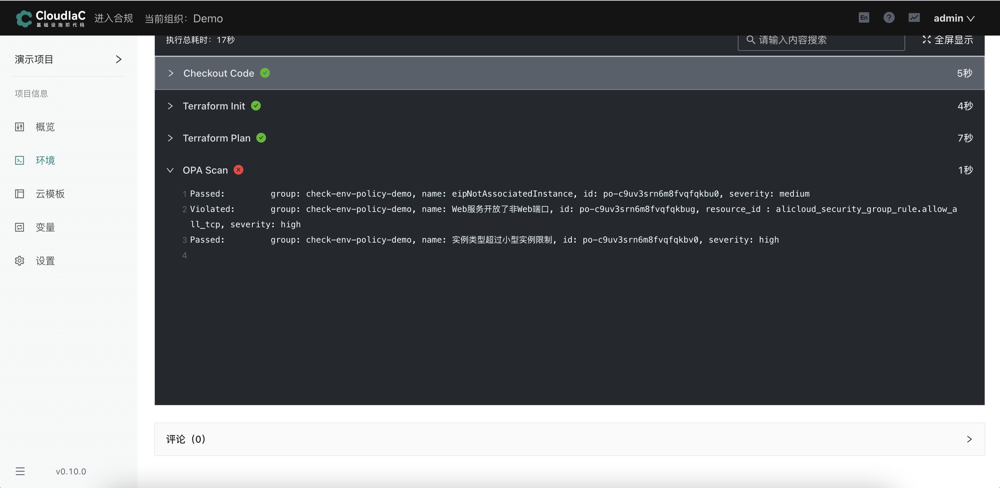

#### 资源合规

只有当所有合规策略都passed，该资源才算合规

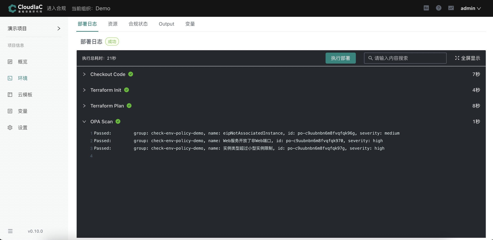

可以在合规状态里查看通过检测的策略详情

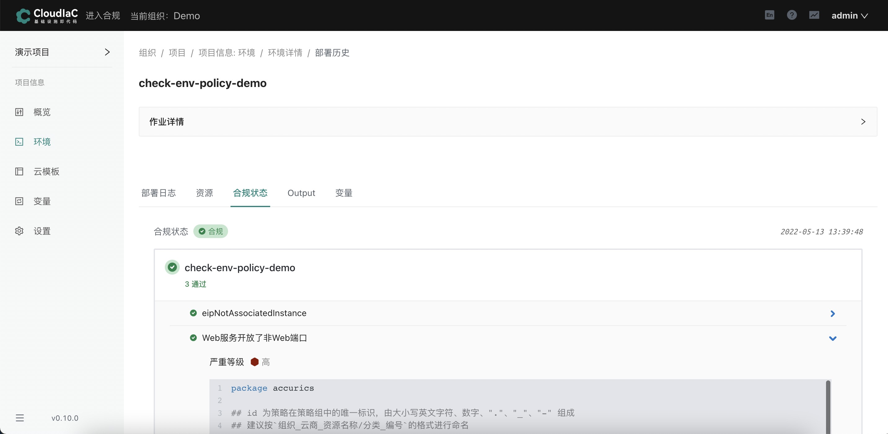

### 云模板合规检测效果展示

#### 资源不合规

其中 Passed 代表云模板中tf文件资源满足该条合规策略，Violated 代表云模板中tf文件资源不满足该条合规策略

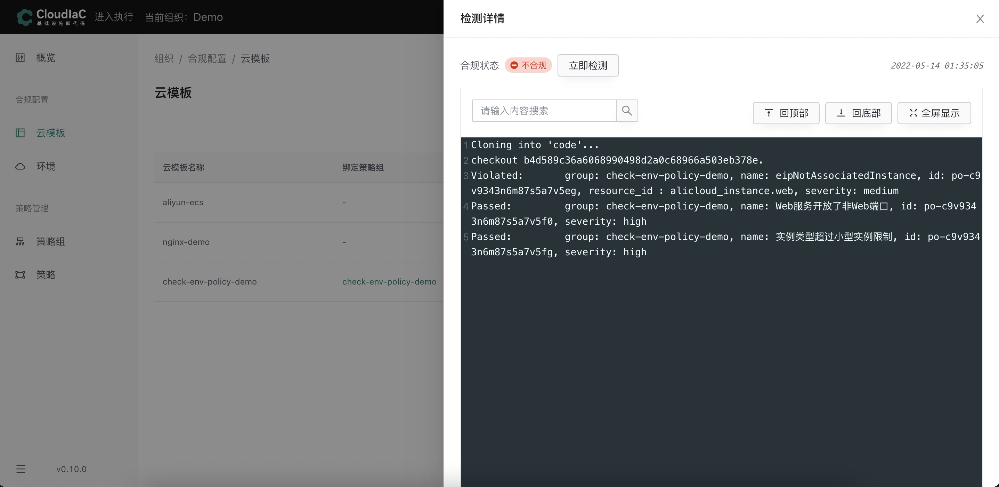

#### 资源合规

只有当所有合规策略都passed，该资源才算合规


### 合规检测机制说明

cloudiac中可以针对云模板或者环境进行合规检测，但检测机制并不相同

云模板合规是检查的tf静态文件，环境合规检测的是动态生成的 plan 文件，因此，对同一云模板与其创建出来的环境进行合规检测，结果并不一致。

#### 针对云模板进行合规检测

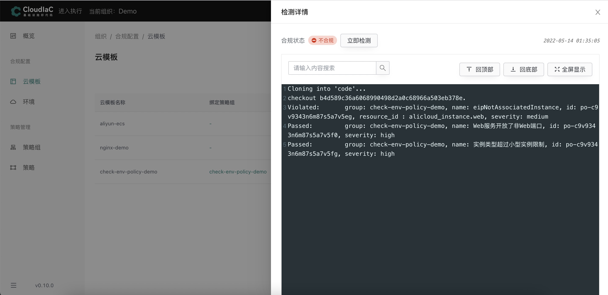

#### 针对环境进行合规检测

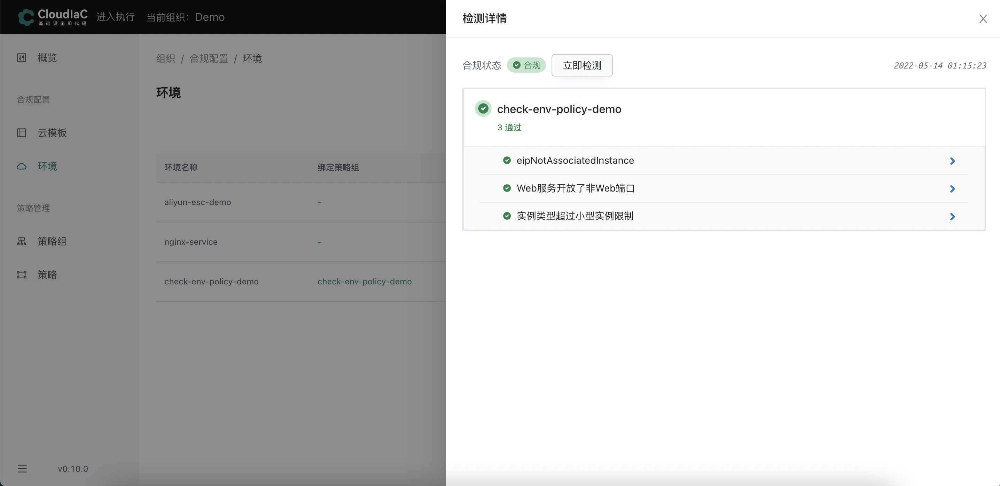

### 检测结果说明

我们在云模板里面会定义很多变量，比如资源```alicloud_eip_association```定义了一个 ```instance_id = alicloud_instance.web[count.index].id```，那在我们环境部署前，这个值是多少是不知道的，只有 plan 之后才知道结果，因此会出现环境合规能够通过，云模板合规却通过不了的情况，因此，云模板合规可以算是预检测，具体的资源合规性请以环境合规为准