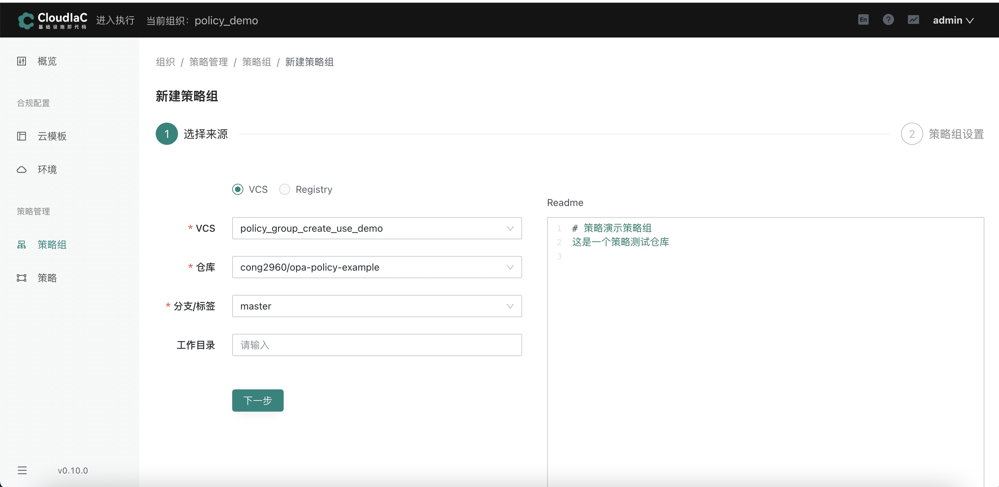
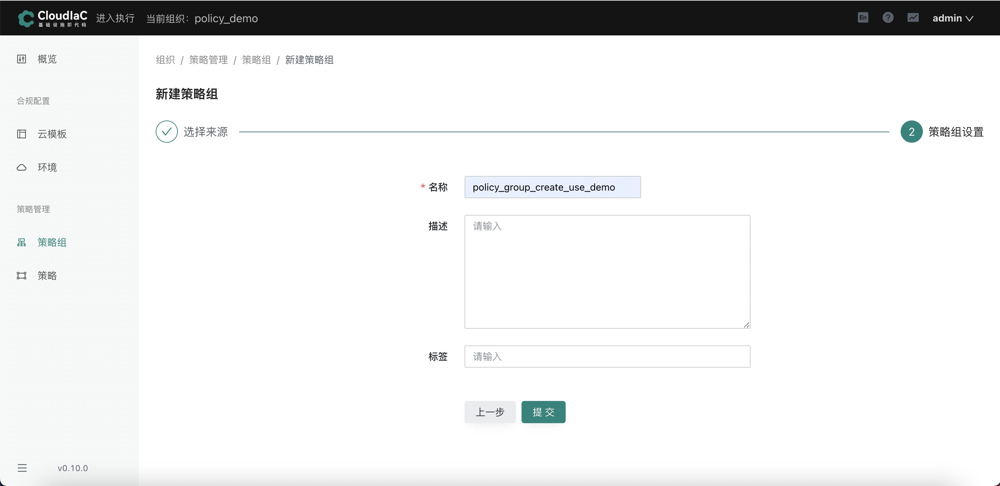
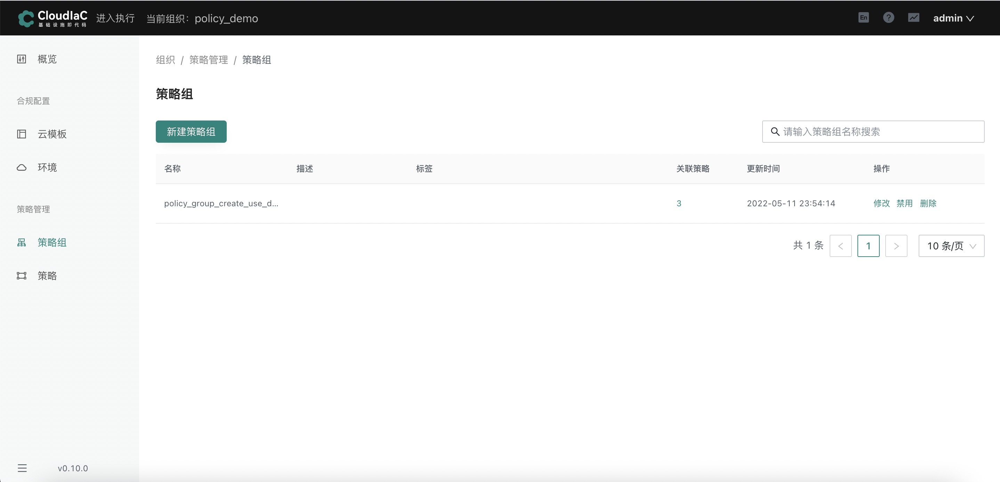
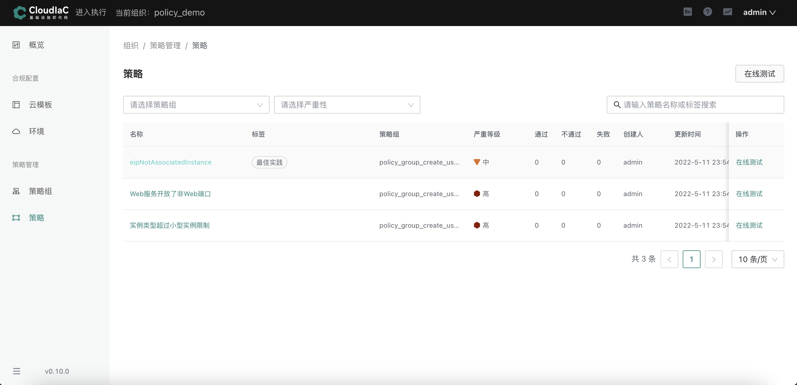

# 创建策略组

## 策略组来源

- vcs仓库
- registry

## 创建策略组

### 选择vcs仓库为来源

以 opa-policy-example 为例：[https://github.com/cong2960/opa-policy-example](https://github.com/cong2960/opa-policy-example)，您可自行fork用于测试

#### 仓库规范

- 请确保仓库中含有.rego格式结尾的文件

#### 操作流程

**必填参数：vcs, 仓库，分支，策略组名称**

创建策略组成功后，可在策略组查看绑定的策略数量，同时可以在策略里看到对应的策略详情

### 选择registry为来源

请参考[使用registry创建策略组](../cases/registry-policygroup)
