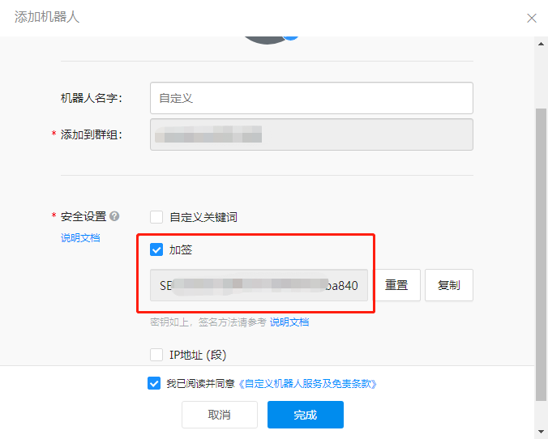

# 添加部署失败通知

## 创建通知

- 进入【组织视图】，选择【设置】Tab，【通知】菜单。
  {.img-fluid}

- 新建通知

点击【新建通知】按钮，弹出添加通知的界面，目前有 4 种类型的通知可以选择。

1. 邮件
2. 企业微信
3. 钉钉
4. Slack

{.img-fluid}

### 创建邮件通知

选择通知类型为【邮件】，添加一个【部署失败】的邮件通知。

从左边的用户列表中选择接受通知的用户，移动右边，然后点击【确认】按钮
{.img-fluid}

### 创建企业微信通知

选择通知类型为【企业微信】，添加一个【部署失败】的企业微信通知。
{.img-fluid}

### 创建钉钉通知

选择通知类型为【钉钉】，添加一个【部署失败】的钉钉通知。
{.img-fluid}

### 创建 slack 通知

选择通知类型为【Slack】，添加一个【部署失败】的 Slack 通知。
{.img-fluid}

### 创建后的通知列表

{.img-fluid}

## 部署失败环境

创建一个会部署失败的环境，测试是否能够收到部署失败的通知。

- 选择【云模板】菜单，并点击【部署】
  {.img-fluid}

- 输入必要的信息，点击【执行部署】
  {.img-fluid}

- 部署失败
  {.img-fluid}

## 查看通知

查看部署失败之后，邮件，企业微信，钉钉和 Slack 的通知是否收到。

- 邮件通知
  {.img-fluid}

- 企业微信通知
  {.img-fluid}

- 钉钉通知
  {.img-fluid}

- Slack 通知
  {.img-fluid}

## 补充：各类通知接收方式的配置

### 邮件通知

邮件通知的邮箱和和系统中账户的邮箱一致，选择邮件通知对象时，选择需要通知的账户即可。

左边红框是待选的账户，右边红框是已经选择接收通知的账户。
{.img-fluid}

### 企业微信通知

创建或者加入企业微信群，在群的设置页面创建接收消息的机器人。
{.img-fluid}

添加一个机器人用于接收部署失败的消息。
{.img-fluid}

添加成功之后，生成 webhook url。
{.img-fluid}

系统中创建企业微信通知时，使用上面的 webhook url。
{.img-fluid}

### 钉钉通知

- 钉钉上创建群，并添加一个机器人
  {.img-fluid}

- 创建钉钉机器人
  创建机器人按照钉钉提示的步骤一步步填写即可，需要注意的地方有：

  1. 机器人类型选择【自定义】机器人
     {.img-fluid}
  2. 安全设置选择【加签】，并将生成的密钥保存下来
     {.img-fluid}
  3. 最后生成的 webhook url 要保存下来
     {.img-fluid}

创建钉钉通知时，将上面的生成的 密钥 和 webhook url 填入下面的对应位置。
{.img-fluid}

### Slack 通知

首先在 slack 官网上注册账户，并创建一个频道。

然后在频道中配置通知。
{.img-fluid}

应用选择【Incoming WebHook】类型，然后添加到接收消息的频道即可。
{.img-fluid}

添加成功之后，会生成一个 webhook url。
{.img-fluid}

将此 url 配置到系统中用来接收通知。
{.img-fluid}
