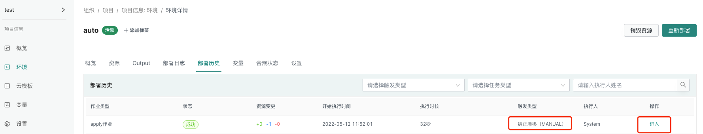
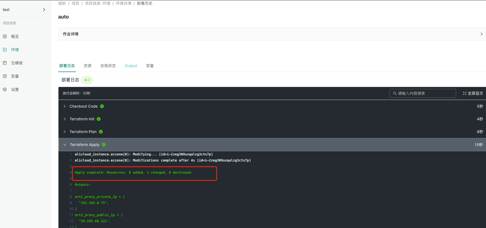

# 漂移检测

##  开启漂移检测
找到环境详情,点击设置,找到合规,开启漂移检测,同时设置定时检测时间 如: [*/10 * * * *] 代表每隔10分钟执行一次
{.img-fluid}

:::tip
此处我们以阿里云的ECS资源为例
自动纠偏会把漂移的资源纠正为原始云模板定义的资源
如果要开启纠偏模式,需要设置自动审批
:::

## 漂移检测信息
登陆阿里云控制台查看ECS资源信息
{.img-fluid}

手动修改带宽规格,由100M->26M
{.img-fluid}

可以通过环境详情的资源信息查看具体的漂移信息
{.img-fluid}

## 自动纠偏

开启自动纠偏
{.img-fluid}

开启自动纠偏后,可以恢复资源到云模板创建状态,具体信息可以在部署历史中查看
{.img-fluid}

查看部署日志纠偏信息
{.img-fluid}

最终纠正漂移信息
{.img-fluid}

