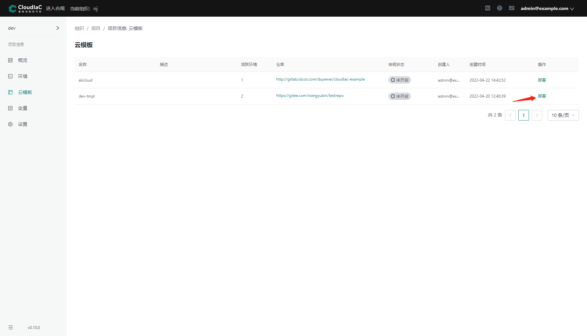
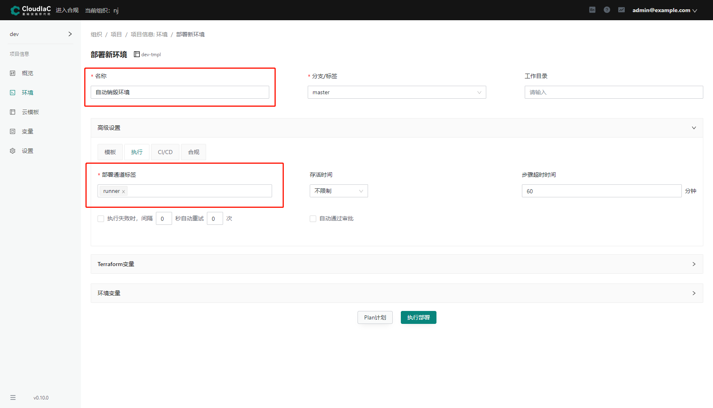
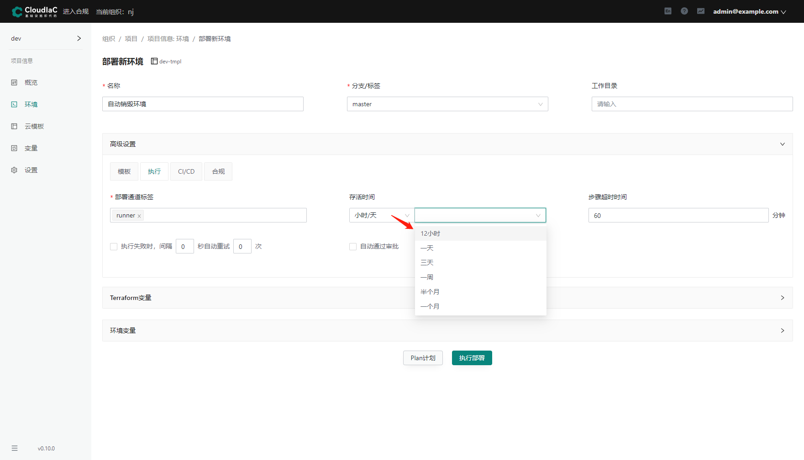
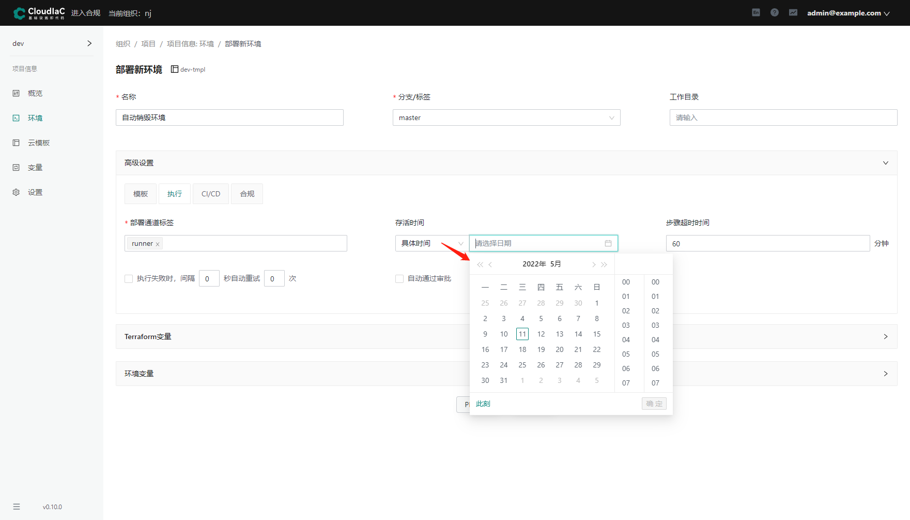
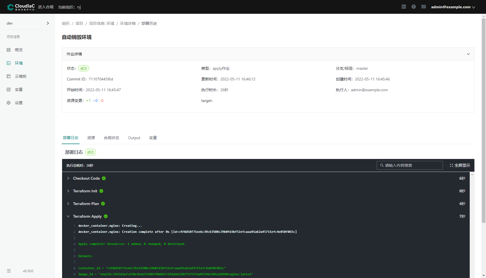
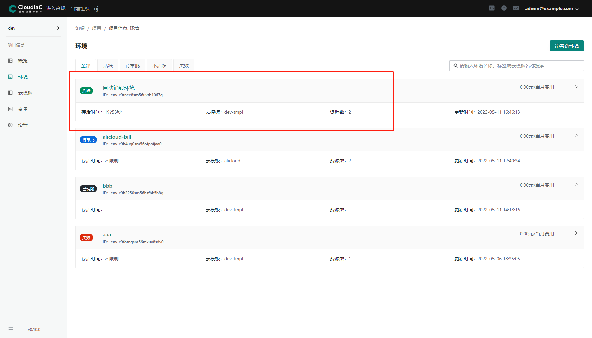
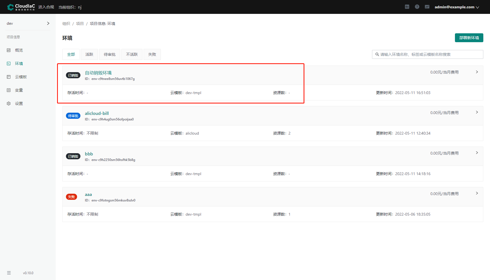

# 环境自动销毁

## 概述

环境的自动销毁，可以在环境部署前或者部署后设置。

设置之后，环境在销毁时间到了之后，自动触发销毁的操作。

## 创建新环境

进入项目概览页后，选择【环境】菜单，点击【部署新环境】按钮。
{.img-fluid}

### 选择云模板

选择部署的云模板，然后点击【部署】按钮
{.img-fluid}

### 设置新环境信息

环境的必须要输入的信息主要有【名称】和【部署通道标签】。

【部署通道标签】在【高级设置】中的【执行】tab 下。
{.img-fluid}

### 存活时间

存活时间有 3 种选择：

- 不限制：默认选项，也就是不自动销毁
- 小时/天：设置多长时间后自动销毁，可以选择的时间如图
  {.img-fluid}

- 具体时间：设置某个时间点开始执行自动销毁
  {.img-fluid}

## 部署环境

为了简化部署过程，选择【自动通过审批】，存活时间选择了 5 分钟之后。

然后点击【执行部署】
{.img-fluid}

部署成功后的日志
{.img-fluid}

环境列表中显示为【活跃】状态
{.img-fluid}

## 自动销毁确认

到达销毁时间后，环境状态自动变成了【执行中】，表示后台已经开始自动销毁环境了。
{.img-fluid}

执行一段时间后，再次查看环境列表，发现环境状态已经变成了【已销毁】
{.img-fluid}

最后，点击列表中的环境名称，进入环境的【部署历史】tab 中，可以看到自动销毁的历史信息。
{.img-fluid}
