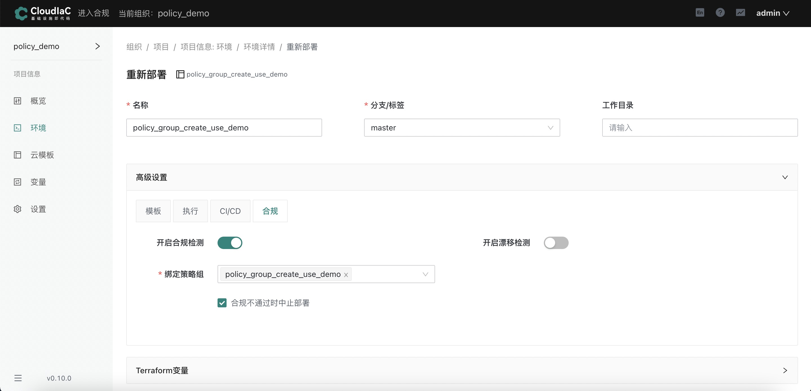
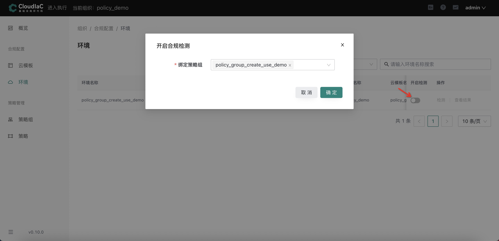
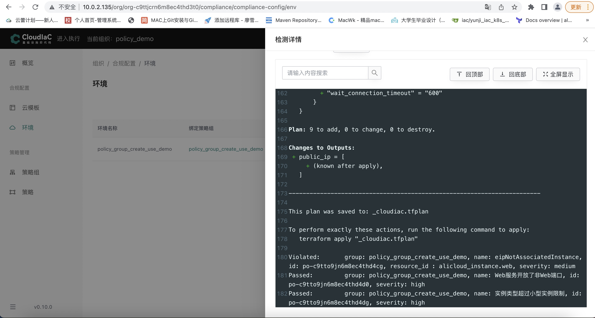
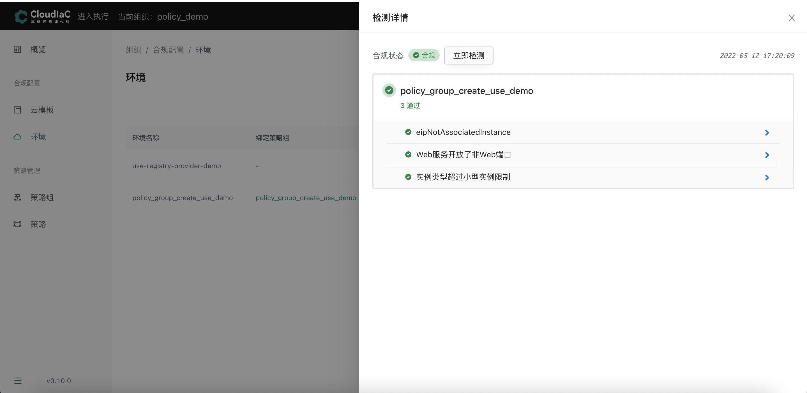

# 为环境开启合规策略

## 准备工作

### 创建云模板

本步骤创建云模板所使用的示例仓库：[https://github.com/cong2960/cloudiac-example](https://github.com/cong2960/cloudiac-example)，您可自行fork用于测试

步骤参考[创建云模板](../quick-start/create-template.md)

**注意：创建云模板时请fork示例仓库或自行创建仓库进行测试**

### 创建环境

参考[创建环境](../quick-start/deploy-env.md)

**注意：创建环境时请使用上述步骤创建出的云模版**

### 创建策略组

本步骤创建策略组所使用的仓库：[https://github.com/cong2960/opa-policy-example](https://github.com/cong2960/opa-policy-example)，您可自行fork用于测试

步骤参考[创建策略组](../cases/create-policy-group.md)

**注意：创建策略组时请fork示例仓库或自行创建仓库进行测试**

### 为环境开启合规策略（两种方式）

**方式一：在执行页面部署新环境或者重新部署旧环境时同时绑定策略组**

**方式二：在合规页面为已存在的环境绑定策略组**

### 合规检测效果展示

**合规检测不通过**

该环境绑定的策略组含有3条合规策略，其中passed代表环境将要创建的资源满足该条合规策略，只有当所有合规策略都passed，该资源创建才算合规

**合规检测通过**

