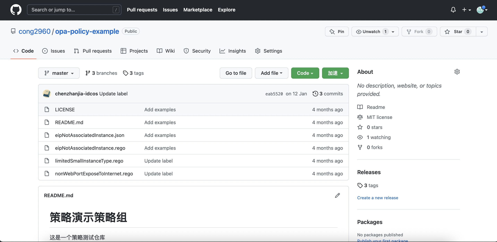
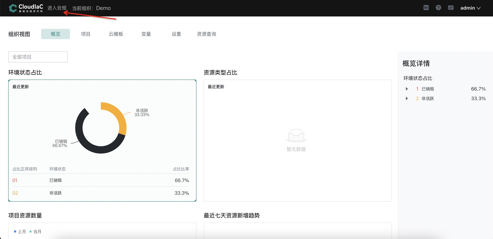
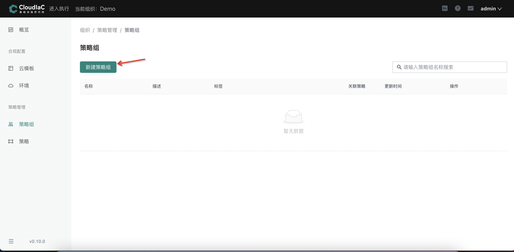
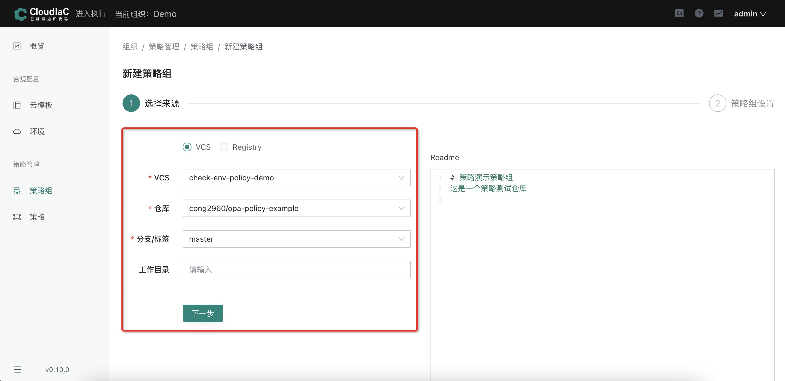
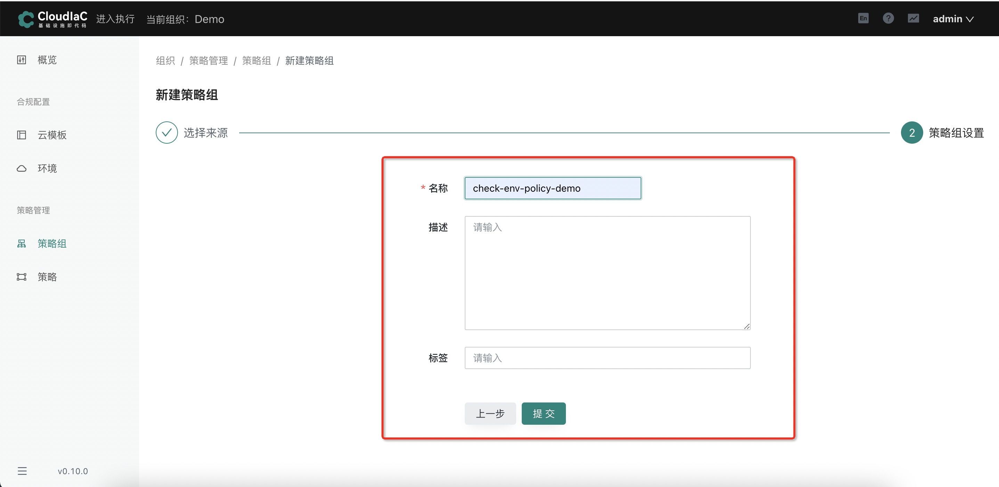

# 通过 Git 仓库创建策略组

## 场景描述

在使用 cloudiac 中的策略组功能时，如果内置的策略组或者 registry 中的策略组不满足您的需求，您可自行编写合规策略，并上传到自己的代码仓库中，即可在 cloudiac 中使用您仓库中的合规策略

## 场景示例

使用示例仓库创建一个策略组作为示例说明：

**仓库由若干个合规策略文件和配置文件组成**

有关合规策略，请参考[安全合规](/docs/mkdocs/manual/compliance.md)

### 创建策略组

进入系统页面后，选择【进入合规】

选择菜单【策略管理】下的【策略组】，点击【新建策略组】按钮

先选择【VCS】，再选择其中需要新建的【VCS】、【仓库】、【分支】、【工作目录】(可选)，点击【下一步】

可以配置策略组的【名称】，【描述】(可选)和【标签】(可选)。配置之后点击【提交】按钮。

