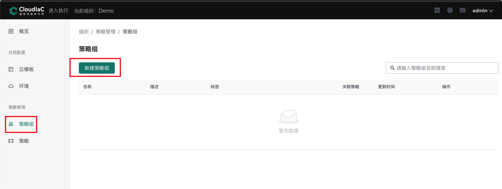
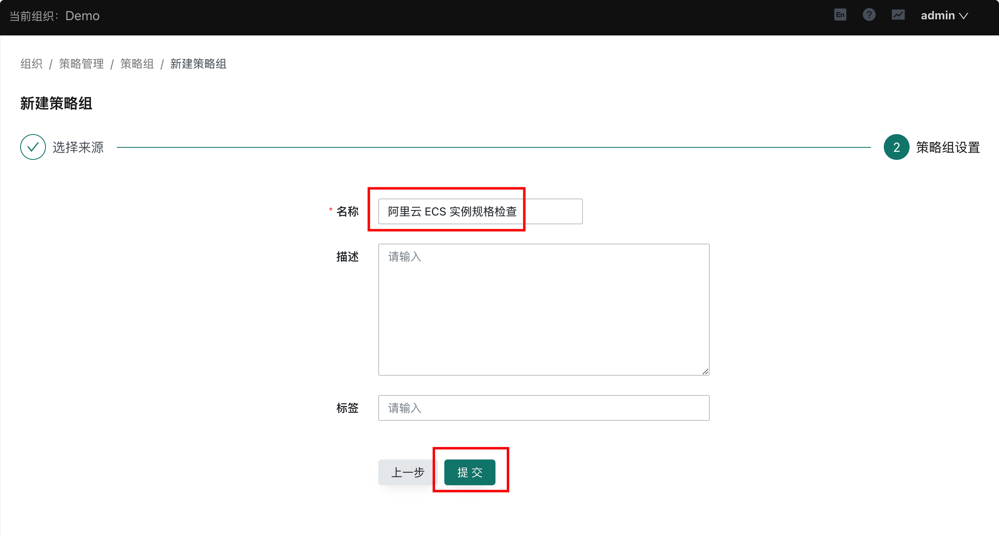
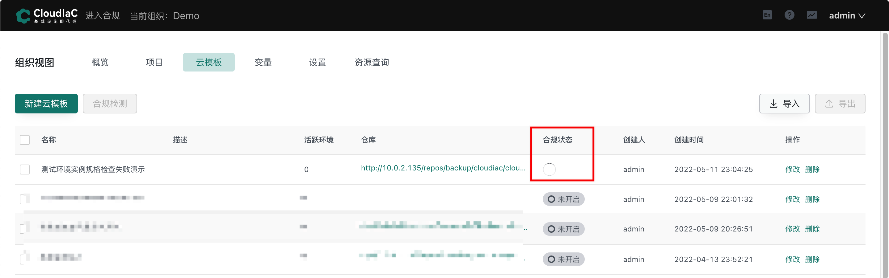
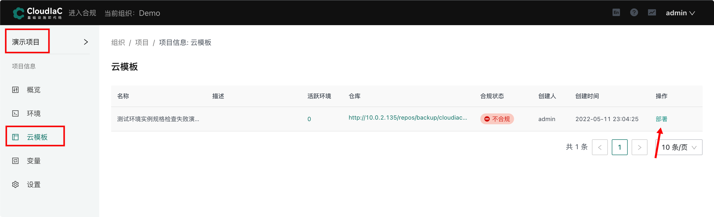
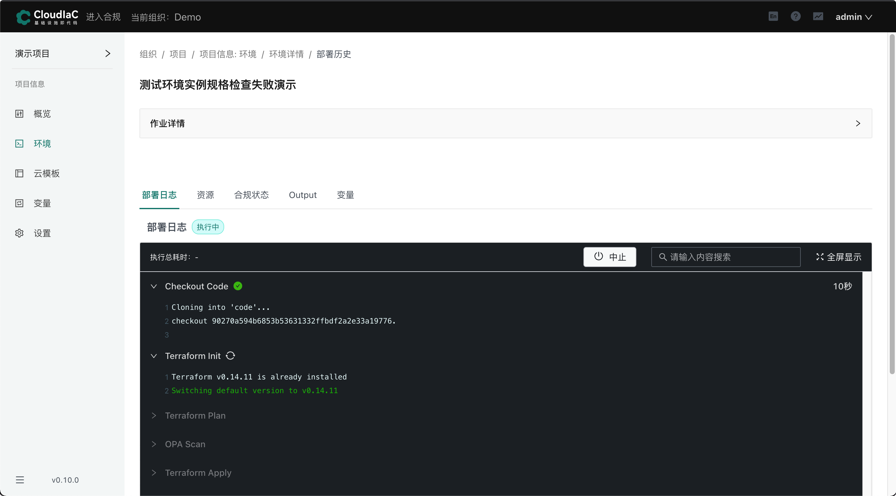

# 使用合规策略限制测试环境的机器规格
该教程演示通过合规策略限制环境使用的机器规则，可用于限制测试或者开发环境只允许使用指定规格的服务器实例，避免资源浪费。

## 创建策略组
### 1. 进入合规中心
使用平台管理员或者合规管理员账号登录平台, 点击页面左上角的“进入合规”链接进入合规中心页面：
  

### 2. 新建策略组
点击的“策略组”菜单进入策略组管理，然后点击“新建策略组”:

  

进入策略组创建页面后先选择策略组的来源的，我们这里选择使用 registry 上已经发布的策略组，策略组名称和版本如下图，完成后点击“下一步”：

  

配置策略组名称后“确认”创建：

  

策略组创建完成：

  

:::tip
这个策略组中只有一条策略，该策略用于检查创建的 aliyun ecs 实例是否为 small / nano 规格。
:::

## 创建云模板并绑定策略组
点击页面左上角的“进入执行”链接，重新进入执行中心，然后点击组织视图中的“云模板”菜单，进入云管理管理页面:

  

点击“新建云模板”，然后按照如下配置创建云模板：

  

在云模板的变量配置中选择 prod-env.tfvars 文件：

  

:::tip
prod-env.tfvars 是生产环境部署时使用的配置文件，其中 aliyun ecs 实例的规格为 ecs.g7.large。
:::

下一步，设置云模板名称，然后为云模板开启合规检测，并绑定“阿里云 ECS 实例规格检查”合规策略组：

  

最后将云模板关联到项目，完成创建：
  

:::tip
这里我们选择将云模板关联到“演示项目”，后面创建环境也是在演示项目下进行。当然也可以选择任意项目关联，后续创建环境也在关联的项目中进行即可。
:::

云模板创建后会立即出发一次合规检测：

  

合规检测完成后可以看到云模板的合规状态为“不通过”：

  

点击合规状态可以打开检测详情页面，查看具体不通过的原因：

  

## 基于云模板部署环境
在上面的步骤中我们已经完成了云模板的创建，并绑定了合规策略。下面我们基于这个云模板创建一个环境，演示通过合规策略限制环境允许部署的实例规格。

进入“演示项目”，然后点击“云模板”菜单，在云模板列表中选择刚刚创建的云模板进行部署：

 

点击部署后会进入部署新环境页面，如下图配置环境名称和分支，并添加资源账号：
  

打开高级设置中的执行设置，选择一个部署通道标签：

  

打开高级设置中的合规设置，勾选“合规不通过时中止部署”:

  

然后点击“执行部署”，开始部署新环境：

  

当执行到 “OPA Scan” 步骤时因为实例规格与合规策略组中的策略冲突，导致未通过检查，部署过程中止：

  

:::tip
此时环境和任务都会变为失败状态，且环境也显示为“不合规”。
:::

通过应用合规策略，我们实现了针对测试或开发环境限制其使用的实例规格的目的，避免创建不必要的实例规格导致资源浪费。