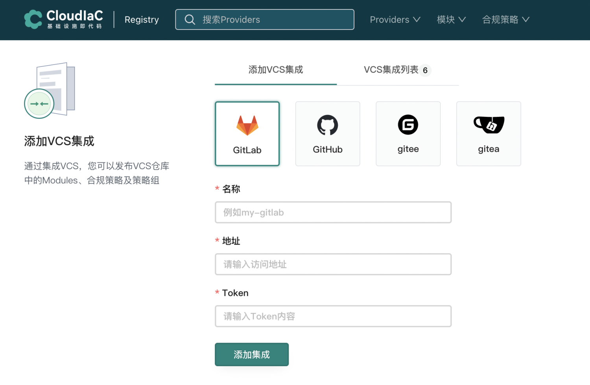
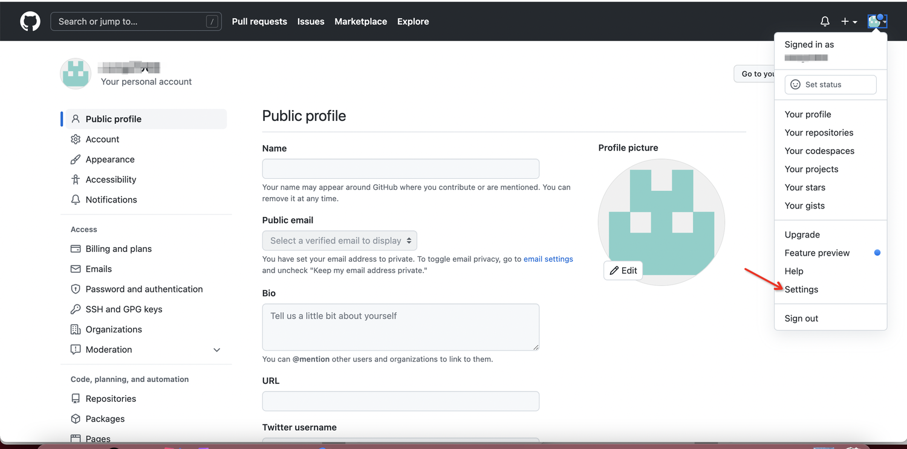
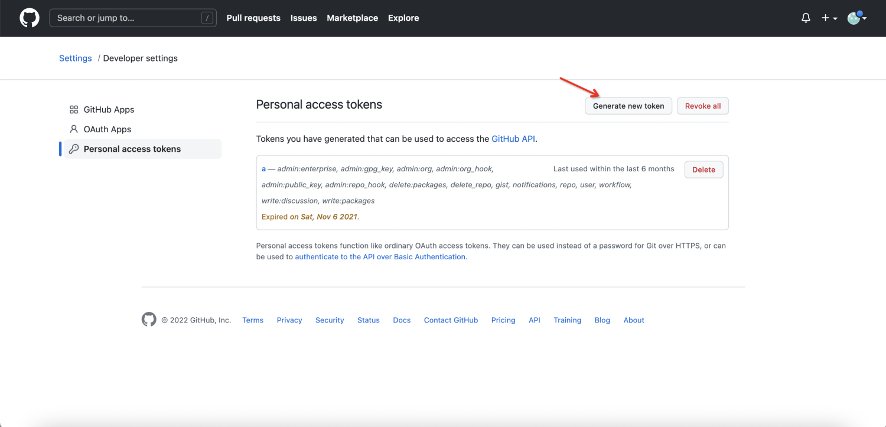
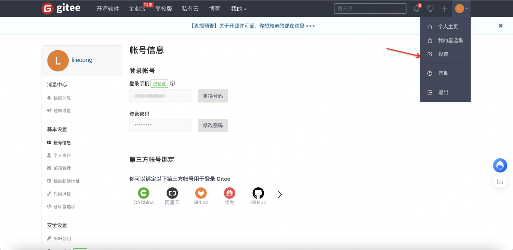
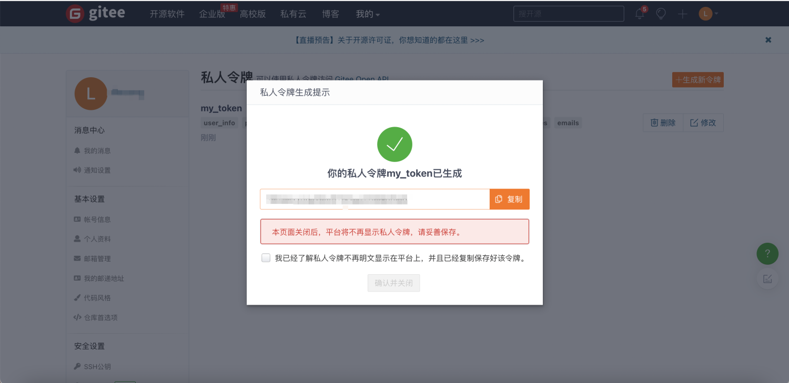
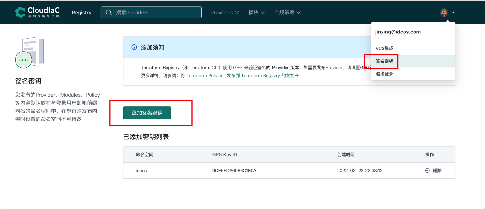
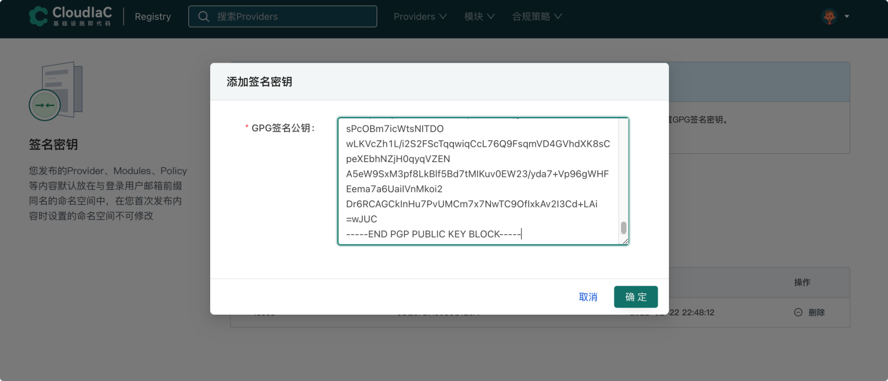
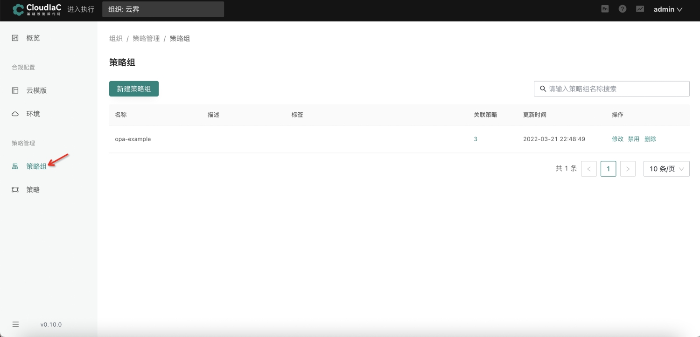
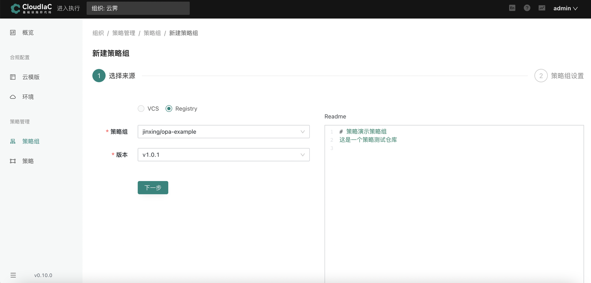
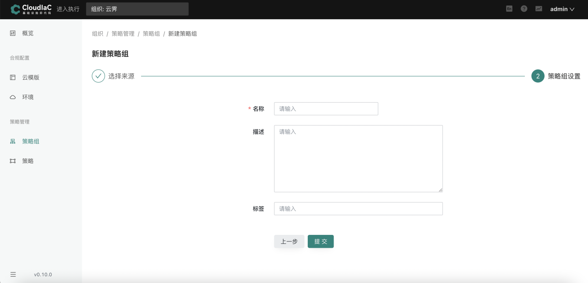

# registry

## 什么是registry

## 登录方式
registry目前拟支持两种登录方式，使用cloudiac账号登录或者github账号登录，通过不同平台登录的账号相互独立

有关github的介绍，请访问[github介绍](https://github.com/about)

要想使用registry，则必须拥有cloudiac账号或者github账号

cloudiac账号的获取请联系管理员

github账号请访问github官网注册


## 产品功能
### vcs管理
#### 什么是vcs

VCS是版本控制系统的简称（Version Control System）

registry中模块发布以及合格策略组的发布都通过VCS（版本控制系统）进行管理

registry通过添加VCS的方式来集成版本控制系统，从而获取代码仓库中的配置文件

#### vcs的类型

registry目前支持以下四种VCS集成：

● GitHub

● GitLab

● Gitee

● Gitea

### vcs集成
#### 添加vcs
1、登录registry以后，选择vcs集成

{.img-fluid}

如果是首次登录，则要求输入命名空间。

tips：命名空间相当于用户的存储空间，使用registry发布的provider,module，策略组将会存放在命名空间中，

如果要使用发布provider功能，则必须额外提供GPG签名密钥，有关GPG签名密钥的获取，请参考[GPG签名密钥的获取](#gpg)

{.img-fluid}

2、选择对应的vcs，输入vcs名称，vcs地址，Token，点击添加集成，添加后可在vcs集成列表中查看已添加的vcs

{.img-fluid}
tips：如果选择GitHub或者gitee，则地址为默认地址即可，不需要变更，

如果选择GitLab或者gitea，因为是内网系统，则需要输入对应的内网网址

Token为对应vcs平台的私人令牌，各平台Token的获取请参考[token获取](#token)

### token获取
#### gitlab
1、访问gitlab，并输入账号密码进行登录（gitlab为内网系统，账号密码需管理员分发）

2、点击设置，再点击访问令牌

{.img-fluid}

3、输入创建令牌需要的信息，点击创建个人访问令牌

tips：名称为该令牌的名称，到期时间为该令牌的有效时间（不填则表示该令牌永不过期），范围指该令牌的权限

{.img-fluid}

4、令牌成功创建，此令牌即可在registry中使用

{.img-fluid}

#### github

1、访问github官网，进行登录

2、点击Settings

{.img-fluid}

3、点击Developer settings

{.img-fluid}

4、点击Personal access tokens

{.img-fluid}

5、点击Generate new token

{.img-fluid}

6、输入对应参数，点击Generate token

{.img-fluid}

7、此token即可在registry中使用

{.img-fluid}

#### gitee

1、访问gitee官网，输入账号密码进行登录

2、点击设置

{.img-fluid}

3、点击私人令牌

{.img-fluid}

4、点击生成新令牌

{.img-fluid}

5、输入相关参数，点击提交

{.img-fluid}

6、输入密码，点击验证

{.img-fluid}

7、 此token即可在registry中使用

{.img-fluid}

## 签名密钥管理
### GPG签名密钥在registry中的作用

GPG 密钥用于对 provider package 签名，要发布 provider 到一个 namespace 下就需要使用已添加到 namespace 的 gpg 密钥对 provider package 进行签名。

### GPG签名密钥的获取
GPG 密钥生成可参考文档：[GPG签名密钥获取](https://docs.github.com/en/authentication/managing-commit-signature-verification/generating-a-new-gpg-key)

以下为 macos 下创建 GPG 密钥对的过程，其他系统过程大致相同

```bash
1. gpg --generate-key
2. 根据提示输入 user id: username-example
3. 根据提示输入 email: username@example.com
4. 在弹出的窗口中输入 passphrase 或者留空
5. 再次在弹出的窗口中输入 passphrase 或者留空
6. 创建成功

使用 gpg --list-keys 查看创建的密钥对
```

以下为过程截图：

{.img-fluid}

{.img-fluid}

{.img-fluid}

导出上一步生成的 GPG key 公钥:

```bash
gpg --armor --export "$GPG_EMAIL"
```

执行以上命令后会输出公钥，格式如下

```bash
-----BEGIN PGP PUBLIC KEY BLOCK-----

mQGNBGEOqLABDAC44R2AxNm6sB/kpBqAl2iV811E1dppRodyMcyNkC2T7zbtjlX6
oR1x8goYrykh5Yn2S0KNzEuT1Uv473ffBNIlM99yzQE74UyYCuw9YnJ3v5ipqqg/
pU7B6AJBcwaZSEgldZC+apidhjRJvZFsrepDaEl292cG9vFPpLjdQ2D95jP0hA49
jaDrXL+Rras9HAphMogEp4q06zijbFr+scrNJyrbdJAWckZZHdiyjRbI+MaAozf+
S5DLKQArm4ih7wQ85620fUh0IUb/cupI05VekaUzOT28o/DybMHgry1Hbis+z2og
mRKdJkK90uubZT8F3bWJdp8OQGahuq8sNpMmwhPR4SLHQZt8Wl7CEe01ShLoTG31
MsVQ7myF/oI+BAKuhyvlFguSHrUPaaigoFCrFYnoJaYpwJ1Bm/bSqnZBMkyFT0Sr
llDtgaVHv6L1yMekFPtbJYVcMJY3r5ytR5/Yllp/APtL/Eto9YM+5aqBaWRpcSEJ
JTtQFhVoQAWl4OUAEQEAAbQpanhpbmdpbmctdGYtcHJvdmlkZXIgPGp4aW5naW5n
QGdtYWlsLmNvbT6JAdQEEwEIAD4WIQRMPwU7Hn0wrLak/n7so3cIf+ZsggUCYQ6o
sAIbAwUJA8JnAAULCQgHAgYVCgkICwIEFgIDAQIeAQIXgAAKCRDso3cIf+ZsgikM
C/41yOODkZ9L+OhN9Z5Ln0OBPnvGNU/UqRIM6YozQ2H/TG5iXspLEjArIafWNKbl
yLZy4EE/yQn/6oX6zRNCy25d3J+FsOvSIUfOWSW7qWs6dVr0umZT9hcZ4F3AFO3d
NuzOef5bOFtStPmmmRlw1gdUeBxAiAKrbNOE+y6SLzmPQIxnThiSay0ezwWud82t
8Ap4rGZwmyXtOseCayCx1m8CBrMWzU0OLlehMXTtT/gGfwjENOlXMjJCki57s4j+
ZyU5G1MVYLf0UhDq9LU0dJfjpKkrQV9gDl93yeLQKWBZH+wLL5EgIPMHNtGj0KhK
mHg7IFQBTe/6KzjWogT+gHtkDLgdKwiEtrADURQF8L436NiURT9ZOS62YNMBKwQB
lQF0MK7Y39v47TTzaBOp4tun2fRhEqhE++491HiEpUWRh1VxDrysM2ro+wNNZcgb
CdXiWRuuXdR4bLiNslAr+lnWT57fCPu84pjuBfMj7riljMwMWg5XpQtXY4/gvvQw
xRK5AY0EYQ6osAEMANi4AAYwKK1hrmInMfEJlv4ZSsP2/kWQBZaQpfO73BhfKveV
Yo4R1UW7w6cgYvFgDl2VUvXyjVJs1KBScgAcXRMIlrCvdW2woVkKPgJdArBcaQ71
/Vs+hsjS/D6kikM61ZZbtYj+Bvigs9fMuCJ3rDM64xDCMvqjrtQ8PC6dPUj/2s03
lPba5x5Ej7oKLfcxgai+JaqSpkAgqQJZ4qJHz4qHLUMR5DbuLbO8nPM3xRaBabK6
RdH5tRrII0EEugJxJ/xyWTlhUIHeTd8h1xWvu7ns4xMKF3BlcuNMEsv5pseQMa20
mmyvK9f7esvAF6hiv1HrMjgF1c9o3ATyebuGw2SeAgeKrkM3ptRn0PASlhTqxPTP
fMs+JQgBIL8P5yP5yNAu1sq4bM5Rc/xw8clD+knFUirhaP0j6DJ5PZOhi1AzHNH6
8Us2+P24YDHvFNfWT2CK1pN/SHB9x/khujIUlhtL8+y34SqV/mRp5dfqMqZUX7//
FKY5otlNVWWt7lrBvQARAQABiQG8BBgBCAAmFiEETD8FOx59MKy2pP5+7KN3CH/m
bIIFAmEOqLACGwwFCQPCZwAACgkQ7KN3CH/mbIIuRAv9HKI4yqogeT9mQXbPAF3/
2lFQ3pgkuIaZWhMUDi8EkmXsOKZYXt5kGqFcrQWMTQvAl2iCzFxsHJ0GjxZcHznF
rCbw+czWB1uONeF2UR/w+t8kuw6Pn+0MLPDnJKVG/WOjE4+TtuavAdMivNmKZpm7
QO7Zh+X2VJ9dTJZPRGhbzz18xnA2uXIz3qzuwNq+KMiwT46U5atGgEZMRpLHlP0j
CtCU+yG/3wKEI/oI1NMUL7q1/ExhXUsPDjN+S/a65GhUKTvWRIfp6bYGlU5VHE2B
6klzTpnSnjRSFUet0TEd9DqA9feCvwqgFzz3JmMTLxnWrG6sPcOBm7icWtsNITDO
wLKVcZh1L/i2S2FScTqqwiqCcL76Q9FsqmVD4GVhdXK8sCpeXEbhNZjH0qyqVZEN
A5eW9SxM3pf8LkBlf5Bd7tMIKuv0EW23/yda7+Vp96gWHFEema7a6UaiIVnMkoi2
Dr6RCAGCkInHu7PvUMCm7x7NwTC9OfIxkAv2I3Cd+LAi
=wJUC
-----END PGP PUBLIC KEY BLOCK-----
```
### 添加签名密钥

登录 registry，打开密钥管理页面，点击添加密钥，将密钥内容粘贴到文本框，然后保存。

如果账号下没有命名空间则打开页面时会要求先创建命名空间，根据页面提示创建即可。

{.img-fluid}

{.img-fluid}
## provider管理
### 什么是provider
Terraform是由hashipcorp开源的基础设施即代码(IAC)管理工具，通过 Terraform 可以将基础设置配置代码在云环境应用实现云资源的供给和维护。

Terraform 目前己支持所有主流云商，目前官方以验证的云服务有200+，更多云服务也在持续接入。

为了对接各云商 Terraform 提供一套插件框架，云服务只需要接入这套插件框架，即可在 terraform 中使用，实现云资源的 CRUD 操作。

这些云服务的插件在 Terraform 中称为 Provider。
### provider发布

请参考[provider发布流程](../provider-publish/)

## module管理
### 什么是module

registry module基于terrafrom module开发，简单来讲module就是包含一组Terraform代码的文件夹，由此可以达到代码
复用的效果，更多关于module的介绍，请参考[terraform module](https://www.terraform.io/language/modules)

### module发布

请参考[modle发布流程](../module-publish/)

## 策略组管理
### 什么是策略组

策略组是cloudiac定义的包含一组合规策略的一个集合，在registry中发布的策略组可以在cloudiac中直接使用

策略组使用流程请参考[策略组使用流程](#_8)

### 策略组发布

请参考[策略组发布流程](../policy-group-publish/)

### 策略组使用流程

1、确保要使用的策略组已经发布到registry

2、登录cloudiac

3、选择组织

4、点击进入合规

{.img-fluid}

5、点击策略组

{.img-fluid}

6、点击新建策略组，来源选择Registry，选择已经在registry中已经发布的策略组

{.img-fluid}

7、点击下一步，输入相关参数，点击提交

{.img-fluid}