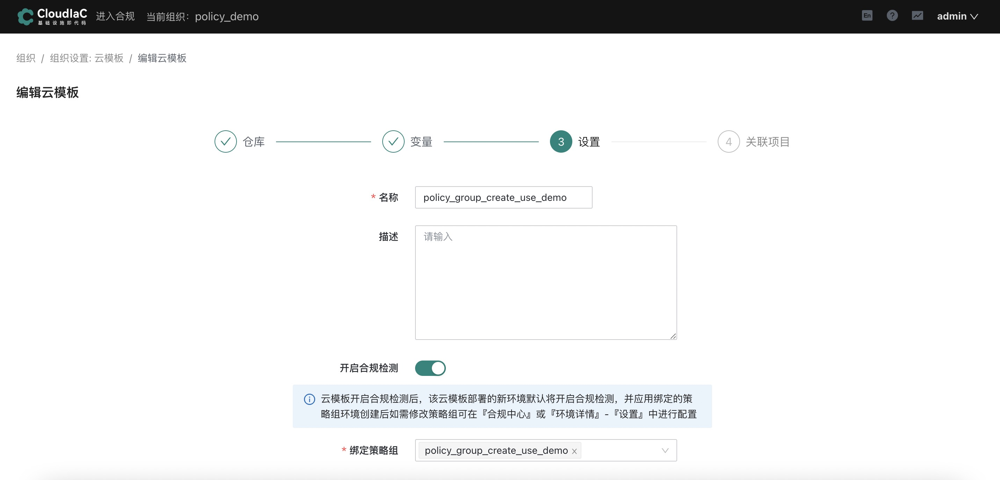
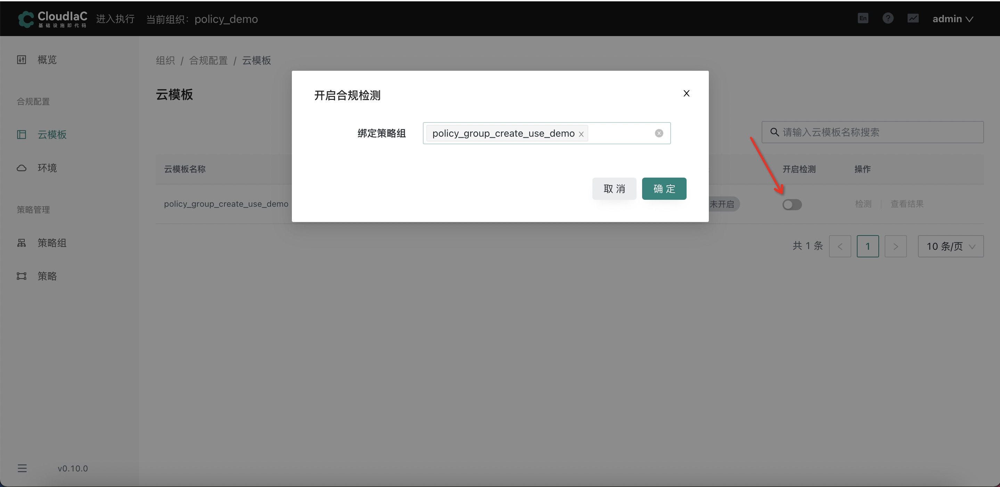
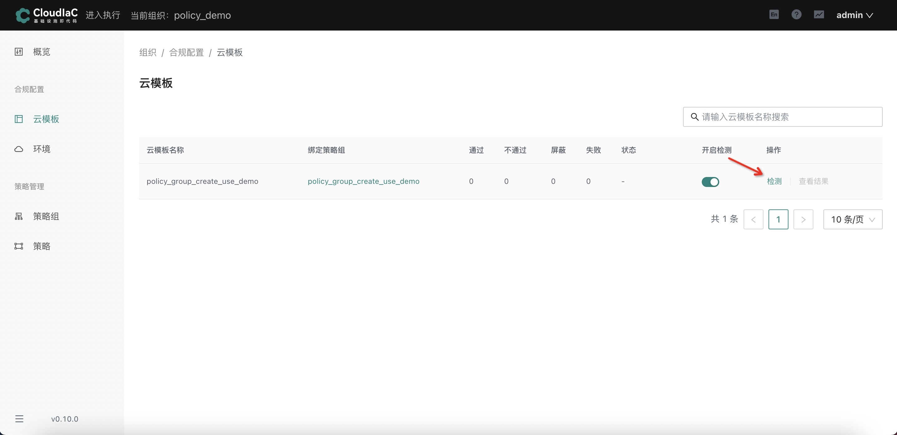
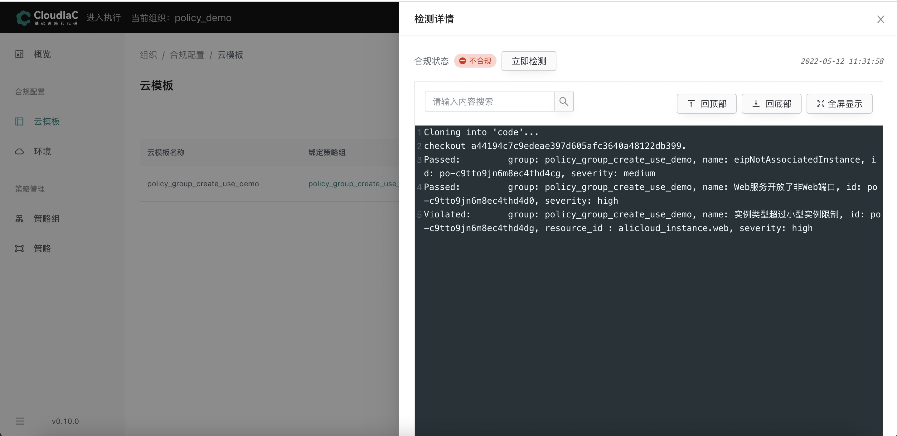
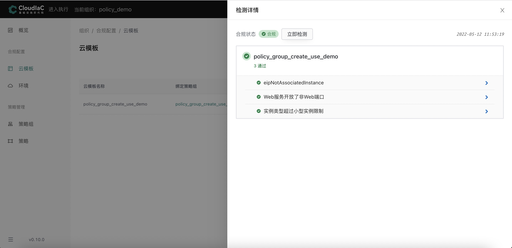

# 为云模版开启合规策略

## 准备工作

### 创建云模板

此步骤创建云模板所使用的示例仓库：[https://github.com/cong2960/cloudiac-example](https://github.com/cong2960/cloudiac-example)

步骤参考[创建云模板](../quick-start/create-template.md)

**注意：创建云模板时请fork示例仓库或自行创建仓库进行测试**

### 创建策略组

此步骤创建策略组所使用的示例仓库：[https://github.com/cong2960/opa-policy-example](https://github.com/cong2960/opa-policy-example)

步骤参考[创建策略组](../cases/create-policy-group.md)

**注意：创建策略组时请fork示例仓库或自行创建仓库进行测试**

### 为云模版开启合规策略（两种方式）

**方式一：在执行页面创建或者修改云模版配置时同时绑定策略组**

**方式二：在合规页面为已创建的云模版绑定策略组**

### 在合规页面点击检测

### 合规检测效果展示

**合规检测不通过**

该云模板绑定的策略组含有3条合规策略，其中passed代表tf文件中将要创建的资源满足该条合规策略，只有当所有合规策略都passed，该资源创建才算合规
    
**合规检测通过**

