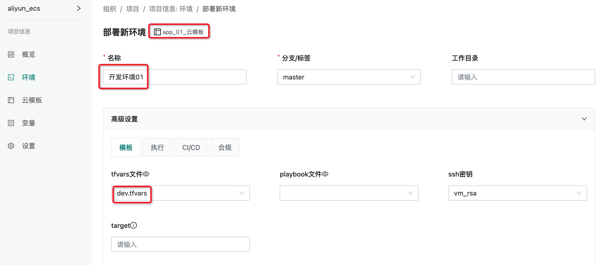
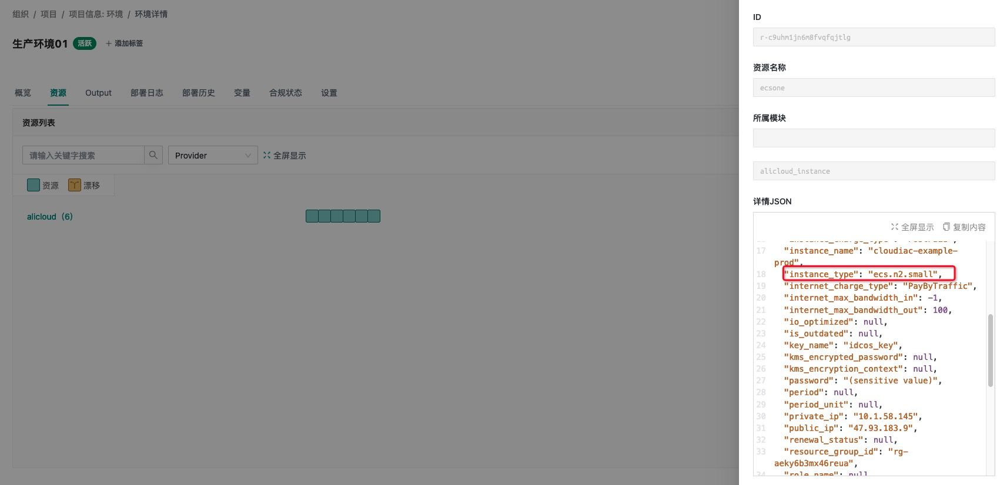
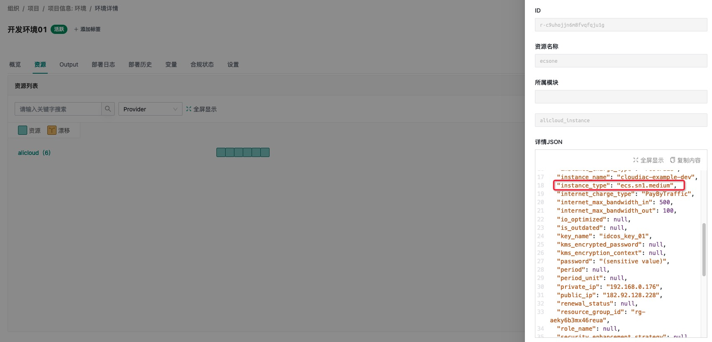

## 通过 tfvars 文件预定义变量

### CloudIaC 修改 terraform 的方法

CloudIaC 可以通过同一套环境部署来部署不同规格类型的环境资源; 通常在云模版中, 我们可以预留多组定义好的 terraform 变量, 在部署环境实例之前, 用户可以临时修改 terraform 变量的参数值来灵活的创建不同规格的环境实例(本次修改仅在本次创建实例时生效);
在 iac 部署/重新部署环境时, 修改 terraform 变量的值有以下几种方法
#### 1. 环境部署时, 在「高级设置」中选择不同的 tfvars 文件;


#### 2. 环境部署时, 在 terraform 一栏的右下角选择导入变量;
CloudIaC 会将用户在云模版中定义的所有 terraform 变量展示出来, 提供给用户选择导入;


#### 3. 同时采用以上两种方式


### 案例说明
本实例主要演示根据 tfvars 的使用, 我们会定义两个不同的 tfvars 文件( ***dev.tfvars*** 和 ***prod.tfvars***，分别用于开发环境和生产环境部署，其中使用的 vpc、实例规格等都不同), 基于同一套云模版, 创建出不同规格的环境实例;  

> 说明: 本次使用阿里云的资源账号, 每个环境创建一台 ecs; 

### 云模版展示

```bash
# 使用 aliyn_ecs 仓库, 用于创建阿里云 ecs 示例的 vsc 仓库
$ cd aliun_ecs && tree .
/USERS/NO.074/CODE/IAC_TF/ALIYUN_ECS
├── .gitignore
├── README.md
├── dev.tfvars
├── main.tf
├── outputs.tf
├── prod.tfvars
├── variables.tf
└── versions.tf
```

### dev.tfvars 内容
```terraform
# 开发环境配置
zone = "cn-beijing-c"

instance_name = "cloudiac-example-dev"
# 2c4g
instance_type = "ecs.sn1.medium"

vpc_name = "vpc-cloudiac-example-dev"
sg_name = "sg-cloudiac-exapmle-dev"
cidr_block = "192.168.0.0/24"
```

### prod.tfvars 内容

```terraform
# 生产环境配置
zone = "cn-beijing-c"

instance_name = "cloudiac-example-prod"
# 1c1g
instance_type = "ecs.n2.small"

vpc_name = "vpc-cloudiac-example-prod"
sg_name = "sg-cloudiac-example-prod"
cidr_block = "10.1.0.0/16"
```

### 创建一个云模板
基于 aliyn_ecs vcs 创建一个 「app_01_云模板」 的模板


### 分别创建生产、开发两个环境
在同一个项目「aliyn_ecs」下创建两套环境分别叫做生产环境01, 开发环境01;

#### 生成环境01
使用 `prod.tfvars` 作为配置规格;


#### 开发环境01
使用 `dev.tfvars` 作为配置规格;



### 基于相同的云模版部署不同的环境

#### 生产环境01



#### 开发环境01
