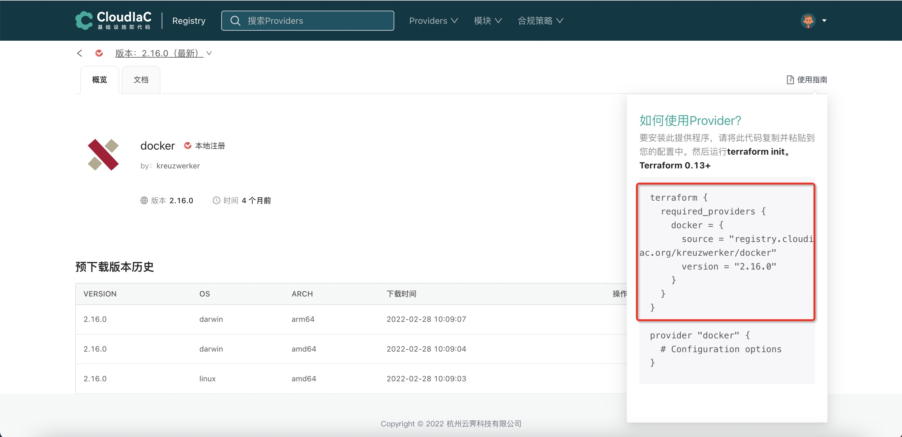

# 使用registry的provider
## 场景描述

Terraform提供了众多的 Providers 可以让我们对基础设施进行统一管理，但对于国内用户来说，在使用 Terraform 时体验可能并不友好，其中主要的原因可能就是下载 Provider 时各种超时问题导致的

由于 Terraform Provider 并没有国内源，所以下载 Provider 就成了耗时严重的环节，随便一个 Provder 动辄几分钟以上的下载时间，严重影响了我们的效率，更不要说一个完整的 Terraform 模板可能需要用到多个 Provider ，更甚的是经常因为下载时间太长出现 timeout 报错退出，导致根本用不起来。

针对上述问题，CloudIaC 推出 CloudIaC Registry，该Registry实现了Terraform的 provider registry协议以及 network mirror 协议，用户可以直接配置 network mirror，以代理的方式实现 provider 的缓存和下载，也可以提前在CloudIaC Registry网站上选择要使用的provider进行预下载，彻底解决国内 Terraform 用户因为网络原因导致的使用困难问题。
## 场景示例
下面以使用 Registry 中的docker provider作为示例说明

要使用本地发布到registry中的provider，只需要把tf文件中对应provider的参数source以及version的值改为对应的registry存在的provider地址和版本即可，registry具体有哪些provider可查看[https://registry.cloudiac.org/provider](https://registry.cloudiac.org/provider)

示例仓库中main.tf中的文件内容如下：

### 效果展示

由此可见使用的正是registry中的provider而非terraform官方的provider，并能达到官方provider的使用效果

